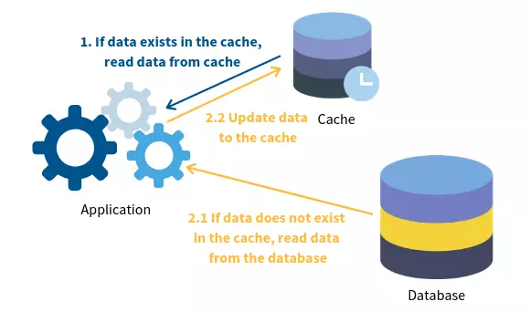

# SYSTEM VÀ SOFTWARE

## GIỚI THIỆU

Trong quá trình phát triển phần mềm, việc xác định rõ các thuộc tính của hệ thống là vô cùng quan trọng để đảm bảo rằng sản phẩm đáp ứng được kỳ vọng của người dùng và vận hành hiệu quả trong môi trường thực tế. Các thuộc tính hệ thống được chia làm hai nhóm chính: thuộc tính chức năng (functional requirements) và thuộc tính phi chức năng (non-functional requirements). Cả hai đều đóng vai trò thiết yếu trong việc định hình kiến trúc, thiết kế và triển khai phần mềm.

## THUỘC TÍNH CHỨC NĂNG VÀ PHI CHỨC NĂNG (FUNCTIONAL REQUIREMENTS & NON-FUNCTIONAL REQUIREMENTS)

### THUỘC TÍNH CHỨC NĂNG (FUNCTIONAL REQUIREMENTS)

#### Khái niệm

Thuộc tính chức năng là những yêu cầu mô tả các hành động hoặc chức năng cụ thể mà hệ thống phần mềm cần thực hiện để đáp ứng nhu cầu sử dụng của người dùng hoặc tổ chức. Những chức năng này thường liên quan trực tiếp đến các quy trình nghiệp vụ và nghiệp vụ cốt lõi mà hệ thống đang phục vụ.
Chúng được xem là “xương sống” của phần mềm, là những tính năng người dùng có thể tương tác trực tiếp, như thao tác nhập liệu, tra cứu, chỉnh sửa, báo cáo, quản lý, xác thực đăng nhập...

#### Vai trò và tầm quan trọng

Các yêu cầu chức năng (functional requirements) đóng một vai trò trung tâm và không thể thiếu trong toàn bộ vòng đời phát triển phần mềm. Chúng không chỉ là danh sách các tính năng, mà còn là kim chỉ nam định hình nên hệ thống, đảm bảo rằng sản phẩm cuối cùng thực sự đáp ứng được mục tiêu kinh doanh và nhu cầu của người dùng. Việc xác định và quản lý hiệu quả các yêu cầu này mang lại nhiều lợi ích chiến lược:

##### Xác định Phạm vi Hệ thống Một Cách Rõ ràng :

Các yêu cầu chức năng chính là yếu tố then chốt để xác định phạm vi (scope) của dự án. Chúng vạch ra ranh giới rõ ràng về "cần làm gì" và "không cần làm gì" cho nhóm phát triển.

- Ngăn chặn mở rộng phạm vi (scope creep): Khi các chức năng được định nghĩa cụ thể, nguy cơ phát sinh thêm các tính năng không dự kiến trong quá trình phát triển sẽ giảm thiểu. Điều này giúp dự án đi đúng hướng, tránh lãng phí nguồn lực và thời gian.
- Tập trung nguồn lực: Nhóm phát triển có thể tập trung vào việc xây dựng những tính năng mang lại giá trị cao nhất cho người dùng và doanh nghiệp, thay vì phân tán vào các chức năng không cần thiết.
- Thiết lập kỳ vọng: Một phạm vi rõ ràng giúp thiết lập kỳ vọng thực tế cho tất cả các bên liên quan – từ nhà đầu tư, quản lý dự án cho đến người dùng cuối.

##### Cơ sở Vững chắc cho Thiết kế và Phát triển :

Yêu cầu chức năng là nền tảng mà từ đó toàn bộ quá trình thiết kế kiến trúc (architectural design) và phát triển mã nguồn (code development) được xây dựng.

- Hướng dẫn thiết kế: Các nhà thiết kế hệ thống sử dụng các yêu cầu này để hình dung cấu trúc tổng thể của phần mềm, cách các module tương tác với nhau và luồng dữ liệu. Chẳng hạn, yêu cầu "cập nhật đơn thuốc" sẽ dẫn đến việc thiết kế các bảng cơ sở dữ liệu liên quan đến thuốc, thông tin kê đơn, và các giao diện người dùng để nhập liệu.
- Chỉ đạo phát triển: Lập trình viên dựa vào các yêu cầu chức năng để viết mã nguồn. Mỗi chức năng được mô tả sẽ được chuyển thành một hoặc nhiều phần của mã lệnh, các lớp (classes), hàm (functions) hoặc component cụ thể.
- Kiểm thử và Đảm bảo chất lượng: Yêu cầu chức năng cung cấp tiêu chí để kiểm thử (testing). Mỗi yêu cầu đều có thể được kiểm tra độc lập để xác minh rằng hệ thống hoạt động đúng như mong đợi. Điều này là nền tảng cho việc đảm bảo chất lượng phần mềm trước khi triển khai.

##### Liên kết Trực tiếp với Người dùng Cuối

Đây là khía cạnh quan trọng nhất về tầm quan trọng của yêu cầu chức năng. Chúng là phần người dùng cuối sẽ trực tiếp tiếp xúc và sử dụng.

- Trải nghiệm người dùng (UX): Nếu các chức năng không đáp ứng được nhu cầu hoặc khó sử dụng, dù hệ thống có được xây dựng với công nghệ tiên tiến đến đâu, nó cũng sẽ thất bại trong việc được chấp nhận và sử dụng rộng rãi.
- Sự hài lòng của người dùng: Các chức năng được xây dựng đúng và đủ sẽ trực tiếp giải quyết các vấn đề, nâng cao hiệu suất làm việc và mang lại sự hài lòng cho người dùng. Ngược lại, việc thiếu đi một chức năng thiết yếu hoặc một chức năng bị lỗi có thể gây ra sự thất vọng và cản trở công việc hàng ngày.

##### Tiết kiệm Chi phí và Tránh Rủi ro :

Việc đầu tư thời gian và công sức vào giai đoạn thu thập và phân tích yêu cầu chức năng một cách kỹ lưỡng ngay từ đầu sẽ mang lại lợi ích tài chính đáng kể.

- Giảm thiểu sửa đổi lớn: Phát hiện lỗi hoặc thiếu sót ở giai đoạn đầu (phân tích yêu cầu) sẽ rẻ hơn rất nhiều so với việc sửa chữa chúng ở giai đoạn cuối (sau khi đã triển khai). Một thay đổi nhỏ ở bản vẽ thiết kế sẽ không tốn kém bằng việc phải đập bỏ và xây lại một phần của công trình đã hoàn thành.
- Tránh phát sinh chi phí không mong muốn: Sự mơ hồ trong yêu cầu có thể dẫn đến việc phát triển các tính năng không cần thiết hoặc hiểu sai mục đích, gây lãng phí nguồn lực và thời gian.
- Giảm thiểu rủi ro dự án: Các yêu cầu chức năng rõ ràng giúp quản lý rủi ro tốt hơn, vì nhóm có thể dự đoán và lập kế hoạch cho các thách thức tiềm ẩn liên quan đến việc triển khai từng chức năng.

#### Các ví dụ thực tế

##### Quản lý Hồ sơ Bệnh nhân và Lượt khám

Cho phép nhân viên y tế tạo hồ sơ khám mới cho bệnh nhân:

Yêu cầu này là nền tảng cho mọi hoạt động khám chữa bệnh. Khi một bệnh nhân mới đến phòng khám hoặc bệnh viện, nhân viên y tế (ví dụ: lễ tân, điều dưỡng) cần có khả năng nhanh chóng và dễ dàng nhập thông tin để lập một hồ sơ cá nhân. Điều này bao gồm các thông tin cơ bản như Họ tên đầy đủ, Ngày sinh, Giới tính, Địa chỉ liên hệ, Số điện thoại, và nếu có, Mã số bảo hiểm y tế (BHYT) hoặc các thông tin bảo hiểm khác. Hệ thống cần đảm bảo tính toàn vẹn dữ liệu, ví dụ như cảnh báo nếu có trùng lặp thông tin bệnh nhân để tránh tạo nhiều hồ sơ cho cùng một người. Việc tạo hồ sơ mới cũng đồng nghĩa với việc khởi tạo một mã bệnh nhân duy nhất để dễ dàng tra cứu và quản lý trong tương lai.

##### Tra cứu và Quản lý Danh mục

Hiển thị danh sách loại thuốc, loại bệnh và cho phép tìm kiếm nhanh:
Để hỗ trợ hiệu quả công việc của bác sĩ và dược sĩ, phần mềm cần có khả năng hiển thị các danh mục tham chiếu quan trọng.

Danh sách loại thuốc: Hệ thống phải hiển thị đầy đủ thông tin về các loại thuốc có sẵn trong kho, bao gồm tên thuốc (biệt dược và gốc), hoạt chất chính, đơn vị tính (viên, ml, gói), giá bán, và đặc biệt là số lượng tồn kho hiện tại. Việc hiển thị này cần được tổ chức khoa học, có thể theo nhóm thuốc hoặc dạng bào chế.

Danh sách loại bệnh (ICD-10): Phần mềm cần tích hợp và hiển thị danh mục các mã bệnh theo chuẩn ICD-10 (International Classification of Diseases, 10th Revision). Mỗi mã bệnh phải đi kèm với mô tả chi tiết để bác sĩ dễ dàng lựa chọn và ghi nhận chẩn đoán chính xác.
Chức năng tìm kiếm nhanh: Điều quan trọng là phải có một cơ chế tìm kiếm mạnh mẽ cho cả danh mục thuốc và danh mục bệnh. Người dùng cần có thể tìm kiếm theo tên, mã, hoặc các từ khóa liên quan để nhanh chóng định vị thông tin cần thiết, giúp tiết kiệm thời gian và giảm thiểu sai sót.

##### Thống kê và Báo cáo

Thống kê số lượt khám theo từng loại bệnh trong một tháng:

Yêu cầu này phục vụ cho mục đích quản lý và phân tích nghiệp vụ. Hệ thống cần có khả năng tổng hợp dữ liệu từ các lượt khám và cung cấp các báo cáo thống kê. Ví dụ, việc thống kê số lượt khám theo từng loại bệnh trong một khoảng thời gian (ví dụ: một tháng, một quý) giúp ban lãnh đạo phòng khám/bệnh viện:

Nắm bắt xu hướng bệnh tật trong cộng đồng.
Đánh giá hiệu quả các chương trình y tế dự phòng.
Phân bổ nguồn lực (ví dụ: nhân sự, thuốc men) phù hợp hơn cho các chuyên khoa có nhu cầu cao.
Đưa ra các quyết định chiến lược về mở rộng dịch vụ hoặc tập trung vào các lĩnh vực nhất định. Báo cáo này cần có thể được xuất ra dưới nhiều định dạng (ví dụ: Excel, PDF) và có khả năng lọc theo các tiêu chí khác nhau (ví dụ: theo bác sĩ, theo khoa).

### THUỘC TÍNH PHI CHỨC NĂNG (NON-FUNCTIONAL REQUIREMENTS)

#### Khái niệm

Thuộc tính phi chức năng là những yêu cầu không liên quan trực tiếp đến các chức năng cụ thể mà hệ thống phải thực hiện, mà mô tả cách thức mà hệ thống đó vận hành, hiệu suất, độ tin cậy, khả năng mở rộng, bảo mật, và tính thân thiện với người dùng.

Khác với các thuộc tính chức năng (trả lời câu hỏi “hệ thống làm gì”), các thuộc tính phi chức năng trả lời cho câu hỏi “hệ thống hoạt động như thế nào”. Chúng ảnh hưởng sâu sắc đến trải nghiệm người dùng, tính hiệu quả khi triển khai, và tính duy trì về lâu dài của hệ thống phần mềm.

#### Vai trò và tầm quan trọng

Mặc dù thường ít được chú trọng hơn so với các yêu cầu chức năng trong giai đoạn đầu phát triển phần mềm, nhưng các yêu cầu phi chức năng có tác động trực tiếp đến chất lượng tổng thể, tính ổn định, và khả năng duy trì của hệ thống. Nếu không được thiết kế và kiểm soát đúng cách, hệ thống có thể vẫn “hoạt động được” nhưng kém hiệu quả, khó mở rộng, dễ bị tấn công, hoặc gây khó chịu cho người dùng.

##### Nâng cao Trải nghiệm Người dùng (UX)

- Tốc độ phản hồi nhanh: Giảm thiểu độ trễ trong các thao tác giúp người dùng không cảm thấy chờ đợi, đặc biệt quan trọng trong các hệ thống thời gian thực như phần mềm y tế hoặc quản lý hàng tồn kho.

- Giao diện mượt mà, nhất quán: Một hệ thống có tính nhất quán trong giao diện và phản hồi sẽ tạo cảm giác tin cậy và dễ sử dụng, góp phần tăng cường sự hài lòng và mức độ chấp nhận của người dùng.

##### Đảm bảo Khả năng Mở rộng và Bảo trì

- Khả năng mở rộng (Scalability): Hệ thống cần được thiết kế để dễ dàng nâng cấp – từ việc xử lý thêm người dùng, dữ liệu lớn hơn, đến tích hợp với các hệ thống khác trong tương lai mà không cần tái thiết kế toàn bộ.

- Tính mô-đun và dễ bảo trì: Hệ thống phải có cấu trúc rõ ràng để dễ dàng cập nhật, vá lỗi hoặc bổ sung tính năng mà không ảnh hưởng đến toàn bộ hoạt động.

##### Đáp ứng Khả năng Xử lý Tải và Hiệu suất

- Throughput (Lưu lượng xử lý): Hệ thống phải có khả năng xử lý khối lượng lớn dữ liệu hoặc lượng truy cập đồng thời mà không bị gián đoạn hoặc chậm trễ.

- Response Time (Thời gian phản hồi): Mỗi hành động của người dùng nên được phản hồi trong thời gian chấp nhận được – thường dưới 2 giây trong các ứng dụng giao diện đồ họa.

- Tối ưu tài nguyên (CPU, RAM, I/O): Hệ thống cần tiết kiệm tài nguyên hệ thống, đặc biệt khi triển khai trên các máy chủ có giới hạn phần cứng.

##### Tăng cường An toàn và Bảo mật

- Xác thực và phân quyền: Đảm bảo chỉ những người dùng hợp lệ mới có thể truy cập hệ thống và chỉ có quyền tương ứng với vai trò của họ.

- Mã hóa và bảo vệ dữ liệu: Dữ liệu bệnh nhân, đơn thuốc hay lịch sử khám bệnh là các thông tin nhạy cảm cần được bảo mật nghiêm ngặt để tuân thủ các chuẩn mực như HIPAA hoặc các quy định quốc gia về bảo vệ dữ liệu cá nhân.

- Ghi log và phát hiện truy cập trái phép: Hệ thống cần có khả năng ghi nhận các hành động nghi vấn và hỗ trợ điều tra khi xảy ra sự cố bảo mật.

##### Tăng Độ Tin Cậy và Tính Sẵn Sàng

- Tính ổn định (Reliability): Hệ thống phải hoạt động ổn định trong thời gian dài mà không bị lỗi hoặc sập đột ngột.

- Khả năng phục hồi (Recoverability): Trong trường hợp hệ thống bị lỗi hoặc sự cố, cần có cơ chế sao lưu và khôi phục dữ liệu nhanh chóng.

- High Availability (Sẵn sàng cao): Đảm bảo hệ thống luôn hoạt động, đặc biệt trong các môi trường yêu cầu thời gian hoạt động 24/7 như phòng khám, bệnh viện.

#### Các ví dụ thực tế

##### Thời gian phản hồi khi thao tác tìm kiếm thuốc

Hệ thống cần đảm bảo rằng khi người dùng gõ tên thuốc vào ô tìm kiếm, danh sách kết quả hiển thị gần như ngay lập tức (ví dụ dưới 1 giây). Điều này rất quan trọng trong môi trường khám bệnh có nhịp độ nhanh. Nếu thời gian phản hồi quá lâu (vài giây), bác sĩ hoặc dược sĩ sẽ bị gián đoạn quy trình, dễ dẫn đến sai sót hoặc bức xúc.

Để đáp ứng yêu cầu này, phần mềm nên sử dụng các kỹ thuật tối ưu như: cache bộ nhớ, tìm kiếm theo từ khóa không dấu, chỉ lấy các trường dữ liệu cần thiết, và dùng cơ chế truy vấn bất đồng bộ (asynchronous).

##### Tính ổn định và sẵn sàng cao trong giờ cao điểm

Vào giờ cao điểm (ví dụ: 7h30–9h00 sáng), có thể có hàng chục người dùng đăng nhập và sử dụng hệ thống cùng lúc. Phần mềm cần đảm bảo hoạt động ổn định, không bị treo hoặc phản hồi chậm. Nếu hệ thống bị sập giữa giờ khám bệnh, hậu quả có thể nghiêm trọng – gây gián đoạn tiếp nhận bệnh nhân, thất thoát dữ liệu, hoặc sai sót trong kê đơn.

Việc này đòi hỏi hệ thống được kiểm thử tải (load testing) kỹ càng trước khi triển khai, đồng thời có các cơ chế dự phòng như sao lưu tự động và ghi log lỗi để phục hồi nhanh chóng nếu gặp sự cố.

##### Bảo mật dữ liệu bệnh nhân

Thông tin bệnh nhân (họ tên, địa chỉ, tình trạng bệnh, thuốc đã dùng) là dữ liệu nhạy cảm và phải được bảo mật tuyệt đối. Hệ thống cần thực hiện:

- Cơ chế đăng nhập với mật khẩu mã hóa (bcrypt, SHA-256,...).
- Phân quyền rõ ràng: Nhân viên lễ tân không thể xem đơn thuốc, bác sĩ không thể chỉnh sửa thông tin hệ thống,...
- Mã hóa dữ liệu khi lưu trữ và khi truyền tải (sử dụng HTTPS, SSL).
- Ghi nhận lịch sử truy cập: Ai đăng nhập lúc nào, thao tác gì.

Điều này giúp phòng chống rò rỉ thông tin và đáp ứng các tiêu chuẩn về bảo mật dữ liệu trong lĩnh vực y tế.

## LỢI ÍCH CỦA CACHE TRONG SYSTEM VÀ SOFTWARE

### Cải thiện hiệu năng (Performance Optimization)

Mục tiêu: Đảm bảo hệ thống phản hồi nhanh, ổn định và đáp ứng tốt khối lượng truy cập lớn.

#### Giảm thời gian phản hồi (Response Time)

Để tăng tốc độ phản hồi khi người dùng tương tác với phần mềm (ví dụ: tìm kiếm thuốc, truy xuất danh sách bệnh nhân), hệ thống cần áp dụng cơ chế cache thông minh. Việc lưu trữ tạm thời những dữ liệu được truy cập thường xuyên (chẳng hạn: danh sách loại thuốc, danh mục ICD-10, danh sách bác sĩ...) ngay tại lớp trung gian hoặc gần phía người dùng (edge caching) giúp:

- Giảm thời gian truy xuất dữ liệu từ vài giây xuống chỉ còn vài milliseconds.

- Tăng tốc độ tải giao diện và rút ngắn thời gian thao tác của người dùng, đặc biệt trong các quy trình nhiều bước (ví dụ: tạo đơn thuốc).

- Cải thiện trải nghiệm tổng thể, đặc biệt trong môi trường bệnh viện/phòng khám nơi mỗi giây đều quan trọng.

#### Tăng thông lượng (Throughput)

Ngoài tốc độ phản hồi, hệ thống cũng cần xử lý được nhiều yêu cầu đồng thời hơn trong cùng một khoảng thời gian. Việc tối ưu throughput mang lại các lợi ích sau:

- Cho phép nhiều người dùng (lễ tân, bác sĩ, dược sĩ...) thao tác cùng lúc mà không bị chậm trễ.

- Giảm tải trực tiếp cho các backend services như cơ sở dữ liệu hoặc máy chủ xử lý nghiệp vụ.

- Góp phần giảm nguy cơ tắc nghẽn hệ thống, đặc biệt trong giờ cao điểm (7h30 – 9h sáng, hoặc sau giờ trưa).

### Tối ưu Khả năng Xử lý Tải và Khả năng Mở rộng (Load Handling & Scalability)

#### Giảm tải cho cơ sở dữ liệu (Database Offloading)

Việc triển khai lớp cache hiệu quả có thể giúp giảm đáng kể số lượng truy vấn gửi đến cơ sở dữ liệu. Cụ thể:

- Dữ liệu đọc nhiều (read-heavy) như danh sách danh mục, lịch sử đơn thuốc,... nên được cache tại lớp trung gian (middleware).
- Tỷ lệ cache hit cao sẽ giúp giảm số lần truy cập database thực tế, nhờ đó:
  - Cải thiện hiệu suất tổng thể của cơ sở dữ liệu.
  - Cho phép phục vụ nhiều người dùng đồng thời hơn.
  - Tránh tình trạng quá tải dẫn đến lỗi hoặc mất ổn định (database overload/crash).

#### Tăng khả năng mở rộng (Scalability)

Trong tương lai, khi số lượng người dùng tăng hoặc khi triển khai hệ thống tại nhiều cơ sở khám chữa bệnh, phần mềm cần có khả năng mở rộng linh hoạt:

- Horizontal scaling: Thêm nhiều node cache (cache cluster) giúp mở rộng hệ thống một cách hiệu quả về chi phí (cost-effective), mà không phải nâng cấp phần cứng hiện tại.
- Load balancer có thể phân phối truy cập đến các nút xử lý dữ liệu và cache khác nhau.
- Việc sử dụng các công nghệ phân tán (như Redis Cluster, Memcached Distributed) cũng giúp đảm bảo độ tin cậy và hiệu suất cao khi mở rộng.

### Tăng cường Bảo mật (Enhanced Security)

Yêu cầu bảo mật dữ liệu y tế là cực kỳ quan trọng, do tính chất nhạy cảm của thông tin liên quan đến bệnh nhân.

#### Giảm mức độ phơi bày hệ thống backend (Backend Exposure Mitigation)

Lớp cache không chỉ đóng vai trò tăng hiệu năng, mà còn có tác dụng như một lớp buffer bảo vệ hệ thống backend:

- Giảm lượng kết nối trực tiếp đến cơ sở dữ liệu, từ đó hạn chế nguy cơ bị tấn công từ bên ngoài (SQL injection, brute force query,...).
- Một số loại cache (như CDN hoặc reverse proxy) có thể lọc và chặn các truy cập bất thường hoặc độc hại, đóng vai trò như tường lửa ứng dụng (Application Firewall).
- Hạn chế khả năng bị tấn công từ chối dịch vụ (DDoS) bằng cách hấp thụ lượng truy cập lớn vào cache thay vì để hệ thống backend xử lý trực tiếp.

#### Bảo vệ dữ liệu người dùng (Data Privacy Compliance)

Do dữ liệu y tế thường thuộc diện bảo mật cao (theo luật pháp và quy định ngành y tế), nên cần đặc biệt lưu ý trong quá trình cache:

- Không lưu trữ dữ liệu nhạy cảm (PII/PHI) như chẩn đoán, số CMND/BHYT, địa chỉ… trong bộ nhớ cache, trừ khi đã được mã hóa hoặc có biện pháp kiểm soát.
- Thiết lập cache expiration (TTL) phù hợp để đảm bảo dữ liệu không bị lưu trữ lâu hơn mức cần thiết.
- Mã hóa nội dung cache nếu có khả năng truy cập từ nhiều nguồn.
- Thực hiện kiểm tra và audit định kỳ các thành phần cache để đảm bảo tuân thủ quy định bảo mật (như HIPAA, **Nghị định 13/2023/NĐ-CP** tại Việt Nam).

## CACHE TRONG GOOGLE CHROME

Trong quá trình tối ưu hiệu năng hệ thống, một trong những kỹ thuật hiệu quả là tận dụng cơ chế cache trình duyệt (browser cache). Đây là một phương pháp giúp cải thiện tốc độ tải trang, giảm tải cho máy chủ, và mang lại trải nghiệm người dùng tốt hơn, đặc biệt với các ứng dụng có giao diện web như phần mềm quản lý phòng khám hoặc bệnh viện.

### Cách thức Hoạt động của Browser Cache

Browser cache là cơ chế lưu trữ tạm thời các tài nguyên tĩnh (static assets) của một website hoặc ứng dụng web ngay trên máy người dùng, nhằm tái sử dụng các tài nguyên này trong các lần truy cập sau.

Đối với trình duyệt **Google Chrome** – một trong những trình duyệt phổ biến nhất hiện nay – cơ chế hoạt động của browser cache bao gồm:

#### Các loại tài nguyên được lưu trong cache:

- Hình ảnh (images): `.png`, `.jpg`, `.svg`, v.v.
- Tệp định dạng giao diện: `.css`
- Mã JavaScript (bao gồm logic xử lý phía client)
- Các trang HTML và font chữ

#### Vị trí lưu trữ:

- Chrome lưu cache trong thư mục cục bộ (local cache folder) của hệ điều hành.
- Các tài nguyên này được quản lý và truy xuất tự động bởi trình duyệt.

#### Cơ chế điều khiển:

Việc cache hay không, cache trong bao lâu, và khi nào cần làm mới cache được điều khiển thông qua các HTTP response headers, ví dụ:

- `Cache-Control`: Quy định thời gian lưu cache (ví dụ: `max-age=31536000`)
- `ETag`: Xác định phiên bản tài nguyên, hỗ trợ cache validation
- `Expires`: Thời điểm hết hạn của tài nguyên cache

> Khi người dùng truy cập một trang web lần đầu, trình duyệt sẽ tải toàn bộ tài nguyên từ máy chủ. Những lần truy cập sau đó, trình duyệt sẽ kiểm tra bộ nhớ cache trước để xác định có thể sử dụng lại dữ liệu hay không, từ đó giảm số lượng yêu cầu gửi lên server.

______________________________________________________________________

### Ví dụ Minh họa Cụ thể với Hình ảnh

Để minh họa rõ ràng cơ chế cache trình duyệt, ta xét một tình huống cụ thể:

#### Lần đầu truy cập một website:

- Người dùng mở trang web lần đầu tiên.
- Chrome gửi yêu cầu (HTTP request) đến server để tải các thành phần như:
  - Hình ảnh logo
  - File CSS, JS, ảnh nền,...
- Ví dụ: Tệp hình ảnh `logo.png` (500KB) được tải về từ server.
- Chrome lưu hình ảnh này vào bộ nhớ cache local.
- Thời gian tải: khoảng 2–3 giây tùy tốc độ mạng.

#### Lần truy cập thứ hai:

- Khi người dùng truy cập lại cùng website:
  - Trình duyệt kiểm tra bộ nhớ cache.
  - Nếu `logo.png` vẫn còn hiệu lực:
    - Trình duyệt tải hình ảnh từ cache, không cần truy cập server.
- Thời gian tải: chỉ khoảng 50–100 milliseconds.

#### Lợi ích rõ rệt từ Browser Cache:

- Hiệu năng (Performance):

  - Tốc độ tải trang tăng lên rõ rệt.
  - Các thành phần giao diện có thể hiển thị tức thì.
  - Cache giúp giảm thời gian tải trang gấp 20–30 lần cho tài nguyên tĩnh.

- Tiết kiệm tài nguyên:

  - Giảm lưu lượng mạng (Bandwidth): Không cần tải lại hình ảnh, JS, CSS.
  - Giảm tải cho server backend: Ít truy vấn lặp lại không cần thiết.

- Trải nghiệm người dùng (UX):

  - Phản hồi nhanh, giao diện mượt mà.
  - Giảm thời gian chờ đợi.
  - Rất hữu ích trong môi trường như bệnh viện/phòng khám – nơi yêu cầu tốc độ và độ chính xác cao.

______________________________________________________________________

### Kiểm tra và Giám sát Cache trong Google Chrome

Các nhà phát triển có thể dễ dàng xem và phân tích cache của trình duyệt bằng công cụ Chrome DevTools.

#### Các bước thực hiện:

1. Mở Chrome DevTools:

   - Nhấn F12 hoặc chuột phải > Inspect.

1. Tab Network:

   - Chọn tab Network.
   - Tick vào ô "Disable cache" để thử tải trang mà không dùng cache.
   - Reload lại trang để kiểm tra:
     - CộtStatus:
       - `200`: tải mới từ server
       - `304 Not Modified`: dùng cache cũ, không cần tải lại
       - `(from disk cache)` / `(from memory cache)`: tài nguyên lấy từ cache
     - Cột Size: hiển thị rõ nguồn gốc của tài nguyên.

1. Tab Application:

   - Chọn tab Application > Storage > Cache Storage.
   - Xem danh sách tài nguyên được lưu trữ bởi Service Workers, bao gồm:
     - Tên file
     - Kích thước
     - Thời điểm lưu cache
   - Có thể xóa cache thủ công nếu cần kiểm thử lại từ đầu.
   - Kiểm tra tình trạng dung lượng bộ nhớ cache nếu phát hiện các lỗi tải chậm.

______________________________________________________________________

> Browser Cache không chỉ là kỹ thuật tối ưu hiệu năng, mà còn là công cụ thiết yếu trong việc phát triển các hệ thống web tốc độ cao, đặc biệt trong các phần mềm quản lý y tế hiện đại.

# TỔNG QUAN VỀ CACHE

## CACHE LÀ GÌ ?

- Bộ nhớ đệm: là phần cứng hoặc phần mềm dùng để lưu trữ tạm thời bản sao của dữ liệu đã được truy cập, tính toán trước đó của máy chủ, ứng dụng hay trình duyệt để nội dung có thể nhanh chóng được gọi lại ra màn hình khi truy cập lại trong quá trình sử dụng. Bộ nhớ đệm còn có thể phát triển theo hướng lưu nội dung vào bộ nhớ hoặc file văn bản trong khoảng thời gian nhất định và mọi người đều có thể truy cập được nội dung trong cache (không chỉ người dùng ban đầu) cho đến khi nó hết hạn.
  
- Caching, hay kỹ thuật lưu đệm, là quá trình lưu trữ tạm thời các dữ liệu hoặc lệnh thường xuyên truy cập trong bộ nhớ cache. Mục đích của caching là cải thiện hiệu suất hệ thống bằng cách giảm thiểu thời gian truy xuất dữ liệu từ các nguồn tài nguyên chậm hơn như bộ nhớ chính, ổ cứng hoặc server gốc bằng cách lưu trư các dữ liệu thường xuyên truy cập trong bộ nhớ, tránh
  việc phải truy cập nhiều lần tới server gốc.
- Caching là một kỹ thuật quản lý dữ liệu nhằm lưu trữ tạm thời các thông tin thường xuyên được truy cập trong một vùng lưu trữ tốc độ cao (cache) để giảm thời gian truy xuất và tăng tốc độ xử lý.

## LỊCH SỬ CỦA CACHE

- Sự hình thành của phương pháp caching đã được lên ý tưởng từ rất lâu về trước đây, bắt đầu từ những năm đầu của máy tính. Ý tưởng về việc lưu trữ tạm thời dữ liệu để tăng tốc độ truy cập được Maurice Wilkes đưa ra năm 1967 khi ông nhận thấy về sự cải thiện đáng kể nếu như có một loại bộ nhớ nhỏ, nhanh hơn để lưu trữ dữ liệu và hướng dẫn CPU truy cập thường xuyên.
- Maurice Wilkes ra đời vào ngày 26/6/1913 tại Dudley, Staffordshire, với cha là Vincent và mẹ là Ellen Wilkes. Hành trình học vấn của Wilkes trải qua những thành tựu đáng nể. Ông theo học tại Trường King Edward VI ở Stourbridge trước khi gia nhập Đại học St John, Cambridge vào năm 1931 và đạt được bằng cử nhân năm 1934. Sau đó, ông tiếp tục nghiên cứu ở Trường Cambridge, và vào năm 1937, ông đã đạt được bằng tiến sĩ sau khi thực hiện nghiên cứu về sự lan truyền của sóng vô tuyến trong tầng điện ly tại Phòng thí nghiệm Cavendish.
- Sau Thế chiến II, ông tham gia vào công việc nghiên cứu về radar trước khi trở lại Cambridge vào năm 1945. Ông đã dẫn dắt Phòng thí nghiệm Toán học từ năm 1946 đến 1970, sau đó nó trở thành Phòng thí nghiệm Máy tính Cambridge, một nơi ông vẫn tiếp tục đóng vai trò quan trọng.
- Năm 1980, Wilkes chuyển hướng sang lĩnh vực công nghệ thông tin, làm việc cho các tổ chức như Tập đoàn Thiết bị Kỹ thuật số ở Massachusetts và Phòng thí nghiệm Nghiên cứu Olivetti và Oracle ở Cambridge, Anh. Ông tiếp tục đóng góp cho ngành máy tính đến những năm cuối đời, được ghi nhận và tưởng nhớ qua nhiều giải thưởng danh giá trong ngành, bao gồm Giải thưởng ACM Turing và Giải thưởng Eckert-Mauchly.
- Maurice Wilkes được biết đến không chỉ là một nhà khoa học hàng đầu mà còn là một nhà lãnh đạo xuất sắc, được tôn vinh bởi nhiều tổ chức uy tín như Hiệp hội Máy tính Anh, Hiệp hội Hoàng gia và Học viện Kỹ thuật Hoàng gia. Ông cũng nhận được sự tôn kính từ các tổ chức quốc tế như Viện Hàn lâm Khoa học và Nghệ thuật Hoa Kỳ. Năm 2000, ông được vinh danh với tước hiệu hiệp sĩ, là một phần của việc công nhận đóng góp to lớn của ông cho lĩnh vực khoa học và công nghệ.
- Bộ nhớ cache đầu tiên được sử dụng trong máy tính CDC 6600 vào năm 1970. Bộ nhớ cache này chỉ có dung lượng 32 kB và được sử dụng để lưu trữ dữ liệu. Ở thời điểm đó, CDC 6600 là một trong những máy tính siêu máy tính đầu tiên, được phát triển bởi Control Data Corporation (CDC). Thiết kế và phát triển của CDC 6600 chủ yếu do Seymour Cray, một trong những nhà thiết kế máy tính nổi tiếng nhất, thực hiện. CDC 6600 đã đánh dấu một bước ngoặt quan trọng trong lịch sử của máy tính, trở thành siêu máy tính nhanh nhất thế giới vào thời điểm đó và mở đường cho các thiết kế siêu máy tính sau này. Việc áp dụng caching vào siêu máy tính này là một bước phát triển lớn đối với công nghệ đương thời.
- Kể từ đó, bộ nhớ cache đã trở thành một thành phần thiết yếu của tất cả các máy tính. Dung lượng và tốc độ của bộ nhớ cache đã tăng lên đáng kể theo thời gian, và ngày nay chúng có thể được tìm thấy ở nhiều cấp độ khác nhau trong hệ thống phân cấp bộ nhớ. Giai đoạn phát triển của caching còn trải qua nhiều giai đoạn, trong đó có thể nói tới việc áp dụng nó vào các máy tính mini (1972), sử dụng trong máy tính cá nhân (1975), trong siêu máy tính (1980) và dần dần, bộ nhớ đệm ngày càng được nâng cao về cả dung lượng và tốc độ. Điển hình có thể kể đến việc lần đầu tiên bộ nhớ cache ERAM được giới thiệu lần đầu tiên trong máy tính Compaq Presario 7000(2000) và bộ nhớ cache nhúng được giới thiệu lần đầu trong máy tính Intel Core 2 Duo.
- Trong những năm đầu của Caching, kỹ thuật được sử dụng để cache là sử dụng các bộ nhớ đệm nhỏ lưu trữ dữ liệu gần đây truy cập, giúp giảm thời gian truy cập dữ liệu từ bộ nhớ chính(RAM).
- Bước tiếp tới những năm 1970-1980, ta đến với giai đoạn phát triển bộ nhớ Cache và hệ thống lưu trữ. Lúc này, chúng ta đã sản xuất ra các loại bộ nhớ Cache hiện đại hơn, là bộ nhớ Cache L1, giúp tăng khả năng xử lý với kích thước tuy nhỏ nhưng tốc độ cao. Ngoài ra ta còn sử dụng kỹ thuật Disk Cache, tức sử dụng bộ nhớ RAM làm bộ nhớ đệm cho ổ đĩa cứng, giúp giảm thời gian truy cập đến dữ liệu từ ổ cứng.
- Tới những năm 1990 trở đi, sự phát triển của máy tính đã mở rộng và tối ưu hóa Caching hơn. Với sự ra đời của bộ nhớ Cache L2, nằm giữa Cache L1 và RAM, lớn hơn và chậm hơn nhưng cải thiện về mặt hiệu suất. Đối với các trình duyệt web và máy chủ proxy còn xuất hiện thêm Proxy Cache và Browser Cache, là nơi để lưu trữ các bản sao của nội dung web và cache trên trình duyệt để lưu trư các tệp tin tạm thời, giảm tải mạng và tăng tốc độ truy cập.
- Giai đoạn những năm 2000 là giai đoạn phát triển Caching trong Hệ thống Phân Tán và Cơ sở dữ liệu. Bộ nhớ cache L3 được giới thiệu, chia sẻ giữa các lõi CPU để tăng cường hiệu suất xử lý đa lõi. Distributed Cache là ky thuật sử dụng các hệ thống cache phân tán như Memcached và Redis, cho phép lưu trữ và truy xuất dữ liệu từ nhiều node trong hệ thống phân tán. Các ông lớn như Facebook và Twitter là những người sử dụng kỹ thuật này. Query cache trong cơ sở dữ liệu sử dụng bằng các lưu trữ các kết quả truy vấn từ SQL. Điển hình có thể kể đến 2 database phổ biến sử dụng kỹ thuật này là MySQL và PostgreSQL.
- Những năm 2010 là những năm tối ưu hóa Caching với các hệ thống hiện đại gần với ngày nay. Khi số lượng dữ liệu truy vấn trở nên khổng lồ, bắt đầu có sự xuất hiện của các CDN(Content Delivery Network). CDN sử dụng các mạng phân phối nội dung để lưu trữ bản sao của các hệ thống web tại các máy chủ gần người dùng, giảm độ trễ và tăng tốc độ truy cập. Clouflare hay Amazon CloudFront là các dịch vụ tiêu biểu mà người dùng có thể dễ biết đến nhất. In-Memory Caching là kỹ thuật đã nói ở trên, sử dụng RAM để cache dữ liệu, được Redis và Memcached tiếp tục phát triển và sử dụng rộng rãi hơn trong các hệ thống. Ngoài ra, với sự phát triển của máy tính, còn xuất hiện thêm một loại kỹ thuật là Egde Computing Cache, hay Cache tại các thiết bị Egde gần người dùng nhất nhằm giảm thiểu tối đa thời gian trễ do khoảng cách địa lý.
- Trở về những năm gần đây, Caching được sử dụng trong các hệ thống AI và Cloud Computing. AI và Machine Learning Caching là kỹ thuật dùng Caching để lưu trữ các mô hình AI và dữ liệu đã được training, giúp giảm thời gian training và dự đoán. Serverless Computing Caching sử dụng các nền tảng serverless để tăng hiệu suất của các hàm không trạng thái. Ngoài ra, việc caching bây giờ có thể được sử dụng trên các kiến trúc hybrid và multi-cloud, giúp giảm tải chi phí lưu trữ hay phần cứng cho những người muốn sử dụng hệ thống lưu trữ.
- Caching đã trải qua một quá trình phát triển dài và không ngừng cải tiến. Từ những bộ nhớ đệm cơ bản trong các hệ thống máy tính đầu tiên, caching đã mở rộng và trở nên phức tạp hơn với sự ra đời của các kỹ thuật và công nghệ mới. Caching hiện nay được sử dụng rộng rãi trong nhiều lĩnh vực, từ CPU và hệ thống lưu trữ đến mạng, cơ sở dữ liệu, và các ứng dụng phân tán hiện đại, góp phần quan trọng vào việc tối ưu hóa hiệu suất và trải nghiệm người dùng.
- Caching đã trải qua một quá trình phát triển dài và không ngừng cải tiến. Từ những bộ nhớ đệm cơ bản trong các hệ thống máy tính đầu tiên, caching đã mở rộng và trở nên phức tạp hơn với sự ra đời của các kỹ thuật và công nghệ mới. Caching hiện nay được sử dụng rộng rãi trong nhiều lĩnh vực, từ CPU và hệ thống lưu trữ đến mạng, cơ sở dữ liệu, và các ứng dụng phân tán hiện đại, góp phần quan trọng vào việc tối ưu hóa hiệu suất và trải nghiệm người dùng.

#### TÓM TẮT LỊCH SỬ CỦA CACHE QUA CÁC NĂM

1967: Maurice Wilkes đề xuất ý tưởng về bộ nhớ cache.
1970: Máy tính CDC 6600 sử dụng bộ nhớ cache lần đầu tiên.
1972: Bộ nhớ cache được sử dụng trong máy tính mini.
1975: Bộ nhớ cache được sử dụng trong máy tính cá nhân.
1980: Bộ nhớ cache được sử dụng trong máy tính siêu máy tính.
1990: Bộ nhớ cache trở thành một thành phần tiêu chuẩn trong tất cả các máy tính.
2000: Bộ nhớ cache trở nên lớn hơn và nhanh hơn

## ƯU ĐIỂM VÀ NHƯỢC ĐIỂM CỦA CACHE

### Ưu điểm của Cache

**Tăng tốc độ truy xuất dữ liệu**

- Giảm thời gian phản hồi: Khi một hệ thống lưu dữ liệu trong cache, các lần truy cập tiếp theo có thể lấy dữ liệu từ cache thay vì truy xuất từ nguồn gốc chậm hơn (như cơ sở dữ liệu hoặc máy chủ từ xa). Điều này giảm thời gian truy vấn, đặc biệt hữu ích trong các ứng dụng yêu cầu phản hồi nhanh, như ứng dụng web và di động.
- Truy xuất từ bộ nhớ nhanh hơn: Cache thường sử dụng các công nghệ lưu trữ nhanh hơn như RAM, thay vì sử dụng các thiết bị lưu trữ chậm hơn như ổ cứng hoặc mạng, giúp hệ thống đáp ứng các yêu cầu nhanh chóng.

*Ví dụ*: Trong trình duyệt web, các tệp như CSS, JavaScript và hình ảnh của một trang web được lưu trong cache. Khi người dùng truy cập lại trang đó, trình duyệt chỉ cần tải lại những tệp này từ cache thay vì từ máy chủ, giúp trang web tải nhanh hơn.

**Giảm tải cho hệ thống gốc**

- Giảm truy vấn đến cơ sở dữ liệu: Thay vì thực hiện các truy vấn tốn tài nguyên và thời gian, cache lưu lại kết quả của các truy vấn thường xuyên được yêu cầu. Điều này giúp giảm số lượng truy vấn đến cơ sở dữ liệu và giảm thiểu tình trạng quá tải.
- Giảm băng thông và tải máy chủ: Bằng cách phục vụ các yêu cầu từ cache thay vì phải chuyển dữ liệu từ các nguồn xa (như máy chủ gốc), hệ thống có thể giảm sử dụng băng thông mạng, giúp các máy chủ gốc và hạ tầng mạng không bị quá tải.

*Ví dụ*: Các hệ thống như CDN (Content Delivery Network) lưu trữ các bản sao nội dung web trên các máy chủ gần người dùng hơn, giảm số lượng yêu cầu đến máy chủ gốc và tiết kiệm băng thông.

**Cải thiện trải nghiệm người dùng**

- Thời gian phản hồi nhanh hơn: Thời gian tải trang hoặc ứng dụng nhanh hơn giúp người dùng không phải chờ đợi, mang lại trải nghiệm mượt mà và thoải mái hơn.
- Tăng tính khả dụng: Khi hệ thống gặp sự cố hoặc có sự cố kết nối với nguồn dữ liệu gốc, các dữ liệu trong cache vẫn có thể được phục vụ cho người dùng, giúp hệ thống có khả năng tiếp tục hoạt động trong một số trường hợp.

*Ví dụ*: Trong các ứng dụng di động, dữ liệu có thể được lưu trong cache để người dùng có thể truy cập ngay cả khi kết nối mạng yếu hoặc tạm thời bị mất.

**Tiết kiệm tài nguyên hệ thống**

- Giảm chi phí tính toán và truy xuất dữ liệu: Khi sử dụng cache, các tác vụ tính toán phức tạp hoặc truy vấn tốn thời gian chỉ cần thực hiện một lần, sau đó kết quả được lưu trữ và tái sử dụng. Điều này giúp hệ thống không cần phải lặp lại các tác vụ đòi hỏi nhiều tài nguyên mỗi khi có yêu cầu tương tự.
- Tối ưu hóa hiệu suất bộ xử lý (CPU): Các hệ thống máy tính và vi xử lý sử dụng cache để lưu trữ các lệnh hoặc dữ liệu được sử dụng thường xuyên, giảm thời gian CPU phải đợi dữ liệu từ bộ nhớ chính (RAM hoặc ổ đĩa), tăng hiệu suất xử lý tổng thể.

*Ví dụ*: Bộ nhớ cache của CPU giúp giảm độ trễ giữa CPU và bộ nhớ chính (RAM), từ đó tăng tốc độ xử lý các tác vụ mà CPU cần thực hiện.

**Tăng khả năng mở rộng**

- Hỗ trợ xử lý tải cao: Khi lưu lượng truy cập tăng đột biến, cache giúp giảm tải cho các hệ thống chính bằng cách phục vụ nhiều yêu cầu từ cache. Điều này cho phép hệ thống xử lý được nhiều người dùng hoặc yêu cầu cùng lúc mà không làm giảm hiệu suất.
- Phân phối nội dung hiệu quả: Trong các hệ thống phân tán hoặc ứng dụng toàn cầu, cache (đặc biệt là CDN) giúp giảm khoảng cách giữa người dùng và nguồn dữ liệu, cải thiện hiệu quả phân phối nội dung mà không cần phải mở rộng hạ tầng máy chủ chính.

*Ví dụ*: Một trang web thương mại điện tử có thể sử dụng cache để giảm tải cho cơ sở dữ liệu và máy chủ ứng dụng trong các sự kiện lớn như ngày mua sắm trực tuyến, nơi số lượng truy cập có thể tăng lên hàng nghìn lần.

**Tăng tính ổn định**

- Bảo vệ hệ thống khỏi sự cố quá tải: Cache giúp hệ thống tránh được tình trạng quá tải trong các giai đoạn lưu lượng truy cập đột biến, giúp hệ thống duy trì ổn định. Điều này đặc biệt quan trọng với các hệ thống có quy mô lớn hoặc các ứng dụng mà trải nghiệm người dùng là yếu tố then chốt.
- Giảm tần suất truy cập vào các tài nguyên đắt đỏ: Các tài nguyên như cơ sở dữ liệu phức tạp, máy chủ từ xa hoặc dịch vụ ngoài thường đắt đỏ về chi phí và thời gian truy cập. Cache giảm thiểu số lần truy cập trực tiếp vào các tài nguyên này, bảo vệ hệ thống khỏi các cuộc tấn công DDoS (Distributed Denial of Service) hoặc tải không mong muốn.

*Ví dụ*: Các trang web lớn sử dụng hệ thống cache phức tạp để đảm bảo rằng khi có lượng người dùng lớn truy cập đồng thời, trang web vẫn có thể đáp ứng một cách ổn định và nhanh chóng.

**Tối ưu hóa cho hệ thống phân tán**

- Giảm độ trễ giữa các khu vực địa lý khác nhau: Cache giúp dữ liệu được lưu trữ gần người dùng hơn, đặc biệt trong các hệ thống phân tán toàn cầu. Điều này giúp giảm độ trễ khi truyền dữ liệu giữa các khu vực địa lý xa nhau, cải thiện hiệu suất cho người dùng ở mọi nơi.
- Tăng hiệu quả trong hệ thống phân tán: Trong các hệ thống nhiều máy chủ, cache được sử dụng để lưu trữ dữ liệu chung hoặc cục bộ nhằm giảm thời gian truy xuất giữa các node, tăng hiệu quả hoạt động chung của toàn hệ thống.

*Ví dụ*: CDN giúp các trang web và dịch vụ trực tuyến lưu trữ các bản sao dữ liệu trên các máy chủ phân phối tại nhiều nơi, giảm thiểu độ trễ và cải thiện hiệu suất khi người dùng từ các khu vực khác nhau truy cập.

**Linh hoạt trong quản lý dữ liệu**

- Hỗ trợ nhiều loại dữ liệu: Cache có thể lưu trữ đa dạng các loại dữ liệu, từ kết quả truy vấn cơ sở dữ liệu, nội dung web, đến các tệp lớn như hình ảnh, video. Điều này giúp tăng cường hiệu quả cho các hệ thống xử lý nhiều loại dữ liệu khác nhau.
- Cấu hình và điều chỉnh dễ dàng: Cache có thể được cấu hình với các chiến lược khác nhau (như LRU, FIFO) hoặc tùy chỉnh TTL theo loại dữ liệu hoặc yêu cầu ứng dụng. Điều này giúp các nhà phát triển linh hoạt hơn trong việc quản lý và tối ưu hóa hiệu suất.

*Ví dụ*: Trong một ứng dụng web, nhà phát triển có thể tùy chỉnh TTL cho từng loại tài nguyên, ví dụ như lưu trữ hình ảnh trong cache lâu hơn so với các dữ liệu động như kết quả truy vấn cơ sở dữ liệu.

### Nhược điểm của Cache

**Dữ liệu lỗi thời**

- Dữ liệu không cập nhật: Một trong những thách thức lớn của cache là lưu trữ dữ liệu có thể trở nên lỗi thời so với nguồn dữ liệu gốc. Nếu dữ liệu trong cache không được làm mới kịp thời khi có thay đổi tại nguồn gốc, hệ thống có thể trả về các kết quả sai hoặc không chính xác.
- Cache Invalidation (Xóa bỏ cache cũ): Việc quản lý và cập nhật cache khi dữ liệu gốc thay đổi là một quá trình phức tạp. Nếu không có cơ chế cache invalidation hiệu quả, dữ liệu trong cache có thể không còn phù hợp, dẫn đến người dùng truy cập thông tin không chính xác.

*Ví dụ*: Trong một ứng dụng thương mại điện tử, nếu giá sản phẩm thay đổi nhưng cache không được làm mới kịp thời, người dùng có thể thấy giá cũ thay vì giá mới, gây ra trải nghiệm không tốt hoặc thậm chí sai lệch trong giao dịch.

**Quản lý dung lượng Cache**

- Giới hạn dung lượng: Cache có dung lượng giới hạn, đặc biệt là khi sử dụng bộ nhớ RAM. Khi cache đầy, hệ thống phải loại bỏ các mục cũ để nhường chỗ cho dữ liệu mới. Nếu không có chiến lược quản lý tốt, việc loại bỏ sai dữ liệu có thể làm giảm hiệu quả của cache.
- Chi phí lưu trữ: Để lưu trữ dữ liệu trong cache, đặc biệt là với các hệ thống lớn hoặc dữ liệu có dung lượng lớn (ví dụ: hình ảnh, video), có thể tốn kém tài nguyên bộ nhớ hoặc dung lượng ổ đĩa, dẫn đến chi phí tăng lên nếu không được quản lý hợp lý.

*Ví dụ*: Các ứng dụng lưu trữ dữ liệu lớn (như video stream) có thể gặp vấn đề khi cache quá tải và không đủ bộ nhớ để lưu trữ nhiều dữ liệu cùng lúc.

**Cache miss có thể xảy ra thường xuyên**

- Hiệu suất bị ảnh hưởng: Khi hệ thống gặp cache miss (khi dữ liệu không có trong cache), nó phải truy cập vào nguồn dữ liệu gốc, làm tăng thời gian phản hồi. Nếu cache miss xảy ra thường xuyên, hiệu suất hệ thống có thể bị ảnh hưởng nghiêm trọng.
- Cold Cache (Cache lạnh): Sau khi khởi động lại hệ thống hoặc khi cache mới được thiết lập, cache chưa có dữ liệu, dẫn đến tình trạng cache miss nhiều hơn và hiệu suất ban đầu thấp hơn. Quá trình làm đầy cache để đạt hiệu quả tốt nhất có thể mất thời gian.

*Ví dụ*: Trong một trang web lớn, khi người dùng truy cập vào lần đầu sau khi cache đã bị xóa, trang sẽ tải chậm hơn vì hệ thống phải lấy dữ liệu từ nguồn gốc thay vì từ cache.

**Chi phí đồng bộ và quản lý**

- Cache Consistency (Đồng bộ cache): Trong các hệ thống phân tán hoặc các ứng dụng có nhiều điểm lưu trữ cache, việc đảm bảo tất cả các cache đều nhất quán với dữ liệu gốc là một thách thức lớn. Dữ liệu có thể thay đổi ở một nơi, nhưng các bản sao trong cache ở các nơi khác không được cập nhật kịp thời, dẫn đến sự không đồng bộ.
- Chi phí và phức tạp: Để đảm bảo tính nhất quán của cache với dữ liệu gốc, cần có các cơ chế quản lý phức tạp như cache invalidation, cache refresh, hoặc các chiến lược đồng bộ dữ liệu. Điều này có thể làm tăng chi phí phát triển và bảo trì hệ thống.

*Ví dụ*: Một hệ thống ứng dụng phân tán với nhiều máy chủ có thể lưu trữ bản sao dữ liệu trong cache riêng biệt. Nếu một máy chủ cập nhật dữ liệu, các máy chủ khác có thể vẫn còn dữ liệu cũ trong cache, dẫn đến tình trạng không đồng bộ.

**Chi phí khởi tạo và làm đầy Cache**

- Thời gian khởi tạo lâu: Cache cần thời gian để làm đầy và hoạt động hiệu quả, đặc biệt là khi dữ liệu phải được tải từ nguồn gốc. Trong giai đoạn đầu, hệ thống sẽ trải qua nhiều cache miss và hiệu suất sẽ không được tối ưu.
- Chi phí xử lý cao: Khi cache không có dữ liệu, việc lấy dữ liệu từ nguồn gốc có thể tốn nhiều tài nguyên xử lý, đặc biệt với các hệ thống có dữ liệu lớn hoặc phức tạp. Điều này làm tăng tải lên các hệ thống nguồn, giảm hiệu suất tổng thể trong quá trình khởi tạo.

*Ví dụ*: Trong một ứng dụng web, sau khi khởi động lại server, cache có thể cần một khoảng thời gian để lưu lại các tài nguyên thường xuyên được truy cập. Trong thời gian này, trang web có thể tải chậm hơn cho người dùng.

**Tăng độ phức tạp trong kiến trúc hệ thống**

- Phức tạp hơn trong quản lý hệ thống: Việc triển khai và duy trì hệ thống cache đòi hỏi cấu trúc phức tạp hơn và cần phải có các chiến lược quản lý cache hiệu quả. Điều này có thể làm tăng độ phức tạp của hệ thống và yêu cầu thêm kiến thức chuyên môn để xử lý các vấn đề phát sinh liên quan đến cache.
- Khả năng gặp lỗi cao hơn: Hệ thống cache thêm một lớp trung gian giữa ứng dụng và nguồn dữ liệu gốc, làm tăng nguy cơ gặp các lỗi kỹ thuật như cache corruption (dữ liệu cache bị hỏng), cache miss nhiều lần, hoặc lỗi đồng bộ dữ liệu.

*Ví dụ*: Một hệ thống lớn với nhiều tầng cache khác nhau (như cache trong bộ nhớ, cache cơ sở dữ liệu, và cache mạng) sẽ phức tạp hơn để quản lý và có thể dẫn đến các lỗi khi dữ liệu không được đồng bộ hóa đúng cách.

**Bảo mật và quyền riêng tư**

- Dữ liệu nhạy cảm trong cache: Cache có thể lưu trữ các thông tin nhạy cảm như thông tin cá nhân, thông tin đăng nhập, hoặc dữ liệu nhạy cảm khác. Nếu cache không được bảo mật tốt, tin tặc có thể truy cập vào các thông tin nhạy cảm này một cách dễ dàng.
- Rủi ro bị tấn công: Cache có thể là mục tiêu của các cuộc tấn công, đặc biệt là các cuộc tấn công kiểu cache poisoning (tấn công làm nhiễm độc cache), trong đó tin tặc đưa dữ liệu độc hại vào cache và từ đó làm hỏng hoặc thao túng dữ liệu mà người dùng hoặc hệ thống truy cập.

*Ví dụ*: Trong một hệ thống web, nếu dữ liệu nhạy cảm như thông tin thanh toán được lưu trữ trong cache không được mã hóa, các cuộc tấn công có thể dễ dàng truy cập và khai thác thông tin đó.

**Hiệu suất không dồng đều**

- Không đảm bảo hiệu suất liên tục: Hiệu quả của cache phụ thuộc rất nhiều vào tỷ lệ cache hit (tức là số lần dữ liệu được tìm thấy trong cache). Nếu tỷ lệ này thấp, hiệu suất tổng thể của hệ thống sẽ giảm sút, do hệ thống phải thường xuyên truy cập vào nguồn dữ liệu gốc.
- Cache không phù hợp cho mọi loại dữ liệu: Không phải tất cả dữ liệu đều có thể được cache hiệu quả. Các dữ liệu thay đổi liên tục hoặc các dữ liệu ít được truy cập không mang lại lợi ích lớn khi lưu trữ trong cache.

*Ví dụ*: Trong một hệ thống web, nếu trang web có nội dung động thay đổi liên tục (như tin tức, dữ liệu thời gian thực), cache có thể không cải thiện hiệu suất đáng kể vì dữ liệu sẽ nhanh chóng trở nên lỗi thời.

## CÁC THÔNG SỐ VÀ YẾU TỐ BỔ TRỢ QUAN TRỌNG THƯỜNG SỬ DỤNG TRONG VIỆC CACHE

- Tỷ lệ trúng cache (Cache Hit Ratio): Đây là tỷ lệ phần trăm của các yêu cầu dữ liệu mà hệ thống cache có thể phục vụ trực tiếp từ cache mà không cần truy cập tới nguồn dữ liệu gốc. Tỷ lệ trúng cache cao thường là một chỉ số cho thấy hiệu suất tốt của hệ thống cache.
- Tỷ lệ trượt cache (Cache Miss Ratio): Đây là tỷ lệ phần trăm của các yêu cầu dữ liệu không được phục vụ từ cache mà cần truy cập đến nguồn dữ liệu gốc. Tỷ lệ này càng thấp càng cho thấy hiệu quả của hệ thống cache. `Tỷ lệ trượt = 1 - Cache Hit Ratio.`
- Thời gian sống (Time To Live - TTL): Đây là khoảng thời gian mà một mục dữ liệu được phép tồn tại trong cache trước khi nó được coi là hết hạn và bị loại bỏ. TTL giúp đảm bảo rằng dữ liệu trong cache luôn cập nhật và tránh lưu trữ các thông tin cũ lỗi thời. TTL ngắn giúp dữ liệu tươi mới, TTL dài giúp giảm tần suất truy vấn nguồn gốc.
- Thông lượng (Throughput): Đây là số lượng yêu cầu mà hệ thống cache có thể xử lý trong một đơn vị thời gian (ví dụ: yêu cầu/giây). Thông lượng cao phản ánh khả năng xử lý hiệu quả của hệ thống cache trong môi trường tải cao.
- Độ trễ truy cập (Access Latency): Là thời gian cần thiết để truy xuất một mục dữ liệu từ cache. Độ trễ thấp đồng nghĩa với việc dữ liệu được phục vụ nhanh chóng, cải thiện hiệu suất tổng thể.
- Kích thước cache (Cache Size): Dung lượng bộ nhớ được phân bổ cho hệ thống cache. Kích thước cache quá nhỏ có thể làm giảm tỷ lệ cache hit, trong khi kích thước quá lớn có thể gây lãng phí tài nguyên.
- Thời gian truy cập trung bình (Average Access Time): Đây là thời gian trung bình mà một yêu cầu dữ liệu phải mất để được phục vụ từ cache. Thời gian truy cập thấp là một chỉ số cho thấy hiệu suất tốt của cache.
- Chính sách loại bỏ (Eviction Policy): Là cách mà hệ thống quyết định loại bỏ dữ liệu cũ khi cache đầy. Các chính sách phổ biến gồm LRU (Least Recently Used), LFU (Least Frequently Used), FIFO (First In First Out),… Việc chọn chính sách phù hợp ảnh hưởng lớn đến hiệu suất cache.
- Tính sẵn sàng (Availability): Là khả năng cache tiếp tục phục vụ yêu cầu ngay cả khi xảy ra sự cố. Các cơ chế như cache replication (sao chép) và failover (chuyển đổi khi lỗi) thường được dùng để đảm bảo tính sẵn sàng.
- Khả năng mở rộng (Scalability): Khả năng hệ thống cache xử lý hiệu quả khi lưu lượng truy cập hoặc kích thước dữ liệu tăng lên. Một hệ thống cache tốt cần dễ dàng mở rộng mà không làm giảm hiệu suất.
- Quản lý bộ nhớ (Memory Management): Các hệ thống cache phải có cơ chế quản lý bộ nhớ hiệu quả để đảm bảo sử dụng tài nguyên bộ nhớ một cách hiệu quả nhất. Điều này bao gồm cơ chế như cache eviction (loại bỏ dữ liệu không cần thiết), caching policies (chính sách lưu trữ dữ liệu), và phân phối tài nguyên bộ nhớ.
- Bảo mật (Security): Bảo mật dữ liệu trong cache là một vấn đề quan trọng, đặc biệt khi dữ liệu nhạy cảm được lưu trữ trong cache. Các chuẩn mực bảo mật có thể bao gồm mã hóa dữ liệu, kiểm tra danh tính, và giới hạn quyền truy cập vào cache.
- Sao lưu và khôi phục (Backup and Recovery): Đảm bảo rằng dữ liệu trong cache có thể được sao lưu và khôi phục một cách an toàn là một phần quan trọng của chuẩn mực của cache, đặc biệt là trong các môi trường sản xuất.
- Kiểm thử và đánh giá hiệu suất (Testing and Performance Evaluation): Các hệ thống cache cần được kiểm thử kỹ lưỡng và đánh giá hiệu suất để đảm bảo rằng chúng đáp ứng được các yêu cầu hiệu suất và độ tin cậy.

## CACHE INVALIDATION

- Cache invalidation (vô hiệu hóa bộ đệm) là quá trình cập nhật hoặc loại bỏ các mục trong bộ nhớ cache khi dữ liệu gốc bị thay đổi, nhằm đảm bảo dữ liệu trong cache luôn đồng bộ chính xác với nguồn dữ liệu chính, nâng cao tính nhất quán của cache (cache consistency) và ngăn ngừa lỗi.
- Vậy vấn đề đặt ra là nếu không thực hiện cache invalidation kịp thời, hệ thống có thể trả về dữ liệu cũ (stale), gây sai lệch hoặc lỗi cho người dùng.
- Cache invalidation giải quyết một trong những thách thức lớn nhất trong hệ thống phân tán: đảm bảo tính nhất quán giữa dữ liệu được lưu trong cache và dữ liệu trong cơ sở dữ liệu gốc. Khi một hệ thống sử dụng caching để tối ưu hiệu suất, nó phải đối mặt với vấn đề "cache coherence" - đảm bảo rằng các thay đổi dữ liệu được phản ánh chính xác trong tất cả các bản sao cache trên toàn hệ thống.
  Về bản chất, cache invalidation giải quyết câu hỏi: **"Khi nào và làm thế nào để cập nhật hoặc loại bỏ dữ liệu cache không còn chính xác?"**

***Đó cũng là lý do cache invalidation được xem là một trong hai vấn đề khó nhất trong ngành khoa học máy tính***

### CÁC CHIẾN LƯỢC CACHE INVALIDATION THỰC TẾ

#### Cache aside:


**Cách hoạt động:**

1. Application sẽ kiểm tra trong cache có dữ liệu mình cần hay không, nếu trong cache có dữ liệu application cần, quá trình sẽ kết thúc. Nếu cache không có dữ liệu, chúng ta sẽ tới bước 2.
1. Khi cache không chứa dữ liệu mà application cần, application sẽ xuống database để lấy dữ liệu
1. Application sẽ lưu dữ liệu lấy được từ database để lưu vào cache, sau đó nó làm tiếp công việc của mình.

**Lợi ích**

- Với cache aside, khi cache server bị chết, bị lỗi connection, hoặc cache miss(dữ liệu mà application cần không nằm trong cache) thì application vẫn có thể lấy dữ liệu từ database để sử dụng
- Dữ liệu lưu trữ trong cache là dữ liệu thật sự cần dùng. Chúng ta không cần load toàn bộ dữ liệu vào trong cache. Tiết kiệm chi phí, resource của cache server.
- Có thể kết hợp nhiều loại dữ liệu từ nhiều nguồn vào trong cache. Ví dụ như thông tin profile của người cần được lấy từ nhiều service, nhiều câu query khác nhau vào database, điều này sẽ tốn nhiều time và tạo áp lực lên database vì có nhiều câu query, và áp lực lên server vì phải xử lí quá nhiều. Chúng ta có thể tính toán một lần rồi đưa thông tin đó vào cache. Lúc đó, khi cần lấy profile, hệ thống chỉ tốn chi phí truy vấn cache.

**Bất lợi**

- Hay xảy ra trường hợp cache miss khi truy vấn dữ liệu lần đầu tiên hoặc khi dữ liệu trong cache bị hết hạn. Để giảm thiểu vấn đề này, chúng ta có thể load dữ liệu thủ công vào cache.
- Với trường hợp cache miss thì thời gian xử lí sẽ bị lâu, ảnh hưởng tới trải nghiệm người dùng cho tới khi hết cache miss. Từ đây, sẽ phát sinh thêm vấn đề `Cache stampede`, mình sẽ mô tả về cache stampede và cách giải quyết trong bài sau
- Khó quản lí, hoặc có độ trễ khi dữ liệu invalid. Dữ liệu invalid là dữ liệu không còn đúng ở thời điểm hiện tại.

**Khi nào dùng cache aside?**

- Cache aside thường được dùng trong trường hợp read-heavy workloads. Khi chúng ta thấy dữ liệu sử dụng nhiều, dữ liệu lặp lại... thì nên dùng cache aside.

**Lưu ý:** Với cache aside, chúng ta thường chỉ lưu trữ dữ liệu nào tốn thời gian/resource để tính toán, xử lí, và dữ liệu đó dùng lại nhiều.

**Cache-Aside (Lazy Loading)**

```
function getData(key):
    data = cache.get(key)
    if data is null:
        data = database.get(key)
        cache.set(key, data, TTL)
    return data

function updateData(key, value):
    database.update(key, value)
    cache.delete(key)  // invalidate
```

#### Read through cache


Chiến lược này khá giống với cache-aside. Nhưng thay vì application phải kết nối với cache và database, giờ đây application chỉ cần giao tiếp với cache. Còn cache sẽ tự lấy dữ liệu ở chính nó hoặc xuống database lấy dữ liệu. Với trường hợp này, cache chính là database chính của ứng dụng, nó đóng vai trò rất rất quan trọng. Với cache-aside, việc cache bị chết thì ứng dụng vẫn chạy được, nhưng với read through cache, nếu cache chết thì ứng dụng chết.

**Cách hoạt động:**

1. Application sẽ gửi request tới cache để lấy dữ liệu.
1. Nếu cache có dữ liệu, nó sẽ trả dữ liệu ngay cho application. Nếu cache không có dữ liệu, nó sẽ xuống bước 3
1. Khi cache không chứa dữ liệu mà application cần, cache server sẽ tự động lấy dữ liệu từ database để update cho chính bản thân mình và trả về cho application.
1. Trả dữ liệu về application.

**Lợi ích**

- Application không cần quan tâm tới trường hợp cache miss. Mọi thứ cứ để cache server lo hết.

**Bất lợi**

- Phải tìm được ứng dụng, platform... đóng vai trò cache phù hợp. Bởi vì một vài trường hợp, dữ liệu mà chúng ta muốn lấy trong database từ một/nhiều câu query phức tạp, lúc đó chúng ta phải tìm được platform thích hợp đóng vai trò cache.
- Khó control thời gian hết hạn của cache. Khi dùng ứng dụng, có những trường hợp dữ liệu chỉ dùng 1 lần duy nhất(không nên/cần cache), nhưng có những dữ liệu được dùng rất thường xuyên. Có những dữ liệu chúng ta chỉ muốn cache 1 ngày, nhưng có những dữ liệu chúng ta muốn cache 1 tiếng. Với mô hình này, chúng ta không có quyền lựa chọn không cache dữ liệu. Mà bắt buộc phải cache hết tùy thuộc vào platform sử dụng.
- Có nhiều dữ liệu cũ, dữ liệu không đồng nhất với database trong cache.

**Khi nào dùng Read through cache?**

- Read through cache thường được hay dùng trong trường hợp read-heavy workloads. Mặc dù trong cache chứa nhiều dữ liệu cũ, dữ liệu không dùng tới nữa, nhưng nhìn chung, nó đáp ứng khá tốt cho các trường hợp đọc dữ liệu nhiều.

**Read-Through**

```
function getData(key):
    return cacheProvider.get(key)

// CacheProvider chịu trách nhiệm tự 
// động lấy từ database nếu cache miss
```

#### Write-through cache

Với chiến lược này, data sẽ được lưu xuống cache, cache sẽ lưu dữ liệu vào database.

Khi một request write tới:

- Dữ liệu sẽ được lưu vào cache
- Cache sẽ gửi yêu cầu lưu dữ liệu vào database ngay lập tức.


**Lợi ích**

- Không bao giờ xảy ra trường hợp cache miss, bởi vì dữ liệu luôn được lưu vào cache trước khi lưu vào database.
- Không xảy ra trường hợp dữ liệu không khớp với database
- Dữ liệu luôn đồng nhất nếu chúng ta kết hợp **Write through cache** và **Read through cache**.

**Bất lợi**

- Hầu hết các dữ liệu trên cache đều là dữ liệu đọc một lần, vậy nên việc ghi qua cache sẽ dẫn tới rất nhiều dữ liệu tồn tại trên cache không cần thiết.
- Dữ liệu lưu trên cache nhiều ngang ngữa database, dẫn tới tốn nhiều resource không cần thiết.
- Quá trình lưu dữ liệu thường sẽ lâu vì phải chờ lưu xuống cache và database. Khi nào dùng Write through cache? Với cái tên write through cache thì chúng ta cũng có thể đoán được rằng chiến lược này dùng cho trường hợp write-heavy workloads.

**Write-through**

```
function updateData(key, value):
    database.update(key, value)
    cache.set(key, value)  // update cache
```

### CLOUDFLARE: CÔNG NGHỆ VÀ CÔNG CỤ THỰC TIỄN


Cloudflare cung cấp một CDN toàn cầu với nhiều công cụ để làm mất hiệu lực cache linh hoạt.

#### Purge cache (xóa cache thủ công)

- Cloudflare cho phép xóa cache theo nhiều cách. Thông thường, Purge by URL (single-file purge) được khuyên dùng để xóa từng tệp. Ngoài ra, còn có Purge by Hostname/Prefix (xóa theo miền hoặc theo tiền tố URL) và Purge Everything (xóa toàn bộ cache của domain). Tất cả các gói (Free/Pro/Business/Enterprise) đều hỗ trợ xóa theo URL, hostname, tag, prefix và purge everything. Nhờ hệ thống “Instant Purge” mới, Cloudflare có thể loại bỏ nội dung cache toàn cầu trong vòng \<150ms (P50) khi purge bằng tags, hostname hoặc prefix.
- Ưu điểm: cập nhật tức thì, người dùng sẽ nhận nội dung mới ngay lập tức.
- Nhược điểm: nếu xóa nhiều tệp cùng lúc, CDN và origin có thể bị tải lại mạnh; tuy nhiên Cloudflare đã tối ưu hạ tầng để hạn chế độ trễ và kết xuất nhanh.

**Lưu ý:** thao tác purge không ảnh hưởng đến bộ nhớ đệm của trình duyệt, chỉ áp dụng trên các edge nodes của Cloudflare

#### Cache-Tag (cache nhãn)

- Bằng cách thêm header Cache-Tag với một hoặc nhiều nhãn trên phản hồi từ origin, mỗi tài nguyên được đánh dấu với tag riêng. Khi cần invalidation, sử dụng API hoặc dashboard để purge theo tag đó, tức xóa đồng loạt tất cả nội dung mang tag tương ứng.

*Ví dụ:* tag `user-123` trên tất cả API liên quan tới người dùng 123. Ưu điểm: xóa đồng loạt dễ dàng mà không cần liệt kê từng URL. Nhược điểm: cần cấu hình server để gắn tag (chỉ hỗ trợ ASCII, độ dài tối đa 1024 ký tự cho tag khi purge) và giới hạn tổng header, tăng công việc phát triển.

#### Edge Cache TTL

- Cloudflare cho phép thiết lập Edge Cache TTL (bằng Cache Rules hoặc Dashboard) để kiểm soát thời gian tối đa lưu trên edge servers

*Ví dụ:* Free Plan có TTL tối thiểu 2 giờ, Pro/Biz có thể đặt ngắn hơn (có thể 1s với Enterprise). Nếu origin trả về header max-age dài hơn, Edge TTL cao nhất cũng sẽ chi phối (ít nhất là giá trị thiết lập). Bằng cách này, ta có thể buộc cache tự hết hạn sau một thời gian ngắn tùy ý.

#### Browser Cache TTL

- Ngoài ra, có thể thiết lập Browser Cache TTL để ghi đè header gốc với trình duyệt người dùng.

*Ví dụ:* đặt cao để cho browser lưu lâu. Lưu ý rằng nếu thay đổi tài nguyên nhưng client còn cache cũ, họ có thể không nhận được ngay; đồng thời, việc purge trên Cloudflare không xóa cache đã lưu trên trình duyệt.

#### Tái xác thực (Revalidation)

- Khi tài nguyên trên edge đã hết hạn (hết TTL), Cloudflare tự động gửi conditional request `(If-Modified-Since/ETag)` tới origin để kiểm tra. Nếu nội dung không đổi, Cloudflare gia hạn TTL mà không tải lại hoàn toàn.
- *Đặc biệt*, khi có nhiều yêu cầu đồng thời cho tài nguyên hết hạn, Cloudflare sử dụng cơ chế khoá cache để chỉ một request được gửi tới origin, các request còn lại sẽ được trả tạm dữ liệu cũ kèm trạng thái UPDATING trong khi đang chờ lấy nội dung mới. Tức là Cloudflare triển khai stale-while-revalidate mặc định: 999 request tiếp theo sử dụng nội dung cũ trong lúc một request duyệt ra origin.
- Điều này giúp giảm tải cho origin và vẫn đảm bảo cuối cùng cache được cập nhật mới.

*Tóm lại, Cloudflare hỗ trợ nhiều kỹ thuật invalidation: từ purge tức thì (URL/tag/prefix/đại lý), đến tự hết hạn (TTL) và xác thực lại (ETag/Last-Modified). Việc lựa chọn phù hợp phụ thuộc vào nhu cầu (ví dụ dữ liệu thay đổi nhiều thì purge/tag gắn nhãn, nếu thay đổi ít thì có thể dùng TTL dài + stale-while-revalidate). Với hạ tầng hiện tại, Cloudflare cam kết khả năng purge nhanh chóng toàn cầu, giúp rủi ro phục vụ nội dung cũ được giảm tối đa.*

## CACHE REPLACEMENT POLICIES

- Trong lĩnh vực điện toán, các chính sách thay thế bộ nhớ đệm (còn gọi là thuật toán thay thế bộ nhớ đệm hoặc thuật toán bộ đệm) là những hướng dẫn hoặc thuật toán tối ưu hóa mà một chương trình máy tính hoặc một cấu trúc được duy trì bởi phần cứng có thể sử dụng để quản lý một bộ nhớ đệm thông tin. Việc sử dụng bộ nhớ đệm giúp cải thiện hiệu suất bằng cách giữ lại các mục dữ liệu gần đây hoặc thường xuyên được sử dụng trong các vị trí bộ nhớ nhanh hơn, hoặc rẻ hơn về mặt tính toán, so với các kho lưu trữ bộ nhớ thông thường. Khi bộ nhớ đệm đầy, thuật toán phải chọn ra các mục nào sẽ bị loại bỏ để nhường chỗ cho dữ liệu mới.
- Thời gian tham chiếu bộ nhớ trung bình:

$$
T = m \\times T_m + T_h + E
$$

Trong đó:

- ( m ) = miss ratio = ( 1 - \\text{(hit ratio)} )
- ( T_m ) = thời gian truy cập bộ nhớ chính khi có cache miss (hoặc, nếu có cache nhiều tầng, là thời gian truy cập trung bình đến cache tầng kế tiếp)
- ( T_h ) = độ trễ: thời gian truy cập cache (giống nhau cho cả hit và miss)
- ( E ) = các hiệu ứng phụ, ví dụ như hiệu ứng hàng đợi trong hệ thống đa xử lý

Một bộ nhớ đệm (cache) có hai chỉ số đánh giá chính: độ trễ (latency) và tỉ lệ trúng (hit ratio). Ngoài ra, còn có một số yếu tố phụ khác cũng ảnh hưởng đến hiệu suất của cache.

- Tỉ lệ trúng (hit ratio) mô tả mức độ thường xuyên mà một mục được tìm kiếm thực sự được tìm thấy trong cache.
- Các chính sách thay thế (replacement policies) hiệu quả hơn sẽ theo dõi thêm thông tin về việc sử dụng để cải thiện tỉ lệ trúng đối với một kích thước cache nhất định.
- Độ trễ (latency) mô tả khoảng thời gian từ khi yêu cầu một mục cho đến khi cache có thể trả lại mục đó trong trường hợp trúng (hit). - Các chiến lược thay thế nhanh hơn thường theo dõi ít thông tin sử dụng hơn — hoặc, trong trường hợp cache ánh xạ trực tiếp (direct-mapped cache), không theo dõi gì cả — nhằm giảm thời gian cần để cập nhật thông tin. Mỗi chiến lược thay thế là một sự đánh đổi giữa tỉ lệ trúng và độ trễ.

Việc đo tỉ lệ trúng thường được thực hiện trên các ứng dụng chuẩn (benchmark), và tỉ lệ này thay đổi tùy theo ứng dụng. Các ứng dụng phát video và âm thanh thường có tỉ lệ trúng gần bằng không, bởi vì mỗi bit dữ liệu trong luồng chỉ được đọc một lần (miss bắt buộc), sử dụng xong là không được đọc hoặc ghi lại nữa. Nhiều thuật toán cache (đặc biệt là LRU) cho phép dữ liệu luồng làm đầy cache, đẩy ra những thông tin sẽ sớm được sử dụng lại (gây ô nhiễm cache – cache pollution).

Các yếu tố khác có thể bao gồm kích thước, thời gian truy cập và thời hạn hết hạn của dữ liệu. Tùy thuộc vào kích thước cache, có thể không cần thuật toán loại bỏ nào thêm. Các thuật toán cũng cần duy trì tính nhất quán của cache (cache coherence) khi có nhiều cache cùng sử dụng chung dữ liệu, chẳng hạn như nhiều máy chủ cơ sở dữ liệu cùng cập nhật một tệp dữ liệu chia sẻ.

### CÁC CHÍNH SÁCH NỔI BẬT

##### 1. Thuật toán FIFO (First-In, First-Out)

Là một trong những giải thuật thay thế trang/bộ nhớ đơn giản và cổ điển nhất, được đặt theo nguyên lý hoạt động của hàng đợi: phần tử nào vào trước thì sẽ được lấy ra trước. Khi áp dụng FIFO cho bộ nhớ đệm, các tài nguyên được nạp vào cache sẽ bị loại bỏ theo thứ tự thời gian mà chúng được thêm vào, bất kể mức độ thường xuyên sử dụng hoặc thời điểm sử dụng gần nhất của chúng.

**Ưu điểm:**

- Cài đặt đơn giản: FIFO rất dễ triển khai. Chỉ cần sử dụng một cấu trúc hàng đợi (queue) cơ bản để quản lý thứ tự vào của các phần tử trong cache. Không cần phải tính toán phức tạp về thời gian truy cập hay số lần truy cập.

- Chi phí thấp (low overhead): Do không cần theo dõi thông tin chi tiết về tần suất hoặc thời gian truy cập của từng phần tử, FIFO tiêu tốn ít bộ nhớ và tài nguyên xử lý hơn so với các thuật toán như LRU hay LFU.

- Công bằng về thời gian lưu trữ: Tất cả các phần tử được giữ trong cache một khoảng thời gian gần bằng nhau, giúp đảm bảo tính công bằng theo thời gian mà không phân biệt mức độ "quan trọng" của dữ liệu.

**Nhược điểm:**

- Không xem xét frequency hoặc recency: FIFO không quan tâm đến việc phần tử có được truy cập thường xuyên hay gần đây hay không. Do đó, có thể xảy ra trường hợp loại bỏ một phần tử vẫn đang được sử dụng nhiều, chỉ vì nó đã vào cache trước.

- Dễ loại bỏ dữ liệu quan trọng: Trong các hệ thống có tính chất temporal locality (dữ liệu được sử dụng gần nhau về thời gian có khả năng sẽ được sử dụng lại), FIFO hoạt động kém hiệu quả vì nó có thể loại bỏ dữ liệu quan trọng vẫn còn được truy cập thường xuyên.

- Hiệu suất thấp trong nhiều tình huống thực tế: Đặc biệt trong các ứng dụng nơi dữ liệu "nóng" (hot data) cần được giữ lại trong cache lâu hơn, FIFO thường không đáp ứng được hiệu suất như mong đợi. Nó có thể dẫn đến tỷ lệ cache miss cao, ảnh hưởng đến hiệu suất tổng thể của hệ thống.

#### 2.Thuật toán LRU (Least Recently Used)

Thuật toán LRU loại bỏ phần tử ít được sử dụng gần đây nhất trong bộ nhớ đệm. Ý tưởng chính là: nếu một dữ liệu không được truy cập trong một khoảng thời gian dài, thì khả năng nó sẽ được dùng lại trong tương lai là thấp. Vì thế, khi cache đầy, LRU sẽ loại bỏ phần tử có thời điểm truy cập gần nhất lâu nhất so với các phần tử còn lại.

**Ưu điểm:**

- Tận dụng temporal locality tốt: LRU khai thác tốt tính chất temporal locality – dữ liệu được truy cập gần đây có khả năng được dùng lại trong tương lai gần.
- Hiệu suất cao hơn FIFO: Do chỉ loại bỏ các phần tử ít được truy cập gần đây nhất, nên LRU có khả năng giữ lại dữ liệu “nóng” hiệu quả hơn FIFO.
- Được sử dụng phổ biến trong thực tế: Các hệ thống hiện đại như hệ điều hành, CPU cache, và Caching Proxy đều ứng dụng LRU (hoặc biến thể của nó).

**Nhược điểm:**

- Chi phí cài đặt cao hơn: LRU yêu cầu theo dõi thứ tự truy cập của các phần tử. Cần cấu trúc dữ liệu như linked list kết hợp với hash map để đảm bảo thao tác thêm/xóa/truy cập đều hiệu quả (O(1)), dẫn đến bộ nhớ bổ sung và độ phức tạp cao hơn FIFO.
- Có thể bị “thrashing” trong một số mẫu truy cập đặc biệt: Nếu có một chuỗi truy cập dài mà không lặp lại, LRU sẽ liên tục loại bỏ phần tử cũ và không tận dụng được.

#### 3. Thuật toán ARC (Adaptive Replacement Cache)

ARC là một thuật toán hiện đại hơn, kết hợp ưu điểm của cả LRU (recency) và LFU (frequency). Nó duy trì hai danh sách chính:

- Một cho các phần tử vừa được truy cập gần đây.
- Một cho các phần tử được truy cập nhiều lần.

ARC sẽ điều chỉnh động độ dài của các danh sách này dựa trên mô hình truy cập hiện tại, từ đó tối ưu hiệu suất cho nhiều loại tải truy cập khác nhau.

**Ưu điểm:**

- Thích nghi với các mẫu truy cập khác nhau:ARC tự động điều chỉnh giữa “recency” và “frequency” mà không cần cấu hình trước, giúp hoạt động hiệu quả trên các hệ thống có truy cập không đoán trước được.

- Tận dụng cả temporal và frequency locality: ARC xử lý tốt cả dữ liệu vừa mới được dùng và dữ liệu dùng nhiều lần.

- Tỷ lệ hit cao hơn LRU trong nhiều tình huống thực tế: Đặc biệt trong các hệ thống có mẫu truy cập phức tạp (có cả ngắn hạn lẫn dài hạn), ARC cho kết quả rất tốt.

**Nhược điểm:**

- Cài đặt phức tạp hơn: So với FIFO hoặc LRU, ARC cần nhiều cấu trúc dữ liệu hơn và logic điều chỉnh động phức tạp hơn, khó triển khai từ đầu.

- Chi phí xử lý cao hơn một chút: Việc theo dõi và điều chỉnh giữa nhiều danh sách có thể tốn thêm tài nguyên xử lý.

- Ít được tích hợp sẵn: Không có sẵn trong nhiều thư viện chuẩn, và cũng ít được hỗ trợ phần cứng như LRU.

#### 4. Thuật toán thay thế ngẫu nhiên (Random replacement)

Đúng như tên gọi, khi cache đầy, Random Replacement sẽ chọn ngẫu nhiên một phần tử trong cache để loại bỏ, bất kể tần suất hay thời điểm truy cập.

**Ưu điểm:**

- Cực kỳ đơn giản: Việc chọn phần tử ngẫu nhiên không yêu cầu theo dõi bất kỳ thông tin nào về truy cập, frequency, hay recency. Cài đặt rất nhanh, rất gọn.

- Chi phí cực thấp: Không yêu cầu cấu trúc dữ liệu đặc biệt. Trong một số hệ thống tối giản (như thiết bị IoT hoặc nhúng), Random là lựa chọn hợp lý.

- Không bị bias bởi mẫu truy cập: Trong một số tình huống, lựa chọn ngẫu nhiên giúp tránh được các “bẫy” mà các thuật toán như LRU hay FIFO dễ mắc phải (ví dụ như mẫu truy cập dạng tuần hoàn).

**Nhược điểm:**

- Hiệu suất không ổn định: Do không có chiến lược nào để giữ lại dữ liệu quan trọng, random replacement có thể loại bỏ ngay cả những phần tử “nóng”.

- Không tận dụng bất kỳ locality nào: Không quan tâm đến temporal hay frequency locality, nên tỉ lệ cache hit thường thấp hơn so với LRU, LFU, ARC.

- Không phù hợp với các hệ thống hiệu năng cao: Trong các hệ thống cần cache tối ưu như cơ sở dữ liệu, CPU cache… Random replacement thường không phải là lựa chọn chính.
