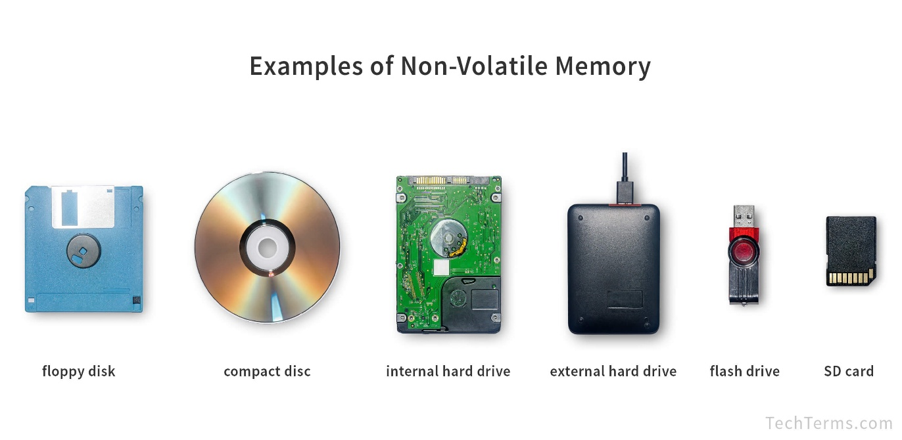

**3. Các loại cache:**

1.  **Hardware Cache:**

    1.  **CPU Cache:**

Caching trong bộ nhớ đệm CPU (CPU cache) là một kỹ thuật được sử dụng để
tăng tốc độ xử lý của bộ vi xử lý bằng cách lưu trữ tạm thời dữ liệu
hoặc lệnh mà CPU thường xuyên sử dụng trong một bộ nhớ nhỏ, nhanh hơn so
với bộ nhớ chính (RAM). Bộ nhớ đệm này nằm gần CPU, thường được tích hợp
trực tiếp trên cùng con chip, giúp giảm thời gian truy cập dữ liệu và
cải thiện hiệu suất tổng thể của hệ thống

1)  **CPU memory cache là gì?**

\- Máy tính có nhiều loại bộ nhớ với tốc độ khác nhau:

- Bộ nhớ chính (như ổ cứng hoặc SSD) lưu trữ dữ liệu lớn, chẳng hạn hệ
  điều hành và chương trình, nhưng truy cập chậm.

- RAM (Random Access Memory) nhanh hơn, lưu trữ tạm thời dữ liệu thường
  dùng để hỗ trợ hoạt động mượt mà của máy tính.

- CPU cache, nhanh nhất trong số này, nằm gần CPU nhất và lưu dữ liệu mà
  CPU cần truy cập ngay lập tức.

\- CPU memory cache, hay bộ nhớ đệm CPU, là một loại bộ nhớ siêu nhanh
nằm trong hoặc gần CPU, giúp tăng tốc độ xử lý dữ liệu. Vào những năm
1980, khi tốc độ CPU tăng nhanh nhưng RAM (bộ nhớ hệ thống) không theo
kịp, CPU cache ra đời để giải quyết vấn đề này.

\- Bộ nhớ máy tính có hệ thống phân cấp dựa trên tốc độ hoạt động của
nó. CPU cache đứng đầu hệ thống phân cấp bộ nhớ nhờ tốc độ vượt trội. Nó
sử dụng SRAM (Static RAM), một loại RAM tĩnh có thể chứa dữ liệu mà
không cần làm mới liên tục, khác với DRAM (Dynamic RAM) trong RAM hệ
thống, điều này khiến SRAM lý tưởng cho cache, giúp CPU xử lý nhanh hơn
bằng cách giảm thời gian chờ dữ liệu từ RAM hoặc bộ nhớ chính.

2)  **Cấu trúc của bộ nhớ đệm CPU:**

Bộ nhớ cache trong CPU được chia thành nhiều cấp, thường là L1, L2 và
L3, mỗi cấp có tốc độ và dung lượng khác nhau. Các cấp này hoạt động
theo thứ tự để cung cấp dữ liệu nhanh nhất cho CPU.

- L1 Cache (Level 1): Nhanh nhất và nhỏ nhất, thường có dung lượng từ
  8KB đến 64KB. L1 nằm trực tiếp trên chip CPU, được chia thành hai
  phần: cache lệnh (instructions) và cache dữ liệu (data). Nó phục vụ
  từng nhân CPU riêng lẻ.

- L2 Cache (Level 2): Lớn hơn và chậm hơn L1, dung lượng thường từ 256KB
  đến vài MB (1MB, 2MB...). L2 cũng nằm trên chip CPU hoặc rất gần, hỗ
  trợ một hoặc nhiều nhân CPU.

- L3 Cache (Level 3): Dung lượng lớn nhất (vài MB đến hàng chục MB)
  nhưng chậm hơn L2. L3 thường được chia sẻ giữa tất cả các nhân trong
  CPU đa lõi và nằm trên cùng chip.

> Khi CPU cần dữ liệu (ví dụ: từ một cú click chuột), nó kiểm tra L1
> trước. Nếu không tìm thấy (cache miss), nó chuyển sang L2, rồi L3, và
> cuối cùng là RAM hoặc ổ cứng nếu cần. Quá trình này diễn ra trong vài
> nano giây, nhanh đến mức người dùng không nhận ra. Nhờ hệ thống phân
> cấp này, CPU xử lý hiệu quả hơn, giảm thời gian chờ dữ liệu.

3)  **Cơ chế hoạt động:**

> Bộ nhớ đệm CPU hoạt động dựa trên nguyên tắc lưu trữ tạm thời các dữ
> liệu và lệnh mà CPU thường xuyên sử dụng, giúp tăng tốc độ xử lý. Khi
> CPU cần dữ liệu, nó kiểm tra bộ nhớ đệm trước. Quá trình này có hai
> trạng thái chính:

- Cache Hit: Nếu dữ liệu đã có trong bộ nhớ đệm (gọi là cache hit), CPU
  truy cập ngay lập tức mà không cần tìm trong bộ nhớ chính (RAM). Điều
  này giúp tiết kiệm thời gian vì bộ nhớ đệm nhanh hơn RAM rất nhiều.

- Cache Miss: Nếu dữ liệu không có trong bộ nhớ đệm (cache miss), CPU
  phải lấy dữ liệu từ cấp bộ nhớ cao hơn (L2, L3) hoặc từ RAM, thậm chí
  từ ổ cứng nếu cần. Dữ liệu sau đó được sao chép vào bộ nhớ đệm để các
  lần truy cập sau nhanh hơn. Cache miss làm chậm quá trình xử lý do độ
  trễ tăng lên khi CPU phải tìm kiếm ở các cấp bộ nhớ xa hơn.

> \- Cách CPU truy cập bộ nhớ đệm:

CPU kiểm tra dữ liệu theo thứ tự từ gần đến xa:

- Đầu tiên là L1 Cache (nhanh nhất, độ trễ thấp nhất, thường vài chục
  KB), nằm ngay trên chip CPU.

- Nếu không tìm thấy, CPU chuyển sang L2 Cache (lớn hơn, chậm hơn L1),
  rồi đến L3 Cache (dung lượng lớn nhất, thường vài MB, chia sẻ giữa các
  nhân CPU).

- Nếu vẫn không có, dữ liệu được lấy từ RAM và cuối cùng là ổ cứng.

Ví dụ, khi bạn mở một chương trình, CPU sẽ cần dữ liệu để xử lý. Nó kiểm
tra L1 trước. Nếu không tìm thấy (cache miss), CPU kiểm tra L2, rồi L3.
Nếu dữ liệu không có trong các cấp cache, nó được lấy từ RAM (hoặc ổ
cứng) và sao chép vào các cấp cache (thường bắt đầu từ L3, sau đó có thể
vào L2 và L1) để các lần truy cập sau nhanh hơn."

4)  **Tầm quan trọng của bộ nhớ đệm CPU:**

Bộ nhớ cache đóng vai trò quan trọng trong việc nâng cao hiệu suất hệ
thống máy tính bằng cách giảm độ trễ truy cập dữ liệu và tăng tốc độ xử
lý của CPU. Dưới đây là các lợi ích chính của bộ nhớ cache:

- Tăng tốc độ truy cập dữ liệu: Bộ nhớ cache lưu trữ các dữ liệu và lệnh
  mà CPU thường xuyên sử dụng, giúp giảm thời gian truy cập so với việc
  lấy từ RAM. Điều này đặc biệt quan trọng với các ứng dụng đòi hỏi hiệu
  năng cao như xử lý video, đồ họa 3D, và game, nơi tốc độ xử lý nhanh
  là yếu tố then chốt.

- Giảm tải cho bộ nhớ chính: Bằng cách lưu trữ dữ liệu thường dùng, bộ
  nhớ cache giảm áp lực lên RAM, cho phép RAM xử lý các tác vụ khác hiệu
  quả hơn. Điều này cải thiện độ trễ và tăng hiệu suất tổng thể của hệ
  thống.

- Tối ưu hóa tài nguyên: Các công nghệ như Intel Smart Cache cho phép
  các lõi CPU trong hệ thống đa lõi chia sẻ bộ nhớ cache một cách thông
  minh, đảm bảo sử dụng tài nguyên hiệu quả và tăng hiệu suất xử lý.

- Tiết kiệm điện năng: Bộ nhớ cache giảm số lần CPU phải truy cập RAM
  (một quá trình tiêu tốn nhiều năng lượng hơn), từ đó giúp tiết kiệm
  điện, đặc biệt hữu ích trong các thiết bị di động hoặc máy tính xách
  tay.

- Hỗ trợ đa nhiệm và cải thiện trải nghiệm người dùng: Trong môi trường
  đa nhiệm, bộ nhớ cache giúp CPU xử lý nhiều tác vụ đồng thời mà không
  bị chậm lại. Điều này rất quan trọng với các máy chủ, hệ thống xử lý
  dữ liệu lớn, hoặc các tác vụ hàng ngày như mở ứng dụng, duyệt web, và
  chơi game, mang lại trải nghiệm mượt mà hơn.

> Mặc dù có nhiều lợi ích, bộ nhớ cache cũng tồn tại một số hạn chế:

- Dung lượng hạn chế: Bộ nhớ cache (thường chỉ vài KB đến vài MB) nhỏ
  hơn nhiều so với RAM, dẫn đến hiện tượng cache miss khi dữ liệu không
  có sẵn. Điều này gây độ trễ vì CPU phải truy cập RAM hoặc ổ cứng. Để
  khắc phục, các nhà sản xuất có thể tăng dung lượng cache (như L3 cache
  lên đến 128MB trong một số CPU hiện đại) hoặc sử dụng thuật toán dự
  đoán dữ liệu thông minh hơn (prefetching) để giảm cache miss.

- Chi phí và diện tích vật lý: Bộ nhớ cache sử dụng SRAM (Static RAM),
  nhanh nhưng đắt hơn DRAM (Dynamic RAM) trong RAM. Tăng dung lượng hoặc
  cải thiện cấu trúc cache sẽ làm tăng chi phí sản xuất và diện tích
  trên chip, đặc biệt trong các thiết bị nhúng hoặc di động. Để giải
  quyết, các nhà thiết kế thường cân bằng giữa hiệu suất và chi phí, ưu
  tiên tối ưu hóa thuật toán cache thay vì tăng kích thước vật lý.

- Tính không nhất quán dữ liệu (cache coherence): Vì dữ liệu trong cache
  là bản sao tạm thời từ RAM, nếu không được cập nhật đúng cách, dữ liệu
  có thể trở nên lỗi thời, đặc biệt trong hệ thống đa lõi nơi nhiều lõi
  CPU chia sẻ dữ liệu. Ví dụ, nếu một lõi cập nhật dữ liệu trong cache
  của nó mà không đồng bộ với các lõi khác, sẽ dẫn đến lỗi. Để khắc
  phục, các giao thức như MESI (Modified, Exclusive, Shared, Invalid)
  được sử dụng để đảm bảo tính nhất quán dữ liệu giữa các cache và RAM.

5)  **Các công nghệ và xu hướng hiện đại:**

Bộ nhớ cache CPU ngày càng được cải tiến để đáp ứng nhu cầu hiệu năng
cao của các hệ thống máy tính hiện đại. Dưới đây là các công nghệ và xu
hướng nổi bật:

1.  **Bộ nhớ cache đa tầng (Multi-Level Cache) và L4 Cache:**

Các CPU cao cấp hiện nay đã tích hợp thêm L4 cache, bổ sung một tầng bộ
nhớ đệm mới ngoài L1, L2, L3. L4 cache thường có dung lượng lớn hơn L3
(lên đến hàng chục MB) và được sử dụng để lưu trữ dữ liệu cho các ứng
dụng đòi hỏi tài nguyên cao, như xử lý đồ họa 3D hoặc máy học. Ví dụ,
một số CPU của Intel (như dòng Xeon) sử dụng L4 cache làm bộ nhớ đệm
eDRAM, giúp giảm độ trễ khi truy cập RAM và tăng hiệu suất tổng thể.

2.  **Bộ nhớ Non-Volatile (NVM) cho cache:**

Bộ nhớ không khả biến (Non-Volatile Memory - NVM), như 3D XPoint (Intel
Optane), đang được nghiên cứu để sử dụng trong L4 cache. NVM có ưu điểm
là dung lượng lớn, độ bền cao, và giá thành rẻ hơn DRAM truyền thống.
Tuy nhiên, hạn chế của NVM là tốc độ truy cập chậm hơn và độ trễ cao hơn
so với SRAM (dùng trong L1-L3). Để khắc phục, các nhà thiết kế thường
kết hợp NVM với SRAM trong cấu trúc lai (hybrid cache), tận dụng ưu điểm
của cả hai.

3.  **Công nghệ Smart Cache:**

Được Intel tiên phong, Smart Cache cho phép các lõi CPU trong hệ thống
đa lõi chia sẻ bộ nhớ cache (thường là L3) một cách linh hoạt. Thay vì
mỗi lõi có bộ nhớ đệm riêng, Smart Cache phân bổ tài nguyên động dựa
trên nhu cầu, giảm lãng phí và cải thiện hiệu suất đa nhiệm. Công nghệ
này đặc biệt hữu ích trong các tác vụ như xử lý dữ liệu lớn hoặc chơi
game, nơi nhiều lõi cần truy cập dữ liệu chung.

4.  **Non-Uniform Cache Access (NUCA):**

NUCA là kỹ thuật tối ưu hóa cho các bộ nhớ cache lớn trong CPU đa lõi.
NUCA chia bộ nhớ cache thành các vùng (banks) với thời gian truy cập
khác nhau, tùy thuộc vào khoảng cách vật lý đến lõi CPU. Dữ liệu thường
xuyên sử dụng được lưu ở vùng gần lõi (truy cập nhanh), trong khi dữ
liệu ít dùng hơn được lưu ở vùng xa hơn (truy cập chậm hơn). NUCA giúp
giảm độ trễ trung bình và tăng hiệu suất, nhưng nhược điểm là tăng độ
phức tạp trong thiết kế và quản lý cache.

**5. Giao thức Cache Coherence (MESI và MOESI):**

Trong hệ thống đa lõi, **Cache Coherence Protocols** đảm bảo tính nhất
quán dữ liệu giữa các lõi CPU, tránh tình trạng một lõi đọc dữ liệu lỗi
thời từ cache của nó. Hai giao thức phổ biến là:

- **MESI (Modified, Exclusive, Shared, Invalid):**

  - **Modified**: Dữ liệu trong cache đã được sửa đổi và khác với bản
    sao trong RAM.

  - **Exclusive**: Dữ liệu chỉ có trong cache của lõi này, chưa được
    chia sẻ.

  - **Shared**: Dữ liệu được chia sẻ giữa nhiều lõi, các bản sao giống
    nhau.

  - **Invalid**: Dữ liệu không hợp lệ, cần cập nhật từ RAM.

- **MOESI (Modified, Owned, Exclusive, Shared, Invalid):**

> Tương tự MESI, nhưng bổ sung trạng thái Owned: Lõi này sở hữu dữ liệu
> và có trách nhiệm cập nhật RAM khi cần, cho phép chia sẻ dữ liệu đã
> sửa đổi mà không cần ghi ngay vào RAM, giảm tải cho bộ nhớ chính.

1.  **GPU cache:**

    1.  **Bộ nhớ đệm GPU:**

\- Bên cạnh bộ nhớ cache CPU, bộ nhớ cache GPU cũng đóng vai trò quan
trọng trong việc tối ưu hóa hiệu năng của các hệ thống xử lý đồ họa và
tính toán song song. GPU (Graphics Processing Unit), hay còn gọi là bộ
xử lý đồ họa, là thành phần chuyên dụng trong máy tính, chịu trách nhiệm
xử lý các tác vụ đồ họa phức tạp và các phép tính song song.

\- GPU cache là bộ nhớ đệm tốc độ cao được tích hợp bên trong GPU, lưu
trữ dữ liệu và lệnh mà GPU thường xuyên truy cập. Bằng cách giảm thời
gian truy xuất dữ liệu từ bộ nhớ chính (thường là VRAM hoặc RAM hệ
thống, vốn chậm hơn nhiều), GPU cache giúp tăng tốc độ xử lý, cải thiện
đáng kể hiệu suất đồ họa và tính toán.

1)  **Cấu trúc của bộ nhớ đệm CPU:**

Bộ nhớ cache trong GPU cũng được thiết kế theo kiến trúc đa tầng, tương
tự CPU, nhưng được tối ưu hóa cho xử lý đồ họa và tính toán song song.
GPU cache thường bao gồm các cấp L1 và L2, cùng với các loại cache
chuyên biệt như Texture Cache và Constant Cache, nhằm đáp ứng nhu cầu
truy cập dữ liệu nhanh chóng của hàng nghìn luồng xử lý đồng thời**.**

- L1 Cache: Nằm gần các lõi xử lý của GPU, được gọi là Streaming
  Multiprocessors (SMs) trong GPU NVIDIA hoặc Compute Units trong GPU
  AMD. Mỗi SM thường có L1 cache riêng (dung lượng khoảng 128KB trong
  GPU NVIDIA RTX 4090), lưu trữ dữ liệu và lệnh thường xuyên sử dụng. L1
  cache giúp giảm độ trễ khi truy cập dữ liệu cục bộ, đặc biệt trong các
  tác vụ tính toán song song như render khung hình hoặc huấn luyện mô
  hình AI.

- L2 Cache: Lớn hơn L1 (thường vài MB, ví dụ: 72MB trong RTX 4090), L2
  cache được chia sẻ giữa tất cả các SMs trong GPU. L2 cache đóng vai
  trò trung gian, lưu trữ dữ liệu không có trong L1, giúp giảm độ trễ
  khi truy cập bộ nhớ đồ họa (VRAM) hoặc RAM hệ thống. Với dung lượng
  lớn, L2 cache đặc biệt hữu ích trong các tác vụ như ray tracing, nơi
  cần truy cập lượng dữ liệu lớn từ VRAM.

- Texture Cache: Là một phần chuyên biệt (thường tích hợp trong L1 hoặc
  L2), được tối ưu hóa để xử lý dữ liệu đồ họa như texture và hình ảnh.
  Texture Cache hỗ trợ truy cập ngẫu nhiên nhanh chóng, đặc biệt với các
  truy vấn không gian hai chiều (2D spatial queries), giúp tăng hiệu
  suất render trong game hoặc ứng dụng 3D. Nhiều GPU hiện đại (như dòng
  NVIDIA GeForce) hỗ trợ nén texture, giảm lượng dữ liệu truyền tải,
  tiết kiệm băng thông VRAM và cải thiện hiệu suất tổng thể.

- Constant Cache: Cũng là một phần chuyên biệt của L1 cache, dùng để lưu
  trữ các hằng số không thay đổi trong quá trình xử lý (ví dụ: thông số
  ánh sáng trong render đồ họa). Vì dữ liệu trong Constant Cache không
  bị ghi đè, việc truy cập rất nhanh và không gây xung đột, giúp GPU
  quản lý các hằng số hiệu quả trong các tác vụ như tính toán shader.

**So sánh với CPU cache:**

Khác với CPU cache (tập trung vào giảm độ trễ cho các tác vụ tuần tự),
GPU cache được thiết kế để tối ưu hóa băng thông và hỗ trợ tính toán
song song. GPU cache thường có dung lượng lớn hơn (đặc biệt là L2) để xử
lý hàng nghìn luồng dữ liệu cùng lúc, nhưng độ trễ trung bình cao hơn do
số lượng truy cập đồng thời lớn.

Ví dụ, trong khi L1 cache của CPU có độ trễ khoảng 1-2 chu kỳ, L1 cache
của GPU có thể lên đến 20-30 chu kỳ, nhưng bù lại băng thông cao hơn
nhiều để đáp ứng nhu cầu đồ họa.

**Xu hướng hiện đại:**

Các GPU mới như NVIDIA Ada Lovelace (RTX 40-series) tăng dung lượng L2
cache và tích hợp các thuật toán dự đoán dữ liệu (prefetching) để giảm
cache miss. Ngoài ra, một số GPU thử nghiệm L0 cache (dành riêng cho
texture hoặc instruction), giúp tăng hiệu suất trong các tác vụ đồ họa
phức tạp như ray tracing hoặc xử lý video 8K.

2)  **Cơ chế hoạt động:**

GPU cache hoạt động dựa trên **nguyên lý địa phương (locality
principle),** một khái niệm quan trọng trong kiến trúc máy tính giúp tối
ưu hóa hiệu suất bộ nhớ đệm. Nguyên lý này bao gồm hai khía cạnh chính:
**địa phương không gian (spatial locality)** và **địa phương thời gian
(temporal locality),** được GPU tận dụng để tăng tốc xử lý đồ họa và
tính toán song song.

- **Spatial Locality (Địa phương không gian):** Nếu một địa chỉ bộ nhớ
  được truy cập, các địa chỉ lân cận có khả năng được truy cập tiếp
  theo. Trong xử lý đồ họa, GPU thường truy cập các pixel hoặc texel gần
  nhau, ví dụ khi render hình ảnh và áp dụng bộ lọc màu sắc. Để tối ưu
  hóa việc truy cập, Texture Cache được thiết kế để lưu trữ các khối
  texture lớn, giảm số lần truy cập VRAM (bộ nhớ đồ họa chính của GPU),
  từ đó tăng hiệu suất render.

- **Temporal Locality (Địa phương thời gian):** Nếu một địa chỉ bộ nhớ
  được truy cập, nó có khả năng được truy cập lại trong tương lai gần.
  GPU tận dụng điều này bằng cách lưu trữ các hằng số (constant data)
  trong Constant Cache, ví dụ như thông số ánh sáng trong shader. Vì các
  hằng số không thay đổi, Constant Cache cho phép truy cập nhanh và hiệu
  quả, giảm độ trễ.

**Luồng truy cập dữ liệu trong GPU cache:**

Khi một chương trình đồ họa yêu cầu dữ liệu, GPU kiểm tra L1 cache trước
(nằm gần các lõi xử lý - Streaming Multiprocessors). Nếu dữ liệu có sẵn
(cache hit), GPU truy cập ngay lập tức. Nếu không (cache miss), GPU kiểm
tra L2 cache, vốn lớn hơn và được chia sẻ giữa các SMs. Nếu L2 cũng
không có, dữ liệu được lấy từ VRAM (bộ nhớ đồ họa chính, chậm hơn
nhiều). Sau đó, dữ liệu này được sao chép vào L2 và L1 để các lần truy
cập sau nhanh hơn. Quá trình này diễn ra trong vài nano giây, đảm bảo
hiệu suất cao cho các tác vụ đồ họa.

**Quản lý GPU cache:**

Để tối ưu hóa việc sử dụng cache, GPU áp dụng các thuật toán quản lý dữ
liệu:

- LRU (Least Recently Used): Loại bỏ dữ liệu ít được truy cập nhất để
  nhường chỗ cho dữ liệu mới.

- FIFO (First In, First Out): Loại bỏ dữ liệu cũ nhất trong cache.

- PLRU (Pseudo-Least Recently Used): Kết hợp ưu điểm của LRU và FIFO, sử
  dụng các bit trạng thái để ước lượng dữ liệu ít dùng, giảm chi phí
  tính toán so với LRU thuần túy.

- Adaptive Cache Replacement: Điều chỉnh thuật toán dựa trên mẫu truy
  cập dữ liệu, ví dụ ưu tiên giữ texture trong Texture Cache nếu GPU
  đang render nhiều khung hình.

3)  **Tầm quan trọng của bộ nhớ đệm GPU:**

Bộ nhớ cache GPU đóng vai trò quan trọng trong việc nâng cao hiệu suất
xử lý đồ họa và tính toán song song, giúp giảm độ trễ truy cập dữ liệu
và tăng tốc độ hoạt động của GPU. Nhờ cache, các ứng dụng yêu cầu hiệu
năng cao như đồ họa, xử lý video, và game chạy mượt mà và nhanh hơn.
Dưới đây là các lợi ích và hạn chế của GPU, với vai trò của bộ nhớ cache
được làm rõ:

**Lợi ích của GPU và vai trò của bộ nhớ cache:**

- Tăng tốc xử lý song song: GPU có hàng nghìn lõi xử lý (ví dụ: NVIDIA
  RTX 4090 có hơn 16.000 lõi CUDA), cho phép thực hiện nhiều tác vụ đồng
  thời. Bộ nhớ cache GPU (L1, L2, Texture Cache) lưu trữ dữ liệu thường
  xuyên truy cập, như ma trận trong học máy hoặc texture trong render,
  giúp giảm độ trễ khi truy cập VRAM. Điều này rất quan trọng trong các
  ứng dụng như phân tích dữ liệu, tính toán khoa học, và huấn luyện mô
  hình deep learning (ví dụ: nhận dạng khuôn mặt, thị giác máy tính).

- Render đồ họa nhanh chóng: GPU chuyên xử lý đồ họa, render hình ảnh 3D
  và hiệu ứng chân thực (như bóng động, phản xạ ánh sáng, giảm nhiễu)
  một cách mượt mà. Texture Cache lưu trữ các khối texture lớn, giảm số
  lần truy cập VRAM, từ đó tăng tốc render trong game (như Cyberpunk
  2077 ở 4K) và ứng dụng thiết kế 3D. Các công nghệ như NVIDIA CUDA, AMD
  Stream, và OpenCL tận dụng khả năng tính toán song song của GPU, kết
  hợp với cache để tối ưu hiệu suất.

- Mô phỏng phức tạp: GPU hỗ trợ mô phỏng vật lý (như động lực học chất
  lỏng, mô phỏng phân tử) nhờ khả năng tính toán ma trận nhanh. L1 và L2
  cache lưu trữ dữ liệu tạm thời, giảm độ trễ khi xử lý các phép tính số
  học lớn, giúp các nhà khoa học thực hiện nghiên cứu tiên tiến.

- Trải nghiệm VR/AR và chơi game: GPU mang lại hình ảnh sống động trong
  game và trải nghiệm VR/AR chân thực, hỗ trợ công nghệ như 8K và HDR.
  Texture Cache và Constant Cache đảm bảo truy cập nhanh texture và hằng
  số, giảm độ trễ khung hình, đặc biệt trong các game AAA hoặc ứng dụng
  VR.

- Chi phí hiệu quả và khả năng mở rộng: GPU thực hiện các tác vụ tính
  toán nặng với chi phí phần cứng thấp hơn so với việc dùng nhiều CPU.
  Bộ nhớ cache giảm tải cho VRAM, giúp GPU xử lý hiệu quả hơn. Hệ thống
  có thể mở rộng bằng cách thêm GPU mà không cần thay đổi kiến trúc.

*Render các phần mềm 3d*

*Xử lý tác vụ trong các tựa game AAA*

**Hạn chế của GPU và cách khắc phục:**

- Tiêu thụ năng lượng cao: GPU hiệu suất cao (như NVIDIA A100) tiêu thụ
  nhiều điện (lên đến 400W), tăng chi phí vận hành và ảnh hưởng môi
  trường. Các nhà sản xuất đang phát triển công nghệ tiết kiệm năng
  lượng, như NVIDIA Max-Q, để giảm tiêu thụ điện trong GPU di động.

- Khó lập trình: Lập trình GPU đòi hỏi kiến thức về CUDA, OpenCL, hoặc
  Vulkan, và hiểu biết về kiến trúc song song, khiến việc phát triển và
  debug phức tạp. Các công cụ như NVIDIA Nsight và AMD ROCm đang được
  cải thiện để hỗ trợ lập trình viên, cùng với sự phát triển của các
  framework như TensorFlow và PyTorch, giúp đơn giản hóa việc lập trình
  GPU.

- Kích thước và khả năng tương thích: GPU thường lớn hơn CPU, làm tăng
  kích thước hệ thống và giảm tính di động. Một số phần mềm không tận
  dụng được GPU, dẫn đến hiệu suất không tối ưu. Các nhà sản xuất đang
  phát triển GPU tích hợp (như AMD APUs) để giảm kích thước, và cải
  thiện khả năng tương thích qua các API chuẩn như DirectX và Vulkan.

- Hạn chế trong tác vụ tuần tự: GPU không hiệu quả trong các tác vụ tuần
  tự hoặc phụ thuộc dữ liệu (data-dependent tasks), vì được thiết kế cho
  tính toán song song. Để khắc phục, các hệ thống thường kết hợp CPU và
  GPU, với CPU xử lý tác vụ tuần tự và GPU tập trung vào tác vụ song
  song.

4)  **Các công nghệ và xu hướng hiện đại:**

Công nghệ và xu hướng hiện đại áp dụng cho GPU đang phát triển nhanh
chóng, mở ra nhiều cơ hội mới trong tính toán và đồ họa. Bộ nhớ cache
GPU đóng vai trò quan trọng trong việc hỗ trợ các công nghệ này, giúp
giảm độ trễ truy cập dữ liệu và tăng hiệu suất xử lý. Dưới đây là các xu
hướng nổi bật:

1.  **Tăng tốc Machine Learning và Deep Learning:**

GPU là lựa chọn hàng đầu cho huấn luyện mô hình học máy (ML) và học sâu
(DL) nhờ khả năng tính toán song song. Trong ML/DL, các phép tính ma
trận lớn (như backpropagation, stochastic gradient descent) được thực
hiện nhanh hơn hàng chục lần so với CPU. Bộ nhớ cache GPU (L1, L2) lưu
trữ trọng số mô hình và dữ liệu huấn luyện, giảm độ trễ khi truy cập
VRAM. Ví dụ, trong NVIDIA A100, Tensor Cores (đơn vị chuyên biệt cho
tính toán ma trận) kết hợp với L2 cache 141MB giúp tăng tốc huấn luyện
mô hình AI gấp 20 lần so với thế hệ trước. Cache cũng lưu trữ kết quả dự
đoán để tái sử dụng, hữu ích trong các ứng dụng như nhận dạng khuôn mặt
hoặc thị giác máy tính.

2.  **Mixed-Precision Arithmetic (MPA):**

MPA sử dụng các định dạng số có độ chính xác khác nhau (như FP16, FP32)
để tăng tốc tính toán trong deep learning mà không làm giảm độ chính xác
mô hình.

Cache GPU hỗ trợ MPA bằng cách lưu trữ dữ liệu ở định dạng nén (như
FP16), giảm băng thông VRAM và tăng hiệu suất. Ví dụ, khi huấn luyện mô
hình trên GPU NVIDIA H100, MPA kết hợp với cache giúp giảm thời gian
huấn luyện đến 50% so với tính toán toàn chính xác (FP32).

3.  **Real-Time Ray Tracing và Rendering:**

Ray tracing mô phỏng cách ánh sáng tương tác trong môi trường 3D, tạo ra
hình ảnh chân thực với bóng, phản xạ, và khúc xạ chính xác. Real-time
ray tracing, được hỗ trợ bởi NVIDIA RTX (dòng RTX 40-series) và AMD
Radeon RX 6000 series, mang lại trải nghiệm đồ họa sống động trong game
và ứng dụng 3D.

Bộ nhớ cache GPU (đặc biệt Texture Cache) lưu trữ dữ liệu mô hình 3D và
texture, giảm độ trễ khi truy cập VRAM. Cache cũng lưu trữ kết quả
render của các khung hình trước để tái sử dụng trong các khung hình tiếp
theo, đặc biệt hiệu quả khi camera di chuyển chậm (như trong game
Control với ray tracing bật).

4.  **AI-Powered Rendering:**

AI cải thiện quá trình rendering bằng cách tự động hóa các tác vụ như
thiết lập ánh sáng, áp dụng vật liệu, hoặc tối ưu hóa hiệu suất. Ví dụ,
NVIDIA DLSS (Deep Learning Super Sampling) sử dụng AI để upscale hình
ảnh từ độ phân giải thấp lên cao (như 1080p lên 4K), vừa tăng chất lượng
hình ảnh vừa giảm tải cho GPU. Cache GPU lưu trữ các trọng số mô hình AI
và dữ liệu khung hình, giúp tăng tốc quá trình upscale và render, mang
lại trải nghiệm mượt mà trong game.

5.  **Hybrid Rendering và Mô phỏng Vật lý:**

- Hybrid Rendering: Kết hợp ray tracing với các kỹ thuật truyền thống
  như rasterization để cân bằng giữa chất lượng hình ảnh và hiệu suất.
  Cache GPU lưu trữ dữ liệu ánh sáng và texture, giảm độ trễ trong các
  cảnh phức tạp.

- GPU-Accelerated Physics Simulation: GPU tăng tốc mô phỏng vật lý (như
  động lực học chất lỏng, mô phỏng hạt nhân) nhờ tính toán song song. L1
  cache lưu trữ dữ liệu tạm thời (như vị trí hạt), giúp GPU xử lý hàng
  triệu phép tính mỗi giây, hữu ích trong nghiên cứu khoa học và thiết
  kế kỹ thuật.

1.  **Disk Cache:**

Bộ nhớ đệm đĩa (Disk Cache) là một thành phần quan trọng trong hệ thống
lưu trữ, giúp tăng tốc độ đọc và ghi dữ liệu từ ổ đĩa cứng (HDD) hoặc ổ
SSD.

1)  **Khái niệm:**

Disk Cache có thể là bộ nhớ tích hợp trên ổ đĩa (onboard cache, thường
8MB-256MB trong HDD hiện đại) hoặc một phần RAM được hệ điều hành sử
dụng để làm bộ nhớ đệm. Bằng cách lưu trữ dữ liệu đã truy cập gần đây và
dữ liệu liền kề có khả năng được truy cập tiếp theo, Disk Cache giảm độ
trễ truy xuất từ ổ đĩa (chậm hơn nhiều so với RAM), từ đó cải thiện hiệu
suất hệ thống.

2)  **Cách disk cache hoạt động:**

Disk Cache hoạt động dựa trên hai cơ chế chính:

- Đọc trước (Read-Ahead): Khi hệ thống đọc một khối dữ liệu từ ổ đĩa,
  các khối liền kề cũng được tải vào cache, dự đoán rằng chúng sẽ được
  truy cập tiếp theo (dựa trên nguyên lý địa phương không gian - spatial
  locality).

- Ghi sau (Write-Behind): Dữ liệu ghi được lưu vào cache trước, sau đó
  được ghi xuống ổ đĩa theo cách tối ưu (ví dụ: gom nhóm các thao tác
  ghi để giảm số lần truy cập ổ đĩa). Điều này tận dụng tốc độ nhanh của
  RAM, giảm thời gian chờ.

*Disk cache*

Khi dữ liệu trong cache bị thay đổi, hệ thống sử dụng hai chính sách để
đồng bộ với ổ đĩa:

- Write-Through: Dữ liệu được ghi đồng thời vào cache và ổ đĩa, đảm bảo
  tính toàn vẹn nhưng chậm hơn.

*Write-through*

- Write-Back: Dữ liệu chỉ ghi vào cache trước, sau đó được đồng bộ với ổ
  đĩa sau, nhanh hơn nhưng có nguy cơ mất dữ liệu nếu mất điện

3)  **Kiến trúc của disk cache:**

Disk Cache bao gồm các thành phần chính:

- Read Cache: Lưu trữ dữ liệu đã đọc gần đây từ ổ đĩa, giúp tăng tốc các
  yêu cầu đọc tiếp theo.

- Write Cache: Đệm các thao tác ghi, gom nhóm và tối ưu hóa trước khi
  ghi xuống ổ đĩa, cải thiện hiệu suất ghi.

- Memory Buffer:

  - RAM Cache: Sử dụng RAM để lưu trữ dữ liệu tạm thời, nhanh nhưng mất
    dữ liệu nếu mất điện.

  - Non-Volatile Memory (NVM): Một số ổ đĩa cao cấp (như SSD NVMe) dùng
    NVM để bảo vệ dữ liệu trong trường hợp mất điện.

- Cache Controller: Quản lý việc lưu trữ và truy xuất dữ liệu, sử dụng
  các thuật toán như LRU (Least Recently Used) (loại bỏ dữ liệu ít dùng
  nhất) và FIFO (First In, First Out) (loại bỏ dữ liệu cũ nhất) để tối
  ưu không gian cache.

4)  **Tác dụng của disk cache:**

Bộ nhớ đệm đĩa (Disk Cache) mang lại nhiều lợi ích quan trọng, giúp tăng
hiệu suất hệ thống và cải thiện trải nghiệm người dùng. Dưới đây là các
lợi ích chính, cùng với vai trò cụ thể của Disk Cache:

1.  **Tăng tốc độ truy cập dữ liệu:**

- **Giảm độ trễ đọc**: Disk Cache lưu trữ dữ liệu đã truy cập gần đây
  trong RAM hoặc bộ nhớ tích hợp trên ổ đĩa (onboard cache), nhanh hơn
  nhiều so với truy xuất trực tiếp từ HDD/SSD. Ví dụ, với một HDD có tốc
  độ đọc 200MB/s, Disk Cache (thường 64MB-256MB) có thể giảm thời gian
  truy cập từ 10ms xuống dưới 1ms nếu dữ liệu đã có trong cache (cache
  hit).

- **Cơ chế đọc trước (Read-Ahead):** Disk Cache dự đoán và tải trước các
  khối dữ liệu liền kề, dựa trên nguyên lý địa phương không gian
  (spatial locality). Điều này đặc biệt hữu ích trong HDD khi đọc các
  tệp lớn (như video), giảm thời gian chờ.

2.  **Cải thiện hiệu suất ghi:**

- **Ghi nhanh hơn**: Write Cache lưu dữ liệu ghi vào bộ nhớ đệm trước,
  cho phép hệ thống xác nhận thao tác ghi hoàn tất ngay lập tức từ góc
  độ ứng dụng, trong khi dữ liệu được ghi xuống ổ đĩa sau
  (write-behind). Điều này tăng tốc độ ghi, đặc biệt trong các tác vụ
  ghi liên tục như sao chép tệp lớn.

- **Quản lý ghi hiệu quả**: Disk Cache gom nhóm các thao tác ghi nhỏ lẻ,
  tối ưu hóa việc ghi xuống ổ đĩa, giảm số lần truy cập vật lý. Với SSD,
  điều này giúp giảm chu kỳ ghi/xóa NAND, kéo dài tuổi thọ ổ.

3.  **Tăng hiệu suất hệ thống tổng thể:**

- **Giảm tải cho ổ đĩa**: Bằng cách giảm số lần truy cập trực tiếp đến
  HDD/SSD, Disk Cache giảm tải cho ổ đĩa, cải thiện hiệu suất tổng thể
  và tối ưu hóa sử dụng tài nguyên hệ thống (như RAM).

- **Hiệu quả với SSD**: Trong SSD NVMe (như Samsung 990 Pro), Disk Cache
  (thường là DRAM 1-2GB) giúp tăng tốc đọc/ghi lên đến 7.450MB/s, đặc
  biệt khi xử lý dữ liệu lớn như chỉnh sửa video 4K.

4.  **Cải thiện trải nghiệm người dùng:**

- **Phản hồi nhanh hơn**: Thời gian truy cập dữ liệu nhanh hơn giúp hệ
  thống phản hồi mượt mà, đặc biệt trong các ứng dụng yêu cầu độ trễ
  thấp như cơ sở dữ liệu trực tuyến (OLTP) hoặc khởi động hệ điều hành
  (giảm thời gian khởi động Windows từ 30 giây xuống 15 giây).

- **Ứng dụng thực tế:** Trong chỉnh sửa video, Disk Cache lưu trữ các
  khung hình đã đọc, tăng tốc độ phát lại và render, mang lại trải
  nghiệm liền mạch.

5.  **Tăng độ an toàn dữ liệu (trong một số trường hợp):**

- **Bảo vệ dữ liệu tạm thời**: Một số ổ đĩa cao cấp (như SSD doanh
  nghiệp) dùng non-volatile memory (NVM) trong Write Cache để bảo vệ dữ
  liệu trong trường hợp mất điện, giảm nguy cơ mất dữ liệu trong
  write-back cache. Ví dụ, SSD Intel Optane dùng 3D XPoint làm NVM, đảm
  bảo tính toàn vẹn dữ liệu

**Hạn chế của Disk Cache:**

- **Nguy cơ mất dữ liệu**: Trong write-back cache, dữ liệu trong RAM có
  thể bị mất nếu mất điện. Giải pháp là dùng NVM hoặc pin dự phòng (như
  trong SSD doanh nghiệp).

- **Dung lượng hạn chế**: Cache nhỏ (vài MB đến vài GB) có thể bị đầy,
  dẫn đến cache miss. Các thuật toán như LRU và Adaptive Cache
  Replacement giúp ưu tiên dữ liệu quan trọng.

5)  **Tương lai của Disk Cache:**

Sự phát triển của công nghệ lưu trữ và nhu cầu ngày càng cao từ các ứng
dụng hiện đại đang định hình tương lai của bộ nhớ đệm đĩa (Disk Cache).
Dưới đây là các xu hướng nổi bật và vai trò của Disk Cache trong bối
cảnh mới:

1.  **Tăng hiệu suất với SSD và NVMe:**

Sự phổ biến của ổ SSD, đặc biệt là SSD NVMe (Non-Volatile Memory
Express), đang nâng cao hiệu suất của Disk Cache. NVMe cung cấp tốc độ
đọc/ghi vượt trội (lên đến 7.450MB/s trong Samsung 990 Pro, so với
200MB/s của HDD) và độ trễ thấp hơn nhiều (dưới 20µs so với 4ms của
HDD). Điều này làm cho Disk Cache hiệu quả hơn trong việc giảm độ trễ,
đặc biệt khi xử lý dữ liệu lớn. Tuy nhiên, vì SSD đã rất nhanh, vai trò
của cơ chế đọc trước (read-ahead) giảm đi, trong khi Write Cache vẫn
quan trọng để tối ưu hóa ghi và kéo dài tuổi thọ NAND.

2.  **Tích hợp bộ nhớ không bay hơi (NVM):**

Công nghệ bộ nhớ không bay hơi (NVM) như 3D XPoint (phát triển bởi Intel
và Micron) và Intel Optane đang mở ra khả năng mới cho Disk Cache. 3D
XPoint có tốc độ gần bằng DRAM (độ trễ ~100ns so với 15ns của DRAM)
nhưng không mất dữ liệu khi mất điện, phù hợp để làm bộ nhớ đệm trung
gian giữa RAM và SSD.

Ví dụ, Intel Optane được dùng trong SSD doanh nghiệp làm Write Cache,
đảm bảo tính toàn vẹn dữ liệu trong trường hợp mất điện, đồng thời tăng
tốc độ truy cập lên đến 2.000MB/s. Trong tương lai, NVM có thể thay thế
DRAM trong Disk Cache, giảm chi phí và tăng độ bền.

3.  **Quản lý thông minh với AI và máy học:**

Trí tuệ nhân tạo (AI) và máy học (ML) đang được tích hợp để tối ưu hóa
quản lý Disk Cache. Các thuật toán AI có thể dự đoán dữ liệu nào sẽ được
truy cập (dựa trên mẫu truy cập), ưu tiên lưu trữ chúng trong cache,
giảm tỷ lệ cache miss.

Ví dụ, trong các hệ thống big data, AI có thể dự đoán các khối dữ liệu
thường xuyên truy cập (như kết quả truy vấn cơ sở dữ liệu), tăng tốc độ
xử lý lên đến 30%. Ngoài ra, ML có thể điều chỉnh thuật toán thay thế
cache (như LRU, FIFO) theo thời gian thực, tối ưu hóa hiệu suất trong
các ứng dụng như phân tích dữ liệu lớn hoặc máy chủ web.

4.  **Hỗ trợ xử lý dữ liệu lớn (Big Data):**

Các ứng dụng big data yêu cầu truy xuất và lưu trữ dữ liệu lớn một cách
nhanh chóng. Disk Cache sẽ đóng vai trò quan trọng trong việc giảm tải
cho hệ thống lưu trữ chính (HDD/SSD), lưu trữ tạm thời các khối dữ liệu
thường xuyên truy cập (như tệp log, kết quả truy vấn).

Ví dụ, trong một cụm Hadoop, Disk Cache có thể giảm thời gian truy vấn
từ 10 giây xuống 2 giây bằng cách lưu trữ dữ liệu trung gian trong RAM.

5.  **Xu hướng mới:**

- **Host Memory Buffer (HMB):** SSD NVMe không có DRAM (DRAM-less) ngày
  càng phổ biến trong thiết bị giá rẻ. HMB cho phép SSD dùng một phần
  RAM hệ thống (thường 64MB-256MB) làm Disk Cache, tăng hiệu suất
  đọc/ghi mà không cần DRAM tích hợp. Ví dụ, SSD Kingston NV2 dùng HMB
  đạt tốc độ đọc 3.500MB/s, gần bằng SSD có DRAM.

- **Tích hợp với lưu trữ đám mây**: Disk Cache có thể được mở rộng để
  lưu trữ dữ liệu từ đám mây, giảm độ trễ khi truy cập dữ liệu từ xa. Ví
  dụ, các hệ thống hybrid cloud dùng Disk Cache để lưu trữ tệp tạm thời,
  tăng tốc độ truy cập dữ liệu từ AWS S3.

**2. Network cache:**

1.  **Khái niệm:**

**-** Network Cache là bộ nhớ đệm lưu trữ dữ liệu yêu cầu mạng từ trước
đó.

\- Network Cache thường nằm **ở tầng 7 (Tầng ứng dụng)** trong mô hình
OSI. Cụ thể:

- **Browser cache** và **CDN cache** hoạt động ở tầng ứng dụng (tầng 7),
  nơi lưu trữ các tài nguyên HTTP/HTTPS như HTML, hình ảnh, hoặc tệp JS.

- Server cache (như Redis, Memcached) cũng thuộc tầng ứng dụng, lưu trữ
  kết quả truy vấn hoặc dữ liệu đã xử lý.

2.  **Phân loại:**

- DNS Cache: Trình duyệt lưu trữ tạm các DNS records vào trong các thiết
  bị, trình duyệt.

- Proxy Cache: Máy chủ proxy lưu trữ dữ liệu để phục vụ nhiều người dùng
  (ví dụ: trong mạng công ty).

- CDN Cache: Mạng phân phối nội dung (Content Delivery Network) lưu trữ
  dữ liệu trên các máy chủ cạnh (edge servers) gần người dùng.

3.  **Chi tiết:**

> **3.1. DNS và DNS Cache:**

1.  **Khái niệm:**

\- Hệ thống Tên miền **(Domain Name System - DNS)** hoạt động như một
"danh bạ Internet", chuyển đổi tên miền dễ nhớ (ví dụ: www.google.com)
thành địa chỉ IP (ví dụ: 172.217.167.78) để máy tính kết nối với máy
chủ. DNS giúp người dùng truy cập các trang web mà không cần ghi nhớ các
dãy số phức tạp.

\- DNS bao gồm các thành phần chính:

- **Tên miền (Domain Name**): Địa chỉ thân thiện với người dùng, như
  example.com.

- **Máy chủ DNS (DNS Server):** Lưu trữ và xử lý thông tin chuyển đổi
  tên miền thành IP.

- **Resolver:** Phần mềm trên thiết bị người dùng, gửi yêu cầu tra cứu
  đến máy chủ DNS.

- **Bản ghi DNS (DNS Record):** Dữ liệu liên kết tên miền với IP hoặc
  các dịch vụ khác.

\- DNS Cache là bộ nhớ đệm lưu trữ thông tin ánh xạ tên miền và địa chỉ
IP tạm thời trên thiết bị người dùng, trình duyệt, hệ điều hành hoặc máy
chủ DNS để tăng tốc độ truy vấn DNS. Thay vì thực hiện truy vấn mới, hệ
thống kiểm tra cache trước, giúp:

- Tăng tốc độ truy cập: Giảm thời gian tải trang web.

- Giảm tải cho máy chủ DNS: Hạn chế số lượng yêu cầu gửi đến máy chủ.

- Tiết kiệm băng thông: Đặc biệt hữu ích cho các mạng lớn.

\- DNS không chỉ tồn tại ở một nơi mà được lưu trữ ở nhiều cấp độ khác
nhau, mỗi cấp có vai trò riêng:

- **Trình duyệt (Browser Cache):** Các trình duyệt như Chrome, Firefox
  lưu trữ bản ghi DNS để tăng tốc độ tải trang. Cache này thường có TTL
  ngắn và bị xóa khi đóng trình duyệt hoặc xóa dữ liệu duyệt web.

- **Hệ điều hành (OS Cache):** Hệ điều hành (Windows, macOS, Linux) duy
  trì một bộ nhớ đệm DNS riêng, được sử dụng bởi tất cả các ứng dụng
  trên thiết bị. Ví dụ, Windows lưu trữ trong DNS Client Service.

- **Router Cache:** Nhiều bộ định tuyến (router) lưu trữ DNS Cache để
  phục vụ các thiết bị trong mạng nội bộ, giảm truy vấn đến máy chủ DNS
  bên ngoài.

- **ISP hoặc DNS Resolver Cache:** Nhà cung cấp dịch vụ Internet (ISP)
  hoặc máy chủ DNS công cộng (như Google DNS, Cloudflare) lưu trữ cache
  để phục vụ nhiều người dùng, giúp giảm tải cho các máy chủ DNS cấp cao
  hơn (Root, TLD, Authoritative).

- **Máy chủ DNS nội bộ (Local DNS Server):** Trong các tổ chức lớn, máy
  chủ DNS nội bộ lưu trữ cache để xử lý truy vấn cho mạng nội bộ.

\- Mỗi bản ghi DNS trong cache có TTL (Time to Live), xác định thời gian
bản ghi được lưu trước khi hết hạn. Ví dụ, nếu TTL là 3600 giây (1 giờ),
cache sẽ được sử dụng trong thời gian này, sau đó hệ thống phải tra cứu
lại.

2.  **Cách hoạt động:**

\- Khi người dùng truy cập một tên miền (ví dụ: www.example.com), hệ
thống thực hiện các bước sau:

- Kiểm tra cache trình duyệt:

  - Trình duyệt (Chrome, Firefox, v.v.) kiểm tra bộ nhớ đệm DNS nội bộ.

  - Nếu tìm thấy bản ghi hợp lệ (chưa hết hạn TTL - Time to Live), trình
    duyệt sử dụng địa chỉ IP ngay lập tức.

  - Ví dụ: Chrome lưu cache DNS trong tối đa 60 giây, tùy thuộc vào TTL.

<!-- -->

- Kiểm tra cache hệ điều hành:

<!-- -->

- Nếu trình duyệt không có bản ghi, yêu cầu được chuyển đến cache DNS
  của hệ điều hành (Windows, macOS, Linux).

- Ví dụ: Windows sử dụng DNS Client Service để lưu cache, có thể xem
  bằng **lệnh ipconfig /displaydns**.

- Nếu bản ghi tồn tại và chưa hết TTL, địa chỉ IP được trả về.

<!-- -->

- Kiểm tra cache router:

  - Nếu hệ điều hành không có bản ghi, yêu cầu được gửi đến router (nếu
    có cache DNS).

  - Router lưu cache để phục vụ nhiều thiết bị trong mạng nội bộ, giảm
    truy vấn ra ngoài.

- Kiểm tra cache DNS Resolver:

  - Nếu router không có bản ghi, yêu cầu được gửi đến DNS Resolver
    (thường do ISP hoặc nhà cung cấp như Google DNS - 8.8.8.8 cung cấp).

    - Resolver kiểm tra cache của nó. Nếu có bản ghi, địa chỉ IP được
      trả về và lưu vào cache của router, hệ điều hành, và trình duyệt
      (nếu được cấu hình).

    - Phân giải DNS đầy đủ (nếu không có cache):

    - Nếu resolver không có bản ghi, nó thực hiện truy vấn đệ quy qua:

    - Root Servers: Xác định TLD (như .com).

    - TLD Servers: Chuyển hướng đến máy chủ DNS có thẩm quyền.

    - Authoritative Servers: Cung cấp địa chỉ IP cuối cùng.

<!-- -->

- Kết quả được lưu vào cache ở tất cả các cấp (resolver, router, hệ điều
  hành, trình duyệt) với TTL do máy chủ DNS chỉ định.

3.  **Tác dụng của DNS cache:**

- **Tăng Tốc Độ Truy Cập Website:**

<!-- -->

- DNS Cache lưu trữ ánh xạ tên miền (như google.com) sang địa chỉ IP
  (như 172.217.167.78). Các truy vấn sau sử dụng cache thay vì gửi yêu
  cầu đến máy chủ DNS, giảm thời gian tải trang từ vài trăm mili giây
  xuống gần như tức thì.

<!-- -->

- **Ví dụ:** Truy cập facebook.com lần thứ hai trong ngày chỉ mất 10ms
  nhờ cache, so với 200ms nếu phân giải đầy đủ.

<!-- -->

- **Giảm Tải cho Máy Chủ DNS:**

<!-- -->

- Cache giảm số lượng truy vấn gửi đến máy chủ DNS (Root, TLD,
  Authoritative), giúp máy chủ hoạt động hiệu quả và ít bị quá tải trong
  giờ cao điểm.

- **Ví dụ:** Một tổ chức với 1.000 nhân viên truy cập office.com có thể
  giảm hàng nghìn truy vấn DNS nhờ cache nội bộ.

<!-- -->

- **Tiết Kiệm Băng Thông và Tối Ưu Hóa Mạng:**

<!-- -->

- DNS Cache tại ISP hoặc router giảm lưu lượng mạng bằng cách phục vụ
  truy vấn từ bản ghi lưu sẵn, đặc biệt hữu ích cho mạng lớn hoặc khu
  vực băng thông hạn chế.

- **Ví dụ:** ISP sử dụng cache để giảm 30% lưu lượng DNS khi người dùng
  truy cập các trang phổ biến như YouTube.

<!-- -->

- **Cải Thiện Trải Nghiệm Người Dùng:**

<!-- -->

- Thời gian phản hồi nhanh hơn mang lại trải nghiệm duyệt web mượt mà,
  đặc biệt trên thiết bị di động hoặc trong ứng dụng thời gian thực như
  trò chơi trực tuyến.

- **Ví dụ:** Trong game online, cache DNS giúp giảm độ trễ khi kết nối
  đến máy chủ.

<!-- -->

- **Hỗ Trợ Khi Mất Kết Nối:**

<!-- -->

- Nếu máy chủ DNS không khả dụng, cache cục bộ vẫn cung cấp bản ghi DNS,
  đảm bảo truy cập các website quen thuộc.

- **Ví dụ:** Trong sự cố mất kết nối ISP, người dùng vẫn truy cập được
  cloudflare.com nếu IP đã lưu trong cache.

<!-- -->

- **Tăng Hiệu Quả cho IoT và CDN:**

<!-- -->

- DNS Cache tối ưu hóa truy vấn trong mạng IoT với hàng triệu thiết bị
  và hỗ trợ CDN (như Cloudflare) định tuyến người dùng đến máy chủ gần
  nhất.

- **Ví dụ:** Cloudflare sử dụng cache để giảm thời gian tải trang từ
  150ms xuống 20ms.

4.  **Một số DNS phổ biến và các công ty vận hành:**

- **Google Public DNS:**

<!-- -->

- Nhà cung cấp: Google LLC

- Địa chỉ IP: 8.8.8.8, 8.8.4.4 (IPv6: 2001:4860:4860::8888,
  2001:4860:4860::8844)

- Ưu điểm:

<!-- -->

- Tốc độ cao nhờ mạng lưới máy chủ toàn cầu của Google, giảm độ trễ
  trung bình xuống dưới 20ms.

- Hỗ trợ DNSSEC để xác thực bản ghi DNS, tăng cường bảo mật.

- Miễn phí, dễ cấu hình trên mọi thiết bị (Windows, macOS, router).

- Tích hợp tốt với các dịch vụ Google (như YouTube, Google Drive).

- Hỗ trợ DoH và DoT (thử nghiệm từ 2023), mã hóa truy vấn DNS.

<!-- -->

- Nhược điểm:

<!-- -->

- Một số tính năng nâng cao (như lọc nội dung, phân tích truy vấn) chỉ
  có trong Google Workspace.

- Quyền riêng tư bị nghi ngại do Google thu thập dữ liệu truy vấn (mặc
  dù được tuyên bố ẩn danh).

<!-- -->

- Ứng dụng thực tế:

<!-- -->

- Phù hợp cho người dùng cá nhân muốn tốc độ cao khi truy cập các trang
  như youtube.com.

- Doanh nghiệp nhỏ sử dụng Google Workspace để quản lý DNS nội bộ.

<!-- -->

- **Cloudflare DNS:**

<!-- -->

- Nhà cung cấp: Cloudflare, Inc.

<!-- -->

- Địa chỉ IP: 1.1.1.1, 1.0.0.1 (IPv6: 2606:4700:4700::1111,
  2606:4700:4700::1001)

- Ưu điểm:

<!-- -->

- Tốc độ nhanh nhất trong các DNS công cộng (theo DNSPerf, trung bình
  11ms).

- Hỗ trợ DoH và DoT, mã hóa truy vấn để bảo vệ quyền riêng tư.

- Miễn phí, cung cấp tính năng chặn quảng cáo và phần mềm độc hại qua
  1.1.1.1 for Families.

- Tích hợp với CDN của Cloudflare, tối ưu hóa truy cập các website lớn
  như netflix.com

<!-- -->

- Chính sách không lưu trữ dữ liệu truy vấn lâu dài, tăng cường quyền
  riêng tư.

<!-- -->

- Nhược điểm:

<!-- -->

- Tính năng nâng cao như phân tích lưu lượng DNS hoặc lọc tùy chỉnh chỉ
  có trong gói Cloudflare Pro hoặc Gateway.

- Không hỗ trợ đầy đủ DNSSEC (chỉ hỗ trợ một phần).

- Ứng dụng thực tế:

- Người dùng cá nhân muốn bảo mật và chặn quảng cáo khi duyệt web.

- Doanh nghiệp sử dụng Cloudflare CDN để tăng tốc website.

<!-- -->

- **Quad9 DNS**

<!-- -->

- Nhà cung cấp: Quad9 Foundation (hỗ trợ bởi IBM)

- Địa chỉ IP: 9.9.9.9, 149.112.112.112 (IPv6: 2620:fe::fe, 2620:fe::9)

- Ưu điểm:

<!-- -->

- Tập trung vào bảo mật, tự động chặn các tên miền độc hại dựa trên dữ
  liệu từ IBM X-Force.

- Hỗ trợ DNSSEC, DoH, và DoT, đảm bảo an toàn và quyền riêng tư.

- Miễn phí, không thu thập dữ liệu cá nhân, phù hợp cho người dùng nhạy
  cảm về quyền riêng tư.

- Độ tin cậy cao nhờ mạng lưới máy chủ toàn cầu.

<!-- -->

- Nhược điểm:

<!-- -->

- Tốc độ chậm hơn một chút so với Cloudflare hoặc Google (trung bình
  15-20ms).

- Thiếu các tính năng nâng cao như lọc nội dung tùy chỉnh hoặc phân tích
  lưu lượng.

<!-- -->

- Ứng dụng thực tế:

<!-- -->

- Cá nhân hoặc tổ chức muốn bảo vệ khỏi phần mềm độc hại khi truy cập
  các trang như malicious-site.com.

- Trường học hoặc thư viện cần DNS an toàn mà không yêu cầu cấu hình
  phức tạp.

<!-- -->

- **OpenDNS:**

  - Nhà cung cấp: Cisco Systems, Inc.

<!-- -->

- Địa chỉ IP: 208.67.222.222, 208.67.220.220 (IPv6: 2620:0:ccc::2,
  2620:0:ccd::2)

<!-- -->

- Ưu điểm:

<!-- -->

- Gói trả phí (Cisco Umbrella) cung cấp lọc nội dung tùy chỉnh, phân
  tích lưu lượng, và bảo vệ nâng cao.

- Hỗ trợ DNSSEC và tích hợp tốt với các giải pháp bảo mật doanh nghiệp.

<!-- -->

- Nhược điểm:

<!-- -->

- Tính năng nâng cao (lọc chi tiết, báo cáo) chỉ có trong gói trả phí.

- Không hỗ trợ DoH hoặc DoT, làm giảm bảo mật so với Cloudflare hoặc
  Quad9.

<!-- -->

- Ứng dụng thực tế:

<!-- -->

- **Gia đình muốn chặn nội dung không phù hợp cho trẻ em.**

- **Doanh nghiệp sử dụng Cisco Umbrella để quản lý truy cập mạng nội
  bộ**

<!-- -->

- **Neustar DNS:**

<!-- -->

- Nhà cung cấp: Neustar, Inc. (nay thuộc TransUnion)

<!-- -->

- Địa chỉ IP: 156.154.70.1, 156.154.71.1 (IPv6: 2610:a1:1018::1,
  2610:a1:1019::1)

- Ưu điểm:

<!-- -->

- Cung cấp cả gói miễn phí (UltraDNS Public) và trả phí với tốc độ cao,
  độ tin cậy tốt.

- Tính năng nâng cao như chặn phần mềm độc hại, lọc nội dung, và phân
  tích lưu lượng trong gói trả phí.

- Hỗ trợ DNSSEC và tích hợp với các giải pháp bảo mật doanh nghiệp.

- Phù hợp cho các tổ chức cần DNS ổn định và an toàn.

<!-- -->

- Nhược điểm:

<!-- -->

- Gói miễn phí hạn chế tính năng (chỉ cung cấp phân giải DNS cơ bản).

- Không hỗ trợ DoH hoặc DoT, kém hơn về bảo mật mã hóa.

- Tốc độ không nhanh bằng Cloudflare hoặc Google (trung bình 20ms).

<!-- -->

- Ứng dụng thực tế:

<!-- -->

- Doanh nghiệp cần DNS đáng tin cậy cho các ứng dụng nội bộ.

- Tổ chức tài chính sử dụng gói trả phí để bảo vệ khỏi tấn công DNS.

5.  **Rủi ro của DNS Cache:**

- **DNS Cache Poisoning (Ô nhiễm bộ nhớ đệm):**

<!-- -->

- **Mô tả:** Kẻ tấn công chèn bản ghi DNS giả mạo vào cache, khiến người
  dùng bị chuyển hướng đến các trang web độc hại hoặc lừa đảo.

- **Ví dụ:** Một hacker giả mạo bản ghi của bank.com trong cache router,
  dẫn người dùng đến trang giả mạo để đánh cắp thông tin đăng nhập.

- **Tác động:** Gây rủi ro bảo mật nghiêm trọng, bao gồm đánh cắp dữ
  liệu, cài đặt phần mềm độc hại, hoặc lừa đảo tài chính.

- **Yếu tố kỹ thuật**: Xảy ra khi DNS không sử dụng giao thức bảo mật
  như DNSSEC hoặc DoH/DoT, đặc biệt trong các mạng công cộng.

• **Thông Tin Lỗi Thời (Stale Data):**

- **Mô tả**: Cache lưu giữ bản ghi DNS cũ sau khi địa chỉ IP của tên
  miền thay đổi, dẫn đến truy cập không chính xác hoặc thất bại.

- **Ví dụ:** Một website như example.com chuyển sang IP mới, nhưng cache
  trình duyệt vẫn lưu IP cũ trong 24 giờ (do TTL chưa hết hạn), gây lỗi
  "không thể kết nối".

- **Tác động:** Làm gián đoạn trải nghiệm người dùng, đặc biệt trong các
  hệ thống yêu cầu tính cập nhật cao như CDN hoặc dịch vụ cân bằng tải.

- **Yếu tố kỹ thuật:** Phụ thuộc vào giá trị TTL; TTL dài (như 24 giờ)
  làm tăng nguy cơ lỗi thời.

> **3.2 CDNcache:**

1)  **Khái niệm:**

CDN cache (Content Delivery Network cache) là bộ nhớ đệm được sử dụng
bởi các mạng phân phối nội dung (CDN) để lưu trữ tạm thời các tài nguyên
web (như hình ảnh, video, tệp HTML, CSS, JavaScript) tại các máy chủ
biên (edge servers) gần người dùng nhất. Mục tiêu là tăng tốc độ tải
trang web và giảm tải cho máy chủ gốc (origin server).

2)  **Cách hoạt động:**

<!-- -->

1.  **Lưu trữ nội dung tại máy chủ biên:**

- Khi một website tích hợp CDN, các nội dung tĩnh (như hình ảnh, video,
  CSS, JavaScript) hoặc thậm chí nội dung động (nếu được cấu hình) sẽ
  được sao chép từ máy chủ gốc đến các máy chủ biên của CDN.

- Quá trình này thường được kích hoạt khi có yêu cầu đầu tiên từ người
  dùng hoặc được cấu hình trước bởi quản trị viên website.

2.  **Xử lý yêu cầu của người dùng:**

- Khi người dùng truy cập website (ví dụ: mở một trang web hoặc xem
  video), yêu cầu của họ được gửi đến hệ thống DNS.

- CDN sử dụng Anycast DNS hoặc các thuật toán định tuyến địa lý
  (geo-routing) để chuyển hướng yêu cầu đến máy chủ biên gần nhất về mặt
  địa lý hoặc có độ trễ thấp nhất.

3.  **Kiểm tra cache tại máy chủ biên:**

- Máy chủ biên kiểm tra xem nội dung yêu cầu (ví dụ: một tệp hình ảnh)
  có trong bộ nhớ đệm (cache) hay không:

  - Cache hit: Nếu nội dung đã có trong cache và chưa hết hạn (dựa trên
    thời gian sống - TTL), máy chủ biên trả nội dung trực tiếp cho người
    dùng. Điều này giúp giảm thời gian tải đáng kể.

  - Cache miss: Nếu nội dung không có trong cache hoặc đã hết hạn, máy
    chủ biên sẽ gửi yêu cầu đến máy chủ gốc để lấy nội dung mới.

4.  **Lấy nội dung từ máy chủ gốc (nếu cần):**

- Trong trường hợp cache miss, máy chủ biên liên lạc với máy chủ gốc để
  tải nội dung yêu cầu.

- Sau khi nhận được nội dung, máy chủ biên lưu trữ bản sao vào cache
  (theo cấu hình TTL) và gửi nội dung về cho người dùng.

- Quá trình này chỉ xảy ra lần đầu hoặc khi nội dung trong cache cần
  được làm mới.

5.  **Phân phối nội dung cho người dùng:**

- Máy chủ biên gửi nội dung từ cache hoặc từ máy chủ gốc (nếu vừa lấy)
  đến người dùng qua kết nối mạng tối ưu, thường sử dụng các giao thức
  như HTTP/2 hoặc QUIC để tăng tốc độ.

6.  **Quản lý và cập nhật cache:**

- Thời gian sống (TTL): Mỗi tệp trong cache có thời gian tồn tại được
  cấu hình (ví dụ: 1 giờ, 1 ngày). Khi TTL hết, nội dung sẽ bị xóa hoặc
  làm mới từ máy chủ gốc.

- Xóa cache (Purge): Quản trị viên có thể chủ động xóa cache trên CDN
  khi nội dung trên máy chủ gốc được cập nhật (ví dụ: thay đổi hình ảnh
  hoặc mã CSS).

- Tùy chỉnh cache: CDN cho phép cấu hình để quyết định nội dung nào được
  lưu trữ, thời gian lưu trữ, hoặc cách xử lý các yêu cầu động (dynamic
  content).

3)  **Ứng dụng và lợi ích:**

Lợi ích của CDN Cache (bộ nhớ đệm trong Content Delivery Network) bao
gồm các khía cạnh sau, giúp tối ưu hóa hiệu suất website, cải thiện trải
nghiệm người dùng và giảm tải hệ thống:

1.  **Tăng tốc độ tải trang:**

    - CDN cache lưu trữ nội dung tĩnh (như hình ảnh, video, CSS,
      JavaScript) tại các máy chủ biên gần người dùng, giảm độ trễ
      (latency) khi truyền dữ liệu.

    - Người dùng nhận được nội dung nhanh hơn, đặc biệt khi truy cập từ
      các khu vực xa máy chủ gốc (ví dụ: truy cập website Mỹ từ Việt
      Nam).**  
      **

2.  **Giảm tải cho máy chủ gốc:**

- Các yêu cầu được xử lý trực tiếp từ cache tại máy chủ biên, giảm số
  lượng truy vấn gửi đến máy chủ gốc.

- Tiết kiệm tài nguyên CPU, băng thông và chi phí vận hành cho máy chủ
  chính, đặc biệt trong các đợt lưu lượng truy cập cao (như sự kiện
  livestream hoặc flash sale).**  
  **

3.  **Cải thiện độ tin cậy và tính sẵn sàng:**

- Nếu máy chủ gốc gặp sự cố (downtime), nội dung trong cache tại máy chủ
  biên vẫn có thể được phân phối, đảm bảo website hoạt động liên tục.

- CDN giúp phân phối lưu lượng, tránh tình trạng quá tải máy chủ.

4.  **Tối ưu hóa trải nghiệm người dùng:**

- Tốc độ tải trang nhanh hơn dẫn đến trải nghiệm mượt mà, tăng sự hài
  lòng và giữ chân người dùng lâu hơn.

- Hỗ trợ tốt cho các ứng dụng nặng như streaming video, game trực tuyến
  hoặc website thương mại điện tử.

5.  **Tăng khả năng mở rộng (scalability):**

- CDN cache giúp website xử lý lưu lượng truy cập lớn mà không cần nâng
  cấp phần cứng máy chủ gốc.

- Phù hợp với các sự kiện có lượng truy cập đột biến, như ra mắt sản
  phẩm hoặc chương trình khuyến mãi.

6.  **Cải thiện SEO:**

- Tốc độ tải trang là yếu tố quan trọng trong xếp hạng công cụ tìm kiếm
  (như Google). CDN cache giúp cải thiện chỉ số này, tăng khả năng hiển
  thị website.

- Giảm tỷ lệ thoát trang (bounce rate) do thời gian tải nhanh hơn.

7.  **Tiết kiệm chi phí băng thông:**

- Bằng cách phục vụ nội dung từ cache, CDN giảm lượng dữ liệu truyền từ
  máy chủ gốc, giúp tiết kiệm chi phí băng thông, đặc biệt với các
  website có lưu lượng lớn.

8.  **Tăng cường bảo mật:**

- Nhiều CDN cung cấp tính năng bảo mật bổ sung như chống tấn công DDoS,
  mã hóa SSL/TLS, và tường lửa ứng dụng web (WAF), bảo vệ website khỏi
  các mối đe dọa.

- Cache giúp giảm tiếp xúc trực tiếp của máy chủ gốc với các yêu cầu độc
  hại.

9.  **Hỗ trợ phân phối nội dung toàn cầu:**

- Với mạng lưới máy chủ biên phân bố khắp thế giới, CDN cache đảm bảo
  người dùng từ mọi khu vực nhận được nội dung nhanh chóng và ổn định.

- Hỗ trợ các website quốc tế hoặc ứng dụng có người dùng toàn cầu (như
  Netflix, YouTube).

10. **Linh hoạt trong quản lý nội dung:**

- Quản trị viên có thể tùy chỉnh thời gian sống (TTL) của cache, xóa
  cache (purge) khi cần cập nhật nội dung, hoặc cấu hình để xử lý cả nội
  dung động.

- Một số CDN hiện đại tích hợp edge computing để xử lý logic ngay tại
  máy chủ biên, tăng hiệu quả.

3)  **Software cache**

> **3.1 Các loại cache của hệ điều hành:**

- **Page Cache (Disk Cache):**

<!-- -->

- **Khái niệm:** Dữ liệu từ ổ đĩa được lưu trữ tạm trong bộ nhớ RAM để
  truy cập nhanh hơn.

- **Cách hoạt động:** Khi một chương trình truy cập tệp, hệ điều hành sẽ
  lưu bản sao vào RAM; nếu truy cập lại, sẽ dùng bản sao trong RAM thay
  vì đọc lại từ đĩa.

- **Ứng dụng:** Tăng tốc truy cập file/tài liệu.

- **Lợi ích:** Giảm I/O disk, tăng hiệu suất hệ thống.

**Ví dụ:** Bạn mở file PDF dung lượng 50MB từ ổ cứng lần đầu, mất 3
giây. Khi đóng rồi mở lại file này lần nữa, chỉ mất 0.2 giây — vì nội
dung đã được cache trong RAM.

- **Buffer Cache**

<!-- -->

- **Khái niệm:** Dữ liệu buffer cho các thao tác ghi/đọc đĩa.

- **Cách hoạt động:** Ghi dữ liệu vào bộ đệm (RAM) trước khi ghi thực sự
  xuống ổ đĩa.

- **Ứng dụng:** Tăng hiệu suất ghi đĩa.

- **Lợi ích:** Giảm thời gian chờ ghi/đọc, gom nhóm các thao tác I/O.

**Ví dụ:** Khi bạn copy một thư mục lớn (ví dụ 10GB), hệ thống sẽ ghi dữ
liệu vào RAM trước rồi sau đó ghi dần xuống ổ đĩa. Lệnh cp hoàn thành
nhanh nhưng đèn ổ cứng vẫn nhấp nháy vài phút.

- **Dentry Cache (Directory Entry Cache)**

<!-- -->

- **Khái niệm:** Cache thông tin về các đường dẫn thư mục/tập tin (tên,
  inode).

- **Cách hoạt động:** Lưu thông tin về cấu trúc cây thư mục đã từng được
  truy cập.

- **Ứng dụng:** Duyệt file/folder.

- **Lợi ích:** Tăng tốc tìm kiếm tệp.

**Ví dụ**: Khi bạn dùng lệnh ls /home/user/projects lần đầu, nó mất 0.5
giây; lần thứ hai gần như tức thì. Vì thông tin tên file và đường dẫn đã
được lưu trong dentry cache.

**3.1.1 Điểm riêng của hệ Linux:**

- **Transparent Page Cache:** Linux tự động sử dụng RAM còn trống làm
  cache mà không yêu cầu ứng dụng can thiệp.

- **Command kiểm tra cache:**

<!-- -->

- free -h: xem “cached” memory

<!-- -->

- cat /proc/meminfo: thông tin chi tiết hơn.

<!-- -->

- **Drop cache:** có thể xóa cache thủ công bằng lệnh echo 3 \>
  /proc/sys/vm/drop_caches.

- **Slab Allocator:** quản lý các loại cache như dentry, inode theo cách
  tối ưu hóa bộ nhớ nhỏ lẻ.

**3.1.2 Điểm riêng của hệ Windows:**

- **System File Cache:** Windows sử dụng một vùng RAM gọi là System
  Working Set để cache file.

- **SuperFetch/Prefetch:**

<!-- -->

- **Prefetch**: Ghi nhớ các file thường được sử dụng khi khởi động để
  load nhanh hơn.

- **SuperFetch (trên Windows Vista trở đi):** học thói quen sử dụng ứng
  dụng để preload vào RAM.

<!-- -->

- **RamMap:** công cụ để xem chi tiết cache RAM trên Windows.

- **Tuning hạn chế:** Ít quyền kiểm soát trực tiếp cache hơn Linux.

**3.2 Web cache:**

**3.2.1 Cache của trình duyệt web (browser cache):**

1.  **Browser cache là gì?**

C là một cơ chế lưu trữ tạm thời được tích hợp trong trình duyệt web,
giúp lưu trữ các tài nguyên tải về từ các trang web để tăng tốc độ truy
cập và giảm tải cho máy chủ.

Khi người dùng sử dụng trình duyệt trên máy tính để truy cập vào một
trang web bất kỳ, trình duyệt sẽ tải các thành phần dữ liệu từ trên web
server xuống như hình ảnh, font chữ, file text.... và kết hợp các thành
phần này thành giao diện trang web hoàn chỉnh hiển thị trên trình duyệt.
Các thành phần dữ liệu đó sẽ được lưu tạm thời vào bộ nhớ đệm trên trình
duyệt. Và đó là bộ nhớ đệm (cache).

Browser cache (bộ nhớ đệm của trình duyệt) là một vùng lưu trữ dữ liệu
trên ổ cứng hoặc trên RAM của máy tính, dùng để lưu trữ tạm thời dữ liệu
được trình duyệt tải về. Các dữ liệu sẽ được lưu tại bộ nhớ đệm này
thường là các file hình ảnh, file html, file css, file javascript, tùy
thuộc vào webserver chỉ định sẽ lưu loại nào trên cache. Và các dữ liệu
tạm thời này sẽ tồn tại trong một thời gian ngắn được chỉ định, sau thời
gian chỉ định thì dữ liệu đó sẽ được xóa hoặc làm mới, cập nhật lại.

2)  **Vai trò của Browser cache:**

Browser cache đóng vai trò quan trọng trong tối ưu hóa hiệu suất và tăng
tốc độ tải trang web ở phía client (front-end). Khi người dùng truy cập
một trang web, trình duyệt lưu trữ các tài nguyên của trang đó trong bộ
nhớ cache. Khi trang web được tải lại hoặc người dùng truy cập vào các
trang khác trên cùng một trình duyệt, các tài nguyên này có thể được sử
dụng lại từ cache thay vì phải tải lại từ máy chủ. Điều này mang lại
nhiều lợi ích quan trọng trong việc cải thiện trải nghiệm người dùng và
giảm tải cho máy chủ.

- **Tăng tốc độ truy cập trang web:**

Đây là vai trò quan trọng nhất của Browser cache trong Front-end. Nhờ
việc lưu trữ tạm thời các tài nguyên tĩnh như hình ảnh, CSS, JavaScript,
... vào bộ nhớ đệm, trình duyệt không cần tải xuống lại những tài nguyên
này từ máy chủ web mỗi khi người dùng truy cập trang. Điều này giúp giảm
đáng kể thời gian tải trang, đặc biệt là đối với những trang web có
nhiều nội dung tĩnh.

Khi trình duyệt gặp lại cùng một tài nguyên trong quá trình duyệt web,
nó sẽ kiểm tra xem tài nguyên này đã được lưu trữ trong cache hay chưa.
Nếu tài nguyên tồn tại trong cache và chưa hết hạn, trình duyệt sẽ sử
dụng lại tài nguyên từ cache thay vì phải tải lại từ máy chủ. Điều này
giúp giảm thời gian tải trang đáng kể, vì các tài nguyên chỉ cần được
truy cập từ bộ nhớ cache trên máy tính của người dùng thay vì từ xa qua
mạng Internet.

Bởi vì tải các tài nguyên từ cache nhanh hơn nhiều so với tải từ máy
chủ, Browser cache giúp giảm thời gian tải trang tổng thể. Điều này có
tác động đáng kể đến trải nghiệm người dùng, đặc biệt là trên các trang
web có nhiều tài nguyên lớn như hình ảnh chất lượng cao hoặc video.

- **Giảm tải cho máy chủ web:**

> Khi người dùng truy cập trang web, máy chủ web phải xử lý yêu cầu và
> gửi dữ liệu cho người dùng. Việc sử dụng Browser cache giúp giảm số
> lượng yêu cầu gửi đến máy chủ web, từ đó giảm tải cho máy chủ và giúp
> máy chủ hoạt động hiệu quả hơn.
>
> Bởi vì khi trình duyệt sử dụng lại các tài nguyên từ cache thì sẽ
> không có yêu cầu mới nào được gửi đến máy chủ. Điều này giảm lượng yêu
> cầu mà máy chủ phải xử lý. Thay vì phải gửi lại các tài nguyên cho mỗi
> yêu cầu, máy chủ chỉ cần xử lý yêu cầu ban đầu và sau đó trình duyệt
> sẽ sử dụng lại các tài nguyên đã lưu trữ trong cache. Điều này giúp
> giảm tải cho máy chủ, cho phép nó xử lý được nhiều yêu cầu từ các
> người dùng khác nhau mà không ảnh hưởng nhiều đến hiệu suất và thời
> gian phản hồi.
>
> Ví dụ: Nếu 1000 người dùng truy cập cùng một trang web, máy chủ web sẽ
> phải xử lý 1000 yêu cầu và gửi 1000 bản sao của trang web cho người
> dùng. Tuy nhiên, nếu trình duyệt của người dùng sử dụng Browser cache,
> máy chủ web chỉ cần gửi một bản sao của trang web đến trình duyệt đầu
> tiên và sau đó trình duyệt này sẽ chia sẻ bản sao đó với các trình
> duyệt khác. Nhờ vậy, máy chủ web chỉ cần xử lý một yêu cầu thay vì
> 1000 yêu cầu, giúp giảm tải đáng kể cho máy chủ.

- **Tiết kiệm băng thông:**

Vai trò của Browser cache trong việc tiết kiệm băng thông liên quan đến
việc giảm lượng dữ liệu phải chuyển qua mạng giữa trình duyệt và máy
chủ.

Khi trình duyệt sử dụng lại các tài nguyên từ cache, không cần phải tải
lại các tài nguyên đó từ máy chủ. Điều này giảm lượng dữ liệu phải
chuyển qua mạng, giúp tiết kiệm băng thông. Thay vì gửi lại toàn bộ tài
nguyên cho mỗi yêu cầu, trình duyệt chỉ cần gửi một yêu cầu nhỏ để kiểm
tra xem tài nguyên trong cache còn hợp lệ hay không. Nếu tài nguyên hợp
lệ, nó sẽ được sử dụng lại từ cache mà không cần tải lại từ máy chủ.
Điều này giúp giảm lượng dữ liệu truyền qua mạng và giảm sử dụng băng
thông.

Việc tiết kiệm băng thông mạng có nhiều lợi ích. Trước tiên, nó giúp cải
thiện trải nghiệm người dùng, đặc biệt là trên các kết nối mạng chậm
hoặc có giới hạn băng thông. Bởi vì tài nguyên đã được lưu trữ trong
cache, trình duyệt không cần phải tải lại chúng từ máy chủ, giúp giảm
thời gian tải trang và tăng tốc độ duyệt web.

Thứ hai, việc giảm sử dụng băng thông cũng có lợi cho máy chủ web. Khi
các tài nguyên đã được lưu trữ trong cache, máy chủ không cần phải gửi
lại các tài nguyên đó cho mỗi yêu cầu. Điều này giảm tải cho máy chủ và
giúp nó xử lý được nhiều yêu cầu từ các người dùng khác nhau mà không
ảnh hưởng nhiều đến hiệu suất và thời gian phản hồi.

Tóm lại, Browser cache giúp tiết kiệm băng thông bằng cách giảm lượng dữ
liệu phải chuyển qua mạng. Sử dụng lại các tài nguyên từ cache giúp
trình duyệt không cần phải tải lại từ máy chủ, giảm tải lượng dữ liệu và
giảm sử dụng băng thông. Điều này cải thiện trải nghiệm người dùng và
giảm tải cho máy chủ web, cho phép nó xử lý được nhiều yêu cầu từ các
người dùng khác nhau một cách hiệu quả.

- **Hỗ trợ hoạt động ngoại tuyến:**

Một số trình duyệt cho phép người dùng truy cập các trang web đã truy
cập trước đó ngay cả khi không có kết nối internet. Điều này nhờ vào
việc trình duyệt lưu trữ các trang web vào bộ nhớ đệm, cho phép người
dùng truy cập nội dung đã tải xuống trước đó.

Khi người dùng truy cập vào một trang web mà các tài nguyên của trang đã
được lưu trữ trong cache, trình duyệt có thể sử dụng lại chúng mà không
cần phụ thuộc vào kết nối mạng. Điều này có ý nghĩa đặc biệt khi người
dùng không có kết nối mạng hoặc kết nối mạng bị gián đoạn. Thay vì hiển
thị thông báo lỗi hoặc trang trắng, trình duyệt có thể tải các tài
nguyên đã lưu trữ trong cache và hiển thị nội dung trang web cho người
dùng.

Vai trò hoạt động ngoại tuyến của Browser cache có nhiều ứng dụng. Ví
dụ, trong các ứng dụng web dựa trên HTML5, nó cho phép các ứng dụng hoạt
động ngoại tuyến và lưu trữ dữ liệu trong cache để truy cập khi không có
kết nối mạng. Điều này hữu ích cho các ứng dụng di động như ứng dụng đọc
tin tức, ứng dụng ghi chú hoặc ứng dụng xem tài liệu, cho phép người
dùng tiếp tục sử dụng các tính năng của ứng dụng mà không phụ thuộc hoàn
toàn vào kết nối mạng.

Tóm lại, vai trò hoạt động ngoại tuyến của Browser cache đóng vai trò
quan trọng trong việc cải thiện trải nghiệm người dùng khi truy cập vào
các trang web trong tình huống không có kết nối mạng hoặc kết nối mạng
không ổn định. Bằng cách lưu trữ các tài nguyên của trang web trong
cache, trình duyệt có thể sử dụng lại chúng để hiển thị nội dung trang
web mà không cần phụ thuộc vào kết nối mạng, đảm bảo rằng người dùng vẫn
có thể truy cập vào thông tin và chức năng của trang web một cách liên
tục và liền mạch.

3)  **Các loại bộ nhớ đệm (Browser Cache):**

> Bộ nhớ đệm trình duyệt có 2 loại:

- ***<u>Private cache:</u>***

Private cache (bộ nhớ đệm riêng) dành riêng cho một người dùng. Bạn có
thể đã thấy “bộ nhớ đệm” trong cài đặt trình duyệt của mình. Bộ nhớ
cache của trình duyệt lưu giữ tất cả các tài liệu được người dùng tải
xuống qua HTTP. Bộ nhớ đệm này được sử dụng để cung cấp các tài liệu đã
truy cập để điều hướng lùi / chuyển tiếp, lưu, xem dưới dạng nguồn, … mà
không yêu cầu thêm một chuyến đi tới máy chủ. Nó cũng cải thiện khả năng
duyệt ngoại tuyến các nội dung được lưu trong bộ nhớ cache.

- **Public cache (Shared cache):**

Shared cache (bộ nhớ đệm chia sẻ) là một nơi lưu trữ tạm thời cho các dữ
liệu được truy cập thường xuyên. Nó được đặt giữa máy chủ web và cơ sở
dữ liệu và được sử dụng để lưu trữ các dữ liệu đã truy cập thường xuyên
để giảm số lượng yêu cầu gửi đến cơ sở dữ liệu. Điều này giúp cải thiện
hiệu suất của ứng dụng web bằng cách giảm số lượng yêu cầu gửi đến cơ sở
dữ liệu.

*Ví dụ: một công ty của bạn có thể đã thiết lập proxy web như một phần
của cơ sở hạ tầng mạng cục bộ để phục vụ nhiều người dùng để các tài
nguyên phổ biến được sử dụng lại một số lần, giảm lưu lượng mạng và độ
trễ.*

**d) Browser Cache hoạt động như thế nào?**

Khi truy cập vào một trang web, trình duyệt sẽ yêu cầu một số nội dung
đến máy chủ web. Nếu nội dung không có trong bộ đệm của trình duyệt thì
nó được lấy trực tiếp từ máy chủ web.

Nếu nội dung đã được lưu trong bộ nhớ cache trước đó, trình duyệt sẽ bỏ
qua máy chủ và tải nội dung trực tiếp từ bộ đệm của nó.

Nội dung được coi là cũ tùy thuộc vào việc nội dung được lưu trữ đã hết
hạn hay chưa. Mặt khác, Fresh có nghĩa là nội dung đã vượt qua ngày hết
hạn và có thể được phục vụ trực tiếp từ bộ đệm của trình duyệt mà không
liên quan đến máy chủ.

Bộ nhớ đệm trình duyệt có thể được các nhà phát triển web và quản trị
viên tận dụng thông qua việc sử dụng các tiêu đề HTTP cụ thể. Các tiêu
đề này hướng dẫn trình duyệt web khi nào nên lưu trữ tài nguyên, khi nào
không và trong bao lâu. Việc sử dụng các tiêu đề liên quan đến bộ đệm
HTTP có thể đôi khi gây khó chịu vì có sự trùng lặp với các tiêu đề
trong suốt các lần tái sinh khác nhau của giao thức HTTP. Thêm vào những
thứ hỗn hợp như proxy web kỳ lạ ở giữa, các trình duyệt cũ, các chính
sách và triển khai bộ đệm xung đột (ví dụ như các plugin WordPress khác
nhau) và nó có thể nhanh chóng trở thành vấn đề đau đầu.

**3.3 Front-end Cache:**

**3.3.1 HTTP Caching:**

1)  **Khái niệm:**

Để hiểu rõ về HTTP caching, đầu tiên ta nên biết đến HTTP, là giao thức
truyền lớp ứng dụng dựa trên văn bản và được coi là cơ sở giao tiếp dữ
liệu giữa các thiết bị mạng, nghĩa là giữa máy khách (client) và máy chủ
(server).

HTTP caching là kỹ thuật lưu trữ tạm thời các phiên bản của các tài
nguyên web như HTML, CSS, JavaScript, hình ảnh và các tài liệu khác trên
bộ nhớ đệm, có thể là phần cứng hoặc phần mềm. Khi người dùng truy cập
một trang web, trình duyệt của họ sẽ lưu trữ các tài nguyên này trong
cache để có thể sử dụng lại nhanh chóng trong tương lai. Điều này giúp
cải thiện hiệu suất và giảm thời gian tải trang, đặc biệt là khi người
dùng truy cập lại cùng một trang web nhiều lần.

Kỹ thuật HTTP caching chính là việc bạn chuyển một bản copy các tài
nguyên tĩnh phía server xuống lưu ở dưới client. Về cơ bản, người dùng
sẽ cảm nhận thấy một độ trễ rất thấp khi yêu cầu các tài nguyên tĩnh này
từ phía Server, lưu lượng truyền đi ít hơn, số yêu cầu đến Server ít
hơn, do vậy Server sẽ nhàn hơn để dùng sức của mình vào những việc khác.

2)  Lợi ích:

    - ***<u>Giảm độ trễ:</u>***

Giảm thời gian tải trang ban đầu: Khi truy cập trang web lần đầu, trình
duyệt cần tải xuống tất cả các tài nguyên như HTML, CSS, JavaScript,
hình ảnh... Điều này có thể dẫn đến thời gian tải trang lâu, đặc biệt
đối với người dùng có kết nối internet chậm. Tuy nhiên, với HTTP
caching, các tài nguyên này sẽ được lưu trữ trên bộ nhớ đệm của trình
duyệt hoặc máy chủ proxy. Khi người dùng truy cập lại trang web, trình
duyệt sẽ sử dụng các tài nguyên được lưu trữ trong cache thay vì tải
xuống lại từ máy chủ web gốc. Nhờ vậy, thời gian tải trang ban đầu được
giảm thiểu đáng kể, mang lại trải nghiệm mượt mà hơn cho người dùng.

Giảm thời gian tải các thành phần trang web: Khi người dùng tương tác
với trang web, ví dụ như nhấp chuột vào liên kết hoặc cuộn trang, trình
duyệt cần tải xuống các tài nguyên bổ sung. Với HTTP caching, các tài
nguyên này cũng có thể được lưu trữ trong cache, giúp giảm thời gian chờ
đợi và cải thiện khả năng phản hồi của trang web.

- ***<u>Giảm mức tiêu thụ băng thông:</u>***

**Giảm lượng dữ liệu tải xuống:** Khi truy cập trang web, trình duyệt
cần tải xuống các tài nguyên tĩnh như hình ảnh, CSS, JavaScript... Những
tài nguyên này thường chiếm phần lớn dung lượng trang web. Với HTTP
caching, trình duyệt sẽ sử dụng các tài nguyên được lưu trữ trong cache
thay vì tải xuống lại từ máy chủ web gốc. Nhờ vậy, lượng dữ liệu cần tải
xuống được giảm thiểu đáng kể, tiết kiệm băng thông cho người dùng. Điều
này sẽ giúp tải cho mang trong trường hợp có nhiều người truy cập cùng
lúc. Điều này góp phần giảm tắc nghẽn mạng và đảm bảo trải nghiệm truy
cập mượt mà cho tất cả người dùng.

**Giảm số lượng truy vấn đến máy chủ web:** Khi người dùng sử dụng các
tài nguyên được lưu trữ trong cache, trình duyệt sẽ không cần phải gửi
yêu cầu đến máy chủ web gốc để tải xuống các tài nguyên đó. Điều này
giúp giảm số lượng truy vấn đến máy chủ web, giảm tải cho máy chủ và
giúp cải thiện hiệu suất tổng thể.

**Giảm tắc nghẽn mạng:** Việc giảm lượng dữ liệu tải xuống cũng giúp
giảm tải cho mạng, đặc biệt là trong trường hợp có nhiều người truy cập
cùng lúc. Điều này góp phần giảm tắc nghẽn mạng và đảm bảo trải nghiệm
truy cập mượt mà cho tất cả người dùng.

**Tiết kiệm chi phí dữ liệu:** Đối với người dùng có gói dữ liệu di động
hạn chế, việc giảm mức tiêu thụ băng thông giúp tiết kiệm chi phí sử
dụng dữ liệu.

**Cải thiện trải nghiệm người dùng:** Người dùng có kết nối internet
chậm thường gặp phải tình trạng tải trang web chậm chạp, ảnh hưởng đến
trải nghiệm sử dụng. HTTP caching giúp giảm thời gian chờ đợi, tăng tốc
độ tải trang và mang lại trải nghiệm mượt mà hơn cho người dùng.

- ***<u>Giảm số lần truy cập máy chủ:</u>***

Khi người dùng sử dụng các tài nguyên được lưu trữ trong cache, trình
duyệt sẽ không cần phải gửi yêu cầu HTTP đến máy chủ web gốc để tải
xuống các tài nguyên đó. Điều này giúp giảm tải cho máy chủ web và giảm
số lượng truy vấn mạng cần thiết.

**Tóm lại,** HTTP caching mang lại nhiều lợi ích cho cả người dùng và
nhà phát triển web. Nhờ lưu trữ các tài nguyên trang web trong bộ nhớ
đệm, HTTP caching giúp giảm thời gian tải trang, giảm mức tiêu thụ băng
thông, giảm số lần truy cập máy chủ và cải thiện hiệu suất tổng thể của
trang web. Việc sử dụng HTTP caching là một giải pháp hiệu quả để nâng
cao trải nghiệm người dùng và hiệu quả hoạt động của trang web.

3)  **HTTP Caching hoạt động thế nào?**

> **• Quyết định lưu trữ**

- Server dùng các HTTP header như Cache-Control, Expires để cho phép
  hoặc từ chối cache.

- Trình duyệt cũng có thể quyết định dựa trên cài đặt người dùng và loại
  tài nguyên.

- **Lưu trữ**

<!-- -->

- Nếu tài nguyên đã có trong cache → sử dụng luôn, không cần gửi request
  mới.

- Nếu chưa có → gửi request lên server để tải.

> **• Cập nhật**

- **Validation:** Dùng các header như If-Modified-Since để kiểm tra nếu
  tài nguyên thay đổi.

- **Expiration:** Tài nguyên có thể có thời hạn sử dụng (max-age,
  Expires) sau đó sẽ được tải lại từ server.

**3.3.2 Local Storage:**

1)  **Định nghĩa:**

Local storage là một phần của trình duyệt web được sử dụng để lưu trữ dữ
liệu trực tiếp trên thiết bị của người dùng, như máy tính hoặc điện
thoại di động. Dữ liệu được lưu trữ trong local storage có thể được truy
cập và cập nhật từ các ứng dụng web mà không cần kết nối mạng, và thông
thường được sử dụng để lưu trữ thông tin như cài đặt người dùng, lịch sử
truy cập, dữ liệu tạm thời và các dữ liệu khác mà không cần phải truy
cập từ máy chủ.

Local storage thường được sử dụng như một phương tiện để cải thiện trải
nghiệm người dùng và tăng tốc độ truy cập dữ liệu trong các ứng dụng
web.

2)  **Vai trò và ý nghĩa:**

**Tăng tốc độ truy cập dữ liệu:** Bằng cách lưu trữ dữ liệu trên thiết
bị của người dùng, local storage giúp giảm thời gian phản hồi của ứng
dụng bằng cách cho phép truy cập nhanh chóng đến thông tin cần thiết mà
không cần phải gửi yêu cầu tới máy chủ.

**Cải thiện trải nghiệm người dùng:** Với khả năng lưu trữ cài đặt người
dùng, lịch sử truy cập, và dữ liệu tạm thời, local storage giúp cá nhân
hóa trải nghiệm người dùng, tạo ra một môi trường sử dụng ứng dụng web
thuận tiện và linh hoạt hơn.

**Giảm tải cho máy chủ:** Bằng cách giữ một phần dữ liệu ở phía máy
khách, local storage giúp giảm tải cho máy chủ bằng cách giảm số lượng
yêu cầu được gửi từ trình duyệt web tới máy chủ.

**Hỗ trợ làm việc offline:** Local storage cung cấp khả năng lưu trữ dữ
liệu trên thiết bị người dùng, cho phép ứng dụng web hoạt động một cách
liên tục mà không cần kết nối mạng, cải thiện trải nghiệm người dùng
trong các điều kiện mạng không ổn định hoặc khi không có kết nối
internet.

**Bảo mật thông tin nhạy cảm:** Mặc dù local storage không thích hợp cho
việc lưu trữ thông tin nhạy cảm như mật khẩu, nhưng nó vẫn có thể được
sử dụng để lưu trữ các thông tin không nhạy cảm mà cần được lưu trữ cục
bộ, giúp bảo vệ dữ liệu của người dùng một cách an toàn hơn.

Local storage đóng vai trò quan trọng trong việc tối ưu hóa trải nghiệm
người dùng, cải thiện hiệu suất ứng dụng web, giảm tải cho máy chủ và hỗ
trợ làm việc offline, đồng thời cũng cần được sử dụng một cách cân nhắc
để đảm bảo an toàn và bảo mật cho dữ liệu của người dùng.

3)  **Cơ chế hoạt động:**

    - **Lưu trữ dữ liệu dạng key-value:**

- Dữ liệu được lưu dưới dạng chuỗi (string) và được truy cập thông qua
  các phương thức đơn giản.

- Dữ liệu chỉ khả dụng trong cùng domain (origin).

  - **Dữ liệu được lưu vĩnh viễn:**

<!-- -->

- Không bị mất khi reload trang, đóng tab, hoặc đóng trình duyệt.

- Chỉ mất khi người dùng hoặc mã JavaScript xóa đi.

  - **Không đồng bộ giữa tab khác:**

<!-- -->

- Dữ liệu lưu ở tab A có thể được truy cập từ tab B (cùng domain), nhưng
  không tự đồng bộ thời gian thực (phải reload hoặc dùng storage event).

  - **Không gửi lên server:**

- Không giống cookie, localStorage không đi kèm request HTTP → bảo mật
  hơn và giảm tải mạng.

  - **Giới hạn dung lượng:**

- Mỗi domain thường được cấp khoảng 5MB dữ liệu (khác nhau giữa các
  trình duyệt).

\* Local storage cung cấp các phương thức hoạt động để quản lý việc lưu
trữ dữ liệu cho các ứng dụng web:

- **localStorage.setItem(key, value)**

  - Chức năng: Lưu một giá trị với tên khóa (key) cụ thể.

  - Giá trị luôn được lưu dưới dạng chuỗi (string).

  - Nếu key đã tồn tại, giá trị sẽ bị ghi đè.

<!-- -->

- **localStorage.getItem(key)**

  - Chức năng: Lấy giá trị tương ứng với key đã lưu.

  - Trả về null nếu không tìm thấy key.

- **localStorage.removeItem(key)**

  - Chức năng: Xóa giá trị tương ứng với key chỉ định.

- **localStorage.clear()**

  - Chức năng: Xóa tất cả dữ liệu đã lưu trong localStorage của domain
    hiện tại.

- **localStorage.key(index)**

  - Chức năng: Truy xuất tên key theo chỉ số (theo thứ tự lưu trữ).

  - Trả về null nếu index vượt quá số lượng key hiện có.

- **localStorage.length**

  - Thuộc tính: Trả về tổng số key hiện có trong localStorage.

**3.4 Back-end:**

1.  **In-memory Cache:**

<!-- -->

1)  **Định nghĩa:**

Khi hệ thống lưu trữ dữ liệu trong RAM, nó được gọi là bộ nhớ đệm trong
bộ nhớ (inmemory cache). Đây là dạng bộ nhớ đệm đơn giản nhất so với các
hình thức bộ nhớ đệm khác. Nó nằm giữa các ứng dụng và cơ sở dữ liệu để
cung cấp phản hồi với tốc độ cao bằng cách lưu trữ dữ liệu từ các yêu
cầu trước đó hoặc sao chép trực tiếp từ cơ sở dữ liệu. Với bộ nhớ đệm
trong bộ nhớ, thời gian cần thiết để truy cập bộ nhớ cho các yêu cầu I/O
và yêu cầu phụ thuộc vào CPU (CPU – bound request) của ứng dụng hoặc máy
tính được giảm đáng kể.

Lợi ích lớn nhất của bộ nhớ đệm trong bộ nhớ là nó loại bỏ sự chậm trễ
khi một ứng dụng dựa trên cơ sở dữ liệu đĩa phải truy xuất dữ liệu từ
đĩa trước khi xử lý.

Bộ nhớ đệm trong bộ nhớ tránh độ trễ và cải thiện hiệu suất ứng dụng
trực tuyến vì RAM có tốc độ truy xuất cực nhanh so với đĩa cứng. Theo
cách tiếp cận này, dữ liệu được lưu trữ trong bộ nhớ đệm dựa trên cơ sở
dữ liệu khóa-giá trị.

Cơ sở dữ liệu được lưu trữ dưới dạng một tập hợp các cặp key – value, và
khóa (key) được biểu thị bằng một giá trị duy nhất, trong khi giá trị
(value) là dữ liệu được lưu trong bộ nhớ đệm. Mỗi mẩu dữ liệu được xác
định bằng một giá trị duy nhất, điều này làm cho quá trình nhanh hơn và
hiệu quả hơn.

2)  **Lợi ích của In-memory cache:**

**Tăng tốc độ truy xuất dữ liệu:** Truy cập dữ liệu từ bộ nhớ chính
(RAM) nhanh hơn nhiều so với truy cập từ nguồn lưu trữ chính như ổ đĩa
cứng hay cơ sở dữ liệu. Bằng cách lưu trữ dữ liệu phổ biến hoặc được
truy cập thường xuyên trong bộ nhớ cache, các hoạt động truy cập dữ liệu
trở nên nhanh chóng và hiệu quả hơn.

**Giảm tải cho nguồn lưu trữ chính:** Bằng cách giảm số lượng truy cập
đến nguồn lưu trữ chính như cơ sở dữ liệu hoặc ổ đĩa, in-memory cache
giúp giảm tải cho các nguồn tài nguyên chính và giúp hệ thống xử lý được
nhiều yêu cầu hơn cùng một lúc.

**Cải thiện hiệu suất tổng thể:** Thời gian phản hồi nhanh hơn và tốc độ
truy xuất dữ liệu tăng cường làm cho hệ thống hoạt động mượt mà hơn,
cung cấp trải nghiệm tốt hơn cho người dùng và giảm nguy cơ gây ra sự
chậm trễ.

**Hỗ trợ mở rộng:** In-memory cache có thể được mở rộng một cách dễ dàng
bằng cách thêm các nút cache mới vào cụm cache hiện có, giúp hệ thống mở
rộng linh hoạt và đáp ứng được tải cao.

**Hỗ trợ tính toàn vẹn dữ liệu:** In-memory cache có thể được cấu hình
để lưu trữ bản sao dữ liệu hoặc sử dụng các cơ chế như đồng bộ hóa và
bảo vệ dữ liệu, giúp đảm bảo tính toàn vẹn của dữ liệu trong hệ thống.

3)  **Cơ chế hoạt động:**

- **Truy xuất cache miss:**

<!-- -->

- Kiểm tra xem trong RAM (cache) đã có dữ liệu chưa -\> Nếu dữ liệu chưa
  tồn tại trong cache, kiểm tra trong nguồn chính.

- Dữ liệu sau đó sẽ được lưu trữ vào RAM cho lần sau.

<!-- -->

- **Truy xuất cache hit:**

  - Nếu dữ liệu đã có trong cache thì truy xuất thẳng đến cache mà không
    cần kiểm tra nguồn.

- **Lưu trữ Key/Value:**

  - Dữ liệu được lưu dưới dạng key / value trong RAM.

  - Hệ thống thường sử dụng **Hash Map** để truy xuất nhanh.

- **Expiration (TTL):**

  - Mỗi mục trong cache thường có thời gian sống giới hạn (TTL).

  - Khi hết hạn thì mục sẽ tự động bị xóa cache để dữ liệu không quá cũ.

4)  **Các loại In-memory cache phổ biến:**

    1.  **Local cache:**

Local Cache là một phần của bộ nhớ được lưu trữ trực tiếp trên một nút
hoặc một ứng dụng cụ thể trong một hệ thống phân tán. Mỗi nút hoặc ứng
dụng sẽ duy trì một bản sao của local cache của chính nó. Dữ liệu được
lưu trữ trong local cache chỉ có thể được truy cập bởi nút hoặc ứng dụng
đó và không được chia sẻ với các nút hoặc ứng dụng khác trong hệ thống.

**- Cách sử dụng local cache:**

- **Caching các kết quả truy vấn**:

Trong các ứng dụng web, local cache thường được sử dụng để lưu trữ kết
quả của các truy vấn cơ sở dữ liệu hoặc kết quả tính toán phức tạp. Khi
một truy vấn được thực hiện, ứng dụng sẽ trước tiên kiểm tra xem kết quả
đã được lưu trong local cache chưa. Nếu có, nó sẽ trả về kết quả từ
cache mà không cần thực hiện truy vấn lại.

- **Lưu trữ dữ liệu tạm thời:**

Local cache cũng có thể được sử dụng để lưu trữ dữ liệu tạm thời như
phiên đăng nhập, thông tin người dùng hoặc các cấu trúc dữ liệu nhất
định để giảm thiểu thời gian truy xuất và tải lại từ nguồn lưu trữ
chính.

- **Cache các tài nguyên tĩnh:**

Trong các ứng dụng web, local cache thường được sử dụng để lưu trữ các
tài nguyên tĩnh như hình ảnh, CSS và JavaScript files. Việc lưu trữ
những tài nguyên này trong cache giúp giảm thiểu thời gian tải trang và
tăng trải nghiệm người dùng.

- **Cache các kết quả xử lý:**

Trong các ứng dụng có yêu cầu tính toán phức tạp, local cache có thể
được sử dụng để lưu trữ các kết quả xử lý trước đó. Việc này giúp tránh
việc tính toán lại những kết quả đã được tính toán trước đó và giảm
thiểu thời gian xử lý.

\- **Lợi ích của Local Cache:**

- **Tăng hiệu suất ứng dụng:**

Sử dụng local cache giúp tăng hiệu suất của ứng dụng bằng cách giảm
thiểu thời gian truy cập dữ liệu từ nguồn lưu trữ chính. Việc sử dụng
cache cho phép ứng dụng xử lý các yêu cầu của người dùng một cách nhanh
chóng và hiệu quả hơn, cải thiện trải nghiệm người dùng cuối.

- **Giảm tải cho hệ thống:**

Sử dụng local cache giúp giảm tải cho hệ thống bằng cách giảm số lượng
truy vấn đến nguồn lưu trữ chính. Thay vì phải truy cập trực tiếp vào cơ
sở dữ liệu hoặc hệ thống tệp mỗi khi có yêu cầu, dữ liệu có thể được
cung cấp từ bộ nhớ địa phương một cách nhanh chóng.

- **Tăng tính linh động:**

Local cache cung cấp một cơ chế linh động để quản lý và lưu trữ dữ liệu.
Bằng cách lưu trữ dữ liệu tạm thời trong bộ nhớ địa phương, hệ thống có
thể dễ dàng cập nhật và truy cập dữ liệu mà không cần phải truy cập lại
các nguồn lưu trữ chính. Điều này giúp cải thiện khả năng mở rộng và bảo
trì của hệ thống.

- **Giảm chi phí tài nguyên:**

Sử dụng local cache giúp giảm sự phụ thuộc vào các nguồn tài nguyên như
cơ sở dữ liệu hoặc hệ thống tệp. Bằng cách lưu trữ dữ liệu trực tiếp
trong bộ nhớ địa phương, local cache giảm chi phí và tài nguyên mà hệ
thống cần để truy cập và quản lý dữ liệu từ các nguồn lưu trữ chính.

2)  **Distributed Cache:**

Distributed cache là một hệ thống cache phân tán, tức là dữ liệu được
lưu trữ và quản lý trên nhiều nút (node) khác nhau trong mạng. Mỗi nút
trong hệ thống distributed cache chịu trách nhiệm lưu trữ một phần của
dữ liệu và chia sẻ nó với các nút khác trong cụm.

***Cách sử dụng distributed cache và lợi ích của nó như sau:***

- **Tăng hiệu suất ứng dụng và giảm thời gian truy cập dữ liệu:**

Sử dụng distributed cache giúp tăng hiệu suất của ứng dụng bằng cách
giảm thiểu thời gian truy cập dữ liệu từ nguồn lưu trữ chính. Việc truy
cập dữ liệu từ bộ nhớ địa phương trên các nút trong mạng nhanh hơn so
với việc truy cập trực tiếp vào cơ sở dữ liệu hoặc hệ thống tệp. Điều
này cải thiện trải nghiệm người dùng và giảm tải cho hệ thống.

- **Cân bằng tải và mở rộng ngang:**

Distributed cache cung cấp cơ chế tự động cân bằng tải giữa các nút
trong mạng. Khi có sự thay đổi trong tải công việc hoặc số lượng yêu
cầu, hệ thống tự động điều chỉnh việc phân phối dữ liệu và tải công việc
để đảm bảo rằng mọi nút trong hệ thống hoạt động hiệu quả.

- **Tính nhất quán và đồng bộ hóa dữ liệu:**

Distributed cache cung cấp các cơ chế đồng bộ hóa dữ liệu giữa các nút
trong mạng để đảm bảo tính nhất quán của dữ liệu. Khi dữ liệu được cập
nhật trên một nút, các thay đổi sẽ được truyền đến các nút khác trong hệ
thống để đảm bảo rằng mọi người dùng đều nhận được phiên bản mới nhất
của dữ liệu.

- **Tăng cường khả năng chịu lỗi:**

Distributed cache có khả năng chịu lỗi cao bằng cách sao lưu dữ liệu
trên nhiều nút trong mạng. Khi một nút gặp sự cố, các nút khác có thể
tiếp tục cung cấp dữ liệu cho các ứng dụng mà không bị gián đoạn.

- **Giảm chi phí tài nguyên:**

Distributed cache giúp giảm sự phụ thuộc vào các nguồn tài nguyên như cơ
sở dữ liệu hoặc hệ thống tệp. Việc lưu trữ dữ liệu tạm thời trong bộ nhớ
địa phương giảm chi phí và tài nguyên mà hệ thống cần để truy cập và
quản lý dữ liệu từ các nguồn lưu trữ chính.

**8. Các best practices cho Caching**

1.  **Lazy caching:**

    1)  **Khái niệm:**

Chiến lược lazy caching, còn được gọi là lazy population hoặc
cache-aside, là một hình thức phổ biến của caching. Đây là chiến lược
caching chỉ tải dữ liệu vào cache khi có yêu cầu truy cập. Chiến lược
này có ưu điểm là tiết kiệm bộ nhớ và thời gian xử lý, vì chỉ những dữ
liệu thực sự cần thiết mới được lưu trữ.

2)  **Luồng hoạt động:**

- Ứng dụng của bạn nhận được truy vấn dữ liệu, ví dụ như 10 tin tức mới
  nhất.

- Ứng dụng của bạn sẽ kiểm tra bộ nhớ đệm để xem đối tượng có nằm trong
  bộ nhớ đệm hay không.

- Nếu có (lượt truy cập bộ nhớ đệm), đối tượng được lưu trong bộ nhớ đệm
  sẽ được trả về và luồng cuộc gọi kết thúc.

- Nếu không (lỗi bộ nhớ đệm), cơ sở dữ liệu sẽ được truy vấn để tìm đối
  tượng. Bộ nhớ đệm sẽ được điền và đối tượng sẽ được trả về.

**- Mô tả chi tiết các bước thực hiện:**

1)  **Kiểm tra cache:**

Hệ thống cần lựa chọn một cơ chế lưu trữ cache phù hợp với nhu cầu và
đặc điểm của ứng dụng. Một số cơ chế lưu trữ cache phổ biến bao gồm:

- **Hash table:** Cung cấp truy cập dữ liệu nhanh chóng và hiệu quả.

- **Memcached:** Một hệ thống lưu trữ bộ nhớ cache phân tán, cung cấp
  khả năng mở rộng cao.

- **Redis:** Một kho lưu trữ dữ liệu cấu trúc dạng khóa-giá trị, cung
  cấp nhiều tính năng nâng cao như hỗ trợ dữ liệu cấu trúc và ngôn ngữ
  kịch bản.

Khóa truy vấn là một chuỗi duy nhất được sử dụng để xác định một đối
tượng trong cache. Khóa truy vấn cần được thiết kế cẩn thận để đảm bảo
tính nhất quán và hiệu quả. Ví dụ, khóa truy vấn có thể bao gồm ID sản
phẩm, URL trang web hoặc một chuỗi duy nhất đại diện cho truy vấn dữ
liệu

Khi nhận được yêu cầu truy cập dữ liệu, hệ thống sẽ sử dụng khóa truy
vấn để kiểm tra cache. Hệ thống sẽ tra cứu khóa truy vấn trong cơ chế
lưu trữ cache để xác định xem đối tượng có được lưu trữ hay không

2)  **Xử lý cache hit:**

Trước khi trả về đối tượng từ cache, hệ thống cần xác minh xem đối tượng
có còn hợp lệ hay không. Việc xác minh tính hợp lệ có thể dựa trên các
yếu tố như thời gian lưu trữ cache, phiên bản dữ liệu hoặc các thông tin
khác liên quan đến trạng thái của đối tượng.

Nếu đối tượng hợp lệ, hệ thống sẽ trả về đối tượng cho ứng dụng. Việc
trả về đối tượng có thể được thực hiện trực tiếp hoặc thông qua một giao
diện lập trình ứng dụng (API) cụ thể.

3)  **Xử lý cache miss:**

Nếu đối tượng không được tìm thấy trong cache, hệ thống sẽ truy vấn cơ
sở dữ liệu để lấy dữ liệu cần thiết. Việc truy vấn cơ sở dữ liệu có thể
được thực hiện bằng cách sử dụng SQL hoặc các ngôn ngữ truy vấn dữ liệu
khác.

Hệ thống sẽ lấy kết quả trả về từ truy vấn cơ sở dữ liệu và lưu trữ dữ
liệu trong một biến tạm thời.

Hệ thống sẽ lưu trữ dữ liệu từ biến tạm thời vào cache, sử dụng khóa
truy vấn tương ứng. Việc lưu trữ dữ liệu vào cache có thể bao gồm việc
thiết lập thời gian lưu trữ, phiên bản dữ liệu và các thông tin khác
liên quan đến trạng thái của đối tượng.

Trả về đối tượng: Hệ thống sẽ trả về dữ liệu từ biến tạm thời cho ứng
dụng.

3)  **Ưu và nhược điểm khi sử dụng Lazy Caching:**

**- Ưu điểm:**

Lazy caching là một chiến lược lưu trữ dữ liệu thông minh, mang lại
nhiều lợi ích thiết thực cho hiệu suất và khả năng mở rộng của ứng dụng.
Dựa trên những ưu điểm đã trình bày, hãy cùng khám phá chi tiết hơn về
sức mạnh của lazy caching trong các khía cạnh sau:

1)  ***Tối ưu hóa hiệu suất ứng dụng:***

**Giảm tải cho cơ sở dữ liệu:** Lazy caching hoạt động như một trung
gian đắc lực, giúp giảm thiểu số lượng truy vấn trực tiếp đến cơ sở dữ
liệu. Khi dữ liệu cần thiết được tìm thấy trong cache, ứng dụng có thể
truy cập ngay lập tức mà không cần tốn thời gian chờ đợi truy vấn được
thực hiện. Điều này giúp giảm tải đáng kể cho cơ sở dữ liệu, đặc biệt là
trong các hệ thống có lưu lượng truy cập cao.

**Cải thiện thời gian phản hồi:** Nhờ việc giảm tải cho cơ sở dữ liệu và
truy cập dữ liệu nhanh chóng từ cache, lazy caching giúp ứng dụng phản
hồi yêu cầu của người dùng một cách nhanh chóng và mượt mà. Người dùng
có thể trải nghiệm ứng dụng một cách trơn tru, hạn chế tối đa tình trạng
chờ đợi và thất vọng.

**Tiết kiệm băng thông**: Khi dữ liệu được lưu trữ trong cache, ứng dụng
không cần tải xuống dữ liệu tương tự nhiều lần từ máy chủ. Điều này giúp
tiết kiệm băng thông, đặc biệt hữu ích cho các ứng dụng di động sử dụng
mạng di động hoặc các khu vực có kết nối internet hạn chế.

2)  ***Nâng cao khả năng mở rộng:***

**Giảm thiểu điểm nghẽn hệ thống:** Lazy caching giúp phân tán tải trọng
truy cập dữ liệu, giảm thiểu nguy cơ xảy ra điểm nghẽn hệ thống, đặc
biệt là khi có nhiều người dùng truy cập đồng thời.

**Cải thiện khả năng xử lý truy vấn:** Khi dữ liệu thường xuyên truy cập
được lưu trữ trong cache, cơ sở dữ liệu có thể tập trung xử lý các truy
vấn phức tạp và quan trọng hơn. Điều này giúp hệ thống hoạt động hiệu
quả và ổn định hơn, đặc biệt trong các trường hợp có lượng truy cập dữ
liệu lớn và đa dạng.

**Dễ dàng mở rộng lưu trữ:** Lazy caching cho phép sử dụng nhiều máy chủ
cache để phân tán dữ liệu, giúp dễ dàng mở rộng dung lượng lưu trữ và
đáp ứng nhu cầu truy cập ngày càng tăng của hệ thống.

3)  ***Tăng cường tính linh hoạt và kiểm soát:***

**Quản lý dữ liệu hiệu quả:** Lazy caching cung cấp khả năng kiểm soát
chi tiết việc lưu trữ và cập nhật dữ liệu trong cache. Các nhà phát
triển có thể linh hoạt xác định dữ liệu nào cần được lưu trữ, thời gian
lưu trữ và điều kiện cập nhật cache.

**Tùy chỉnh chiến lược:** Lazy caching cho phép tùy chỉnh chiến lược lưu
trữ cache phù hợp với nhu cầu cụ thể của từng ứng dụng. Ví dụ, có thể ưu
tiên lưu trữ dữ liệu truy cập thường xuyên hoặc dữ liệu quan trọng đối
với hiệu suất ứng dụng.

**Hỗ trợ đa dạng dữ liệu:** Lazy caching có thể lưu trữ nhiều loại dữ
liệu khác nhau, bao gồm dữ liệu tĩnh, dữ liệu động, dữ liệu được tính
toán hoặc kết quả của các truy vấn phức tạp.

4)  ***Dễ dàng triển khai và quản lý:***

**Tích hợp đơn giản:** Lazy caching có thể được tích hợp dễ dàng vào hầu
hết các kiến trúc ứng dụng hiện có mà không yêu cầu thay đổi lớn về mã
nguồn hoặc cấu trúc hệ thống.

**Công cụ hỗ trợ đa dạng:** Có nhiều công cụ và thư viện hỗ trợ lazy
caching, giúp đơn giản hóa việc triển khai và quản lý cache trong ứng
dụng.

**Giám sát hiệu quả:** Lazy caching cung cấp khả năng giám sát hiệu quả
hoạt động của cache, giúp xác định các vấn đề tiềm ẩn và tối ưu hóa hiệu
suất

5)  ***Tiết kiệm chi phí:***

**Giảm chi phí hạ tầng:** Việc giảm tải cho cơ sở dữ liệu và tối ưu hóa
hiệu suất ứng dụng có thể giúp giảm nhu cầu về tài nguyên phần cứng, dẫn
đến tiết kiệm chi phí hạ tầng.

**Cải thiện hiệu suất ứng dụng:** Hiệu suất ứng dụng tốt hơn có thể dẫn
đến tăng doanh thu và giảm chi phí vận hành, bảo trì.

\- **Nhược điểm:**

Lazy caching, mặc dù mang lại nhiều lợi ích về hiệu suất và tải cho cơ
sở dữ liệu, nhưng cũng tiềm ẩn một số bất lợi cần được quản lý cẩn thận
để đảm bảo tính nhất quán và hiệu quả của hệ thống.

Một trong những bất lợi chính của lazy caching là khi xảy ra cache miss,
tức là dữ liệu yêu cầu không tồn tại trong cache. Khi này, ứng dụng phải
thực hiện truy vấn cơ sở dữ liệu để lấy dữ liệu cần thiết, và quá trình
này có thể tốn thời gian đáng kể. Thời gian xử lý cache miss kéo dài có
thể ảnh hưởng đáng kể đến trải nghiệm người dùng, đặc biệt là trong các
ứng dụng yêu cầu độ phản hồi nhanh. Điều này có thể gây khó chịu cho
người dùng và làm giảm sự hài lòng với ứng dụng.

Ngoài ra, việc sử dụng lazy caching có thể gây ra hiện tượng cache
stampede. Đây là tình huống khi dữ liệu trong cache bị hết hạn hoặc bị
xóa và có nhiều yêu cầu đồng thời đến truy vấn dữ liệu mới từ cơ sở dữ
liệu. Khi điều này xảy ra, một lượng lớn yêu cầu cùng truy vấn dữ liệu
từ cơ sở dữ liệu, gây ra tải lớn đồng thời lên cơ sở dữ liệu và làm tăng
thời gian xử lý. Hiện tượng cache stampede có thể dẫn đến tình trạng quá
tải và giảm hiệu suất của hệ thống, làm cho ứng dụng trở nên không ổn
định và không đáng tin cậy.

Tóm lại, mặc dù lazy caching mang lại nhiều lợi ích về hiệu suất và tải
cho hệ thống, nhưng cũng tiềm ẩn một số bất lợi cần được quản lý cẩn
thận. Các vấn đề như cache miss, cache stampede, dữ liệu không hợp lệ và
độ trễ có thể ảnh hưởng đến hiệu suất, tính nhất quán và trải nghiệm
người dùng của ứng dụng. Để vượt qua những bất lợi này, cần có chiến
lược phù hợp trong việc quản lý cache, kiểm soát đồng bộ dữ liệu và sử
dụng các kỹ thuật tối ưu để giảm thiểu độ trễ.

**3.1.4. Các bước cần thiết khi ứng dụng chạy Lazy Caching vào ứng dụng
của bạn:**

> **3.1.4.1. Xác định dữ liệu phù hợp:**

**Phân tích truy cập dữ liệu:** Xác định các loại dữ liệu thường xuyên
được truy cập bởi ứng dụng. Ưu tiên dữ liệu tĩnh, ít thay đổi và có thời
gian truy cập lâu cho Lazy Caching.

**Đánh giá tính chất dữ liệu:** Xem xét kích thước dữ liệu, thời gian
cập nhật và mức độ phụ thuộc vào dữ liệu thời gian thực. Tránh lưu trữ
dữ liệu quá lớn, cập nhật thường xuyên hoặc phụ thuộc vào tính nhất quán
cao vào cache.

**Lựa chọn dữ liệu phù hợp**: Dựa trên phân tích và đánh giá, lựa chọn
các loại dữ liệu phù hợp để lưu trữ trong cache, đảm bảo cân bằng giữa
lợi ích hiệu suất và độ phức tạp quản lý.

Ví dụ:

**Ứng dụng mạng xã hội:** Thông tin người dùng, bài đăng, hình ảnh ít
thay đổi có thể được lưu trữ trong cache.

**Ứng dụng thương mại điện tử:** Thông tin sản phẩm, danh mục sản phẩm,
giá cả có thể được lưu trữ trong cache.

**Ứng dụng tin tức:** Bài viết tin tức, hình ảnh, video đã xuất bản có
thể được lưu trữ trong cache.

**3.1.4.2. Áp dụng chiến lược Lazy Caching:**

Sau khi xác định được dữ liệu phù hợp cho lazy caching, bạn cần áp dụng
chiến lược để lưu trữ và truy xuất dữ liệu từ cache. Một cách thông
thường là sử dụng một hệ thống key-value store để lưu trữ dữ liệu trong
cache. Khi có yêu cầu truy xuất dữ liệu, bạn kiểm tra xem dữ liệu có tồn
tại trong cache hay không. Nếu có, bạn trả về dữ liệu từ cache. Trong
trường hợp cache miss, tức là dữ liệu không tồn tại trong cache, bạn
thực hiện truy vấn cơ sở dữ liệu để lấy dữ liệu và sau đó lưu trữ dữ
liệu đó vào cache để sử dụng cho các yêu cầu tiếp theo.

**3.1.4.3. Lựa chọn công cụ và thư viện hỗ trợ:**

Để thực hiện lazy caching trong ứng dụng của bạn, bạn cần lựa chọn các
công cụ và thư viện hỗ trợ. Có nhiều lựa chọn phổ biến như Redis,
Memcached, hoặc các thư viện caching như Spring Cache (cho Java) hoặc
Django Cache (cho Python). Các công cụ và thư viện này cung cấp các chức
năng cơ bản để lưu trữ và truy xuất dữ liệu từ cache một cách dễ dàng.

**3.1.4.4. Đảm bảo xóa cache và cập nhật đúng:**

Một khía cạnh quan trọng của lazy caching là đảm bảo tính nhất quán giữa
dữ liệu trong cache và dữ liệu trong cơ sở dữ liệu chính. Khi dữ liệu
được cập nhật hoặc xóa khỏi cơ sở dữ liệu, bạn cần đảm bảo rằng cache
cũng được cập nhật hoặc xóa tương ứng. Điều này đảm bảo rằng dữ liệu
trong cache luôn được cập nhật và chính xác. Một cách thông thường là sử
dụng các sự kiện hoặc ghi nhật ký để phát hiện và xử lý các thay đổi dữ
liệu, sau đó cập nhật hoặc xóa dữ liệu tương ứng trong cache.

Trong quá trình triển khai lazy caching, quan trọng là theo dõi hiệu
suất của hệ thống và đảm bảo rằng bất lợi của lazy caching không vượt
qua lợi ích của nó. Điều này có thể đòi hỏi điều chỉnh và tinh chỉnh các
tham số cache như kích thước cache, thời gian hết hạn, và cơ chế xóa
cache.

Tóm lại, để sử dụng lazy caching trong ứng dụng của bạn, bạn cần xác
định dữ liệu phù hợp cho caching, áp dụng chiến lược caching, lựa chọn
công cụ và thư viện hỗ trợ, và đảm bảo việc xóa cache và cập nhật đúng.

**3.1.5: Một số Open Sources hỗ trợ lazy caching:**

**3.1.5.1: Django (Python web framework):**

- Lazy caching được sử dụng khi truy vấn dữ liệu từ cơ sở dữ liệu và
  cache thủ công bằng **cache.get()/cache.set().**

- GitHub: <https://github.com/django/django>

**3.1.5.2: Flask-Caching (Python):**

- Thư viện mở rộng cho Flask để hỗ trợ caching.

- Hỗ trợ lazy caching thông qua decorators như **\@cache.memoize()** hoặc
  kiểm tra thủ công.

> **3.1.5.3: Spring Cache (Java / Spring Framework):**

- Cung cấp annotation-based caching, hỗ trợ lazy behavior.

- Khi dùng **\@Cacheable**, hệ thống chỉ cache sau lần đầu gọi hàm

- GitHub: **https://github.com/spring-projects/spring-framework**

**2. Write – Through Cache:**

**2.1 Write-Through Cache là gì?**

Write-Through Cache là một chiến lược quản lý cache trong đó dữ liệu
được ghi đồng thời vào cả cache và nguồn dữ liệu chính (thường là cơ sở
dữ liệu) khi có thay đổi. Điều này đảm bảo rằng dữ liệu trong cache luôn
cập nhật nhất quán với dữ liệu trong nguồn chính.

**2.2 Khi nào nên sử dụng Write-Through Cache?**

Chiến lược Write-Through Cache phù hợp trong những trường hợp sau:

***Dữ liệu cần được cập nhật thường xuyên và truy cập thường xuyên:***

Ví dụ: Dữ liệu giá cả sản phẩm trong hệ thống thương mại điện tử, dữ
liệu bảng xếp hạng trò chơi, dữ liệu tin tức mới nhất, v.v.

Việc cập nhật dữ liệu thường xuyên đảm bảo rằng dữ liệu trong cache luôn
nhất quán với dữ liệu trong nguồn chính, giúp cải thiện hiệu suất truy
cập dữ liệu và mang lại trải nghiệm tốt hơn cho người dùng.

***Khi việc đảm bảo tính nhất quán dữ liệu là rất quan trọng:***

Ví dụ: Hệ thống thanh toán ngân hàng, hệ thống quản lý tài chính, hệ
thống y tế, v.v.

Trong những trường hợp này, việc đảm bảo dữ liệu trong cache luôn nhất
quán với dữ liệu trong nguồn chính là rất quan trọng để tránh sai sót và
đảm bảo tính chính xác của thông tin.

***Khi hiệu suất truy cập dữ liệu là yếu tố quan trọng:***

Ví dụ: Ứng dụng web có lưu lượng truy cập cao, hệ thống xử lý giao dịch
trực tuyến, v.v.

Write-Through Cache giúp giảm thiểu khả năng xảy ra đọc trượt cache, từ
đó cải thiện hiệu suất truy cập dữ liệu và đáp ứng nhu cầu truy cập
nhanh chóng của người dùng.

**Một số ứng dụng cụ thể của Write-Through Cache:**

**Hệ thống thương mại điện tử:** Cập nhật giá cả sản phẩm, thông tin sản
phẩm mới, giỏ hàng mua sắm, v.v.

**Hệ thống mạng xã hội**: Cập nhật bài đăng mới, thông tin người dùng,
lượt thích, bình luận, v.v.

**Hệ thống tin tức:** Cập nhật tin tức mới nhất, bài báo mới, v.v.

**Hệ thống trò chơi:** Cập nhật bảng xếp hạng trò chơi, điểm số người
chơi, trạng thái trò chơi, v.v.

**Hệ thống thanh toán:** Cập nhật số dư tài khoản, lịch sử giao dịch,
thông tin thanh toán, v.v.

**Hệ thống quản lý đặt chỗ và đặt vé:** Cập nhật thông tin đặt chỗ cho
chuyến bay, vé xem phim, vé sự kiện, v.v.

**Hệ thống quản lý thư viện số:** Cập nhật thông tin sách mới, tác giả,
danh mục sách, v.v.

**Hệ thống quản lý đồng bộ hóa dữ liệu:** Cập nhật thông tin về các thay
đổi dữ liệu như cập nhật danh sách liên lạc, lịch làm việc, tệp tin,
v.v.

**Hệ thống quản lý trực tuyến:** Cập nhật thông tin đặt chỗ, giá cả và
trạng thái phòng hoặc dịch vụ.

**Hệ thống quản lý tài nguyên:** Cập nhật thông tin về tình trạng sử
dụng, lịch sử bảo trì và trạng thái các tài nguyên.

**Hệ thống quản lý địa điểm:** Cập nhật thông tin về địa điểm mới, đánh
giá, đề xuất địa điểm, v.v.

**Hệ thống quản lý khoá học trực tuyến:** Cập nhật thông tin về khóa học
mới, tiến độ học tập, điểm số, v.v.

**Hệ thống quản lý sự kiện:** Cập nhật thông tin về sự kiện mới, lịch
trình, đăng ký, v.v.

Các ứng dụng này đều có yêu cầu cao về tính nhất quán và đồng bộ giữa
cache và cơ sở dữ liệu. Sử dụng Write-Through Cache trong các trường hợp
này giúp đảm bảo rằng dữ liệu luôn được cập nhật đồng bộ và tăng hiệu
suất truy xuất dữ liệu.

**2.3 Cơ chế hoạt động của Write-Through Cache:**

Write-Through Cache là một thành phần quan trọng trong kiến trúc bộ nhớ
đệm để tăng cường hiệu suất truy xuất dữ liệu. Nó được sử dụng rộng rãi
trong các hệ thống máy tính và các ứng dụng mà đòi hỏi tính nhất quán
giữa cache và cơ sở dữ liệu chính. Mục tiêu của Write-

Through Cache là đảm bảo rằng mọi thay đổi dữ liệu được ghi vào cache
đều được ghi vào cơ sở dữ liệu chính ngay lập tức.

Khi một yêu cầu ghi dữ liệu được gửi đến Write-Through Cache, quá trình
ghi dữ liệu diễn ra theo các bước sau:

**Nhận yêu cầu ghi dữ liệu:** Khi cache nhận được yêu cầu ghi dữ liệu,
nó kiểm tra xem dữ liệu có tồn tại trong cache hay không. Nếu dữ liệu đã
có trong cache, tiến trình ghi dữ liệu sẽ được tiếp tục. Ngược lại, nếu
dữ liệu không có trong cache, cache phải tìm dữ liệu trong cơ sở dữ liệu
chính.

**Tìm kiếm dữ liệu trong cache:** Nếu dữ liệu đã tồn tại trong cache,
cache sẽ xác định vị trí của dữ liệu đó để tiến hành cập nhật. Công việc
này thường được thực hiện bằng cách sử dụng các kỹ thuật như bộ nhớ
cache tương tự (associative cache) hoặc bảng băm (hash table) để tìm
kiếm nhanh chóng.

**Cập nhật dữ liệu trong cache:** Sau khi xác định được vị trí của dữ
liệu trong cache, cache sẽ cập nhật dữ liệu này với giá trị mới từ yêu
cầu ghi dữ liệu. Quá trình cập nhật này thường bao gồm việc ghi đè
(overwrite) dữ liệu cũ trong cache bằng dữ liệu mới. Quá trình này đảm
bảo rằng cache luôn giữ các giá trị dữ liệu mới nhất.

**Gửi yêu cầu ghi dữ liệu đến cơ sở dữ liệu chính:** Sau khi cập nhật dữ
liệu trong cache, cache sẽ gửi yêu cầu ghi dữ liệu tương ứng đến cơ sở
dữ liệu chính. Yêu cầu này chứa thông tin về vị trí của dữ liệu trong cơ
sở dữ liệu và giá trị mới của dữ liệu.

**Cập nhật dữ liệu trong cơ sở dữ liệu chính:** Cơ sở dữ liệu chính nhận
yêu cầu ghi dữ liệu từ cache và tiến hành cập nhật dữ liệu tương ứng.
Quá trình này đảm bảo rằng dữ liệu trong cơ sở dữ liệu chính được cập
nhật với giá trị mới từ cache. Điều này đảm bảo tính nhất quán giữa
cache và cơ sở dữ liệu chính.

**Xác nhận hoàn tất ghi dữ liệu:** Sau khi cơ sở dữ liệu chính hoàn tất
việc cập nhật dữ liệu, nó sẽ gửi một xác nhận về thành công hoặc thất
bại cho cache. Nếu việc cập nhật thành công, cache sẽ tiếp tục xử lý các
yêu cầu tiếp theo. Nếu việc cập nhật thất bại, cache có thể thực hiện
các biện pháp khắc phục như gửi lại yêu cầu ghi dữ liệu hoặc thông báo
lỗi cho hệ thống.

**2.4 Ưu và nhược điểm của Write-Through Cache:**

1)  **Ưu điểm:**

Tránh đọc trượt cache, đảm bảo truy cập dữ liệu nhanh chóng và nhất
quán: Khi dữ liệu được ghi vào cache thông qua Write-Through Cache,
cache được cập nhật ngay lập tức. Điều này đảm bảo rằng các truy cập dữ
liệu tiếp theo sẽ nhận được dữ liệu mới nhất từ cache, tránh trường hợp
đọc trượt (cache miss). Việc tránh đọc trượt giúp cải thiện hiệu suất
truy xuất dữ liệu và đảm bảo tính nhất quán giữa cache và cơ sở dữ liệu
chính.

Cải thiện hiệu suất ứng dụng, đặc biệt cho các trường hợp dữ liệu được
truy cập thường xuyên: Khi dữ liệu được ghi vào cache, các truy cập dữ
liệu sau đó có thể được thực hiện nhanh chóng từ cache mà không cần truy
cập cơ sở dữ liệu chính. Điều này giúp cải thiện hiệu suất của ứng dụng,
đặc biệt là trong các trường hợp mà dữ liệu được truy cập thường xuyên.

Đơn giản hóa việc quản lý cache do dữ liệu luôn được cập nhật theo thời
gian thực: Với Write-Through Cache, dữ liệu trong cache luôn được cập
nhật theo thời gian thực. Khi có yêu cầu ghi dữ liệu, cache sẽ cập nhật
dữ liệu đó ngay lập tức và gửi yêu cầu cập nhật tương ứng đến cơ sở dữ
liệu chính. Điều này đơn giản hóa việc quản lý cache vì không cần quan
tâm đến việc đồng bộ hóa cache và cơ sở dữ liệu chính.

2)  **Nhược điểm:**

Tăng nguy cơ mất dữ liệu nếu xảy ra lỗi cache trước khi dữ liệu được ghi
vào cơ sở dữ liệu: Trong Write-Through Cache, việc ghi dữ liệu trực tiếp
vào cache có nguy cơ mất dữ liệu nếu xảy ra lỗi cache trước khi dữ liệu
được ghi vào cơ sở dữ liệu chính. Nếu cache gặp sự cố hoặc mất điện, dữ
liệu ghi vào cache nhưng chưa được ghi vào cơ sở dữ liệu chính có thể bị
mất. Điều này đòi hỏi các biện pháp bảo mật và khôi phục dữ liệu phù hợp
để xử lý các tình huống này.

Gây ra tình trạng ghi nhiều vào cache, đặc biệt cho các trường hợp dữ
liệu được cập nhật liên tục: Với Write-Through Cache, mọi yêu cầu ghi dữ
liệu đều phải cập nhật cả cache và cơ sở dữ liệu chính. Điều này có thể
dẫn đến tình trạng ghi nhiều vào cache, đặc biệt là trong các trường hợp
mà dữ liệu được cập nhật liên tục. Việc ghi nhiều vào cache có thể làm
tăng tải cho hệ thống và ảnh hưởng đến hiệu suất chung.

Tiêu tốn thêm tài nguyên hệ thống do cần cập nhật đồng thời cả cache và
cơ sở dữ liệu: Với Write-Through Cache, mỗi lần ghi dữ liệu đều yêu cầu
cập nhật cả cache và cơ sở dữ liệu chính. Điều này tiêu tốn thêm tài
nguyên hệ thống, bao gồm băng thông mạng và tài nguyên xử lý. Việc cập
nhật đồng thời cả cache và cơ sở dữ liệu có thể tạo ra tải cho hệ thống
và ảnh hưởng đến hiệu suất chung của ứng dụng.

Tóm lại, việc sử dụng Write-Through Cache mang lại các lợi ích như tránh
đọc trượt cache, cải thiện hiệu suất ứng dụng và đơn giản hóa việc quản
lý cache. Tuy nhiên, cần lưu ý các hạn chế tiềm ẩn như nguy cơ mất dữ
liệu, tình trạng ghi nhiều vào cache và tiêu tốn thêm tài nguyên hệ
thống. Việc áp dụng Write-Through Cache cần được xem xét kỹ lưỡng để đảm
bảo rằng các ưu điểm vượt qua các nhược điểm và phù hợp với yêu cầu và
môi trường cụ thể của hệ thống.

**2.5 Các phương pháp để triển khai chiến lược Write – Through Cache
hiệu quả:**

Write-Through Cache là chiến lược quản lý cache trong đó dữ liệu được
ghi đồng thời vào cả cache và nguồn dữ liệu chính (thường là cơ sở dữ
liệu) khi có thay đổi. Việc này đảm bảo rằng dữ liệu trong cache luôn
cập nhật nhất quán với dữ liệu trong nguồn chính, giúp cải thiện hiệu
suất truy cập dữ liệu và mang lại trải nghiệm tốt hơn cho người dùng.
Tuy nhiên, để triển khai và sử dụng Write-Through Cache hiệu quả, cần áp
dụng các phương pháp hay nhất sau*:*

***Lựa chọn kích thước cache phù hợp:***

**Bối cảnh:** Kích thước cache ảnh hưởng trực tiếp đến hiệu suất truy
cập dữ liệu và dung lượng bộ nhớ hệ thống. Cache quá nhỏ có thể dẫn đến
nhiều lần truy cập cơ sở dữ liệu, giảm hiệu suất.

Cache quá lớn có thể chiếm dụng nhiều bộ nhớ, ảnh hưởng đến hiệu suất hệ
thống khác.

**Phương pháp:**

- Xác định nhu cầu truy cập dữ liệu: Phân tích tần suất truy cập, loại
  dữ liệu truy cập và dung lượng dữ liệu cần lưu trữ. o Đánh giá dung
  lượng bộ nhớ hệ thống: Xác định lượng bộ nhớ sẵn có để phân bổ cho
  cache.

- Sử dụng các công cụ đo lường: Theo dõi hiệu suất cache và điều chỉnh
  kích thước cho phù hợp.

Ví dụ:

Ứng dụng web thương mại điện tử: Nên sử dụng cache có kích thước lớn để
lưu trữ dữ liệu sản phẩm, giá cả, giỏ hàng mua sắm, v.v. vì những dữ
liệu này được truy cập thường xuyên.

Ứng dụng xử lý giao dịch: Nên sử dụng cache có kích thước nhỏ hơn để lưu
trữ dữ liệu lịch sử giao dịch vì những dữ liệu này không được truy cập
thường xuyên.

> ***Áp dụng chiến lược chống lỗi cache:***
>
> **Bối cảnh:** Lỗi cache có thể dẫn đến truy cập dữ liệu sai lệch, ảnh
> hưởng đến tính toàn vẹn dữ liệu.
>
> **Phương pháp:**

- Cập nhật đồng bộ: Việc cập nhật dữ liệu trong cache và cơ sở dữ liệu
  diễn ra đồng thời để đảm bảo tính nhất quán.

- Cập nhật theo thời gian: Cập nhật dữ liệu trong cache định kỳ hoặc khi
  có thay đổi quan trọng trong cơ sở dữ liệu. o Cơ chế xác minh: Kiểm
  tra tính nhất quán dữ liệu giữa cache và cơ sở dữ liệu trước khi sử
  dụng.

> Ví dụ:
>
> **Cập nhật đồng bộ**: Sử dụng cơ chế khóa để đảm bảo rằng chỉ có một
> phiên bản dữ liệu được cập nhật trong cache và cơ sở dữ liệu tại một
> thời điểm.
>
> **Cập nhật theo thời gian:** Cập nhật dữ liệu trong cache mỗi phút để
> đảm bảo dữ liệu luôn cập nhật trong vòng một phút.

**Cơ chế xác minh:** Sử dụng checksum để kiểm tra tính nhất quán dữ liệu
giữa cache và cơ sở dữ liệu trước khi sử dụng

> ***Kết hợp Write-Through Cache với cache theo yêu cầu:***
>
> **Bối cảnh:** Write-Through Cache có ưu điểm là dữ liệu luôn được cập
> nhật nhất quán với nguồn chính, nhưng có nhược điểm là tiêu tốn nhiều
> tài nguyên hệ thống. Cache theo yêu cầu có ưu điểm là tiết kiệm tài
> nguyên hệ thống, nhưng có nhược điểm là dữ liệu có thể không được cập
> nhật kịp thời.
>
> **Phương pháp:**
>
> o Sử dụng Write-Through Cache cho dữ liệu truy cập thường xuyên, ít
> thay đổi. o Sử dụng cache theo yêu cầu cho dữ liệu truy cập ít thường
> xuyên, thay đổi thường xuyên.
>
> Ví dụ:
>
> Lưu trữ dữ liệu sản phẩm trong Write-Through Cache: Dữ liệu sản phẩm
> được truy cập thường xuyên và ít thay đổi, do đó nên lưu trữ trong
> Write-Through Cache để đảm bảo truy cập nhanh chóng và nhất quán.

Lưu trữ dữ liệu lịch sử giao dịch trong cache theo yêu cầu: Dữ liệu lịch
sử giao dịch được truy cập ít thường xuyên và thay đổi thường xuyên, do
đó nên lưu trữ trong cache theo yêu cầu để tiết kiệm tài nguyên hệ
thống.

**2.6 Một số Open Sources sử dụng Write-Through Cache:**

1.  **Ehcache (Java):**

- Một trong những thư viện cache phổ biến nhất cho Java.

- Hỗ trợ write-through và write-behind caching.

- Cho phép cấu hình CacheWriter interface để ghi đồng thời ra backend.

- GitHub: <https://github.com/ehcache/ehcache3>

*Write-through được thiết lập thông qua CacheWrite*

*Cấu hình Write-Through*

2)  **Caffeine (Java):**

- Thư viện cache hiệu suất cao cho Java

- Có hỗ trợ write-through thông qua kết hợp với custom CacheWriter hoặc
  LoadingCache.

- GitHub: https://github.com/ben-manes/caffeine

3)  **Redis + Write-through bằng ứng dụng:**

- Redis bản thân không có write-through tích hợp sẵn, nhưng rất nhiều
  thư viện/ứng dụng client (trong Node.js, Python, Go...) xây dựng
  write-through logic:

  - Khi ghi dữ liệu, client ghi vào Redis và đồng thời vào database.

- Thư viện hỗ trợ:

<!-- -->

- node-cache-manager (Node.js)

- python-redis-cache

- lettuce (Java Redis client)

<!-- -->

- Redis GitHub: <https://github.com/redis/redis>

*Viết logic Write-Through thủ công*
